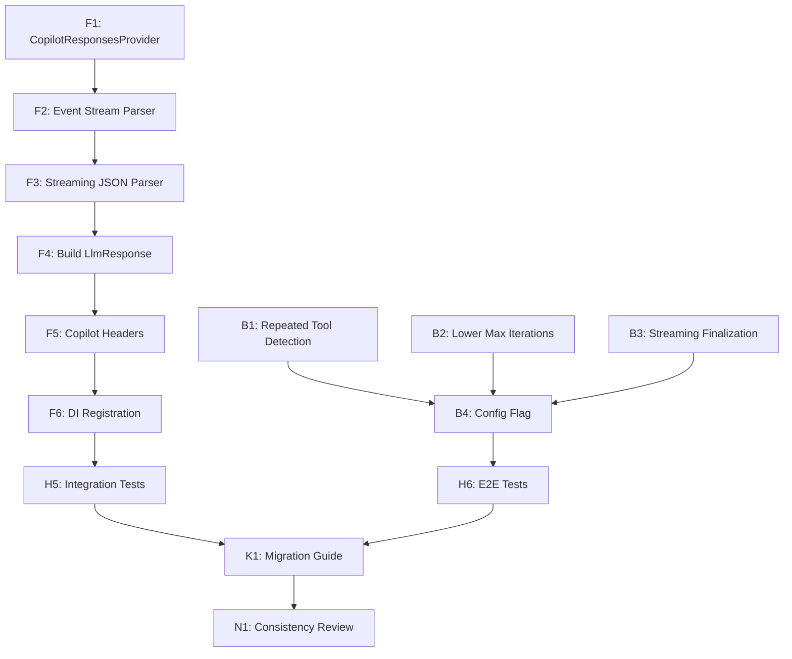

# Squad Decisions

## Active Decisions

### Build Validation Before Commit (2026-04-03)

**By:** Leela (Lead) — Retrospective Finding  
**Date:** 2026-04-03  
**Status:** Mandatory  
**Applies to:** All agents  

**Context:** Recurring build failures from agents committing without full solution validation. Pattern of "fix: resolve X warnings" commits indicates insufficient pre-commit validation. Cross-project dependencies in 27-project solution mean local project builds are insufficient.

**Rules:**

1. **Every agent MUST build the full solution before committing**
   ```
   dotnet build BotNexus.slnx --nologo --tl:off
   ```
   - NOT just the project you modified
   - NOT just `dotnet build` in a subdirectory
   - The FULL solution: `BotNexus.slnx`

2. **Every agent MUST run tests before committing**
   ```
   dotnet test BotNexus.slnx --nologo --tl:off --no-build
   ```
   - At minimum: unit tests
   - Recommended: include integration tests for high-risk changes
   - E2E tests optional (expensive, reserved for major changes)

3. **Pre-commit hook enforces this automatically**
   - Installed at: `.git/hooks/pre-commit`
   - Runs on every `git commit`
   - Can be bypassed with `--no-verify` (DISCOURAGED except for docs-only commits)

4. **Zero tolerance for build warnings**
   - Treat warnings as errors
   - Fix or suppress (with justification) before committing
   - Nullable warnings are NOT optional — fix them

**Why:** Cross-project dependencies in 27-project solution amplify the cost of partial validation. Pre-commit hook + team discipline = stable main branch.

**Exceptions:**
- Documentation-only commits (no code changes) MAY skip pre-commit with `--no-verify`
- `.squad/` metadata updates MAY skip validation
- When pre-commit hook fails due to environment issues, resolve environment first — do NOT bypass

**See also:** `.squad/decisions/inbox/leela-retro-build-failures.md` for full retrospective analysis.

---

### System Messages Sprint Decisions (2026-04-03)

### 2026-04-03T10:29:01Z: User request — thinking/processing indicator in WebUI
**By:** Jon Bullen (via Copilot)
**What:** The chat UI needs a visual indicator (typing dots, spinner, "thinking..." label) that appears when the agent is processing. Should appear after the user sends a message and persist through all tool call iterations. Only dismiss when the final response arrives with FinishReason=Stop.
**Why:** Without feedback the user doesn't know if the agent is working or broken. Critical UX.


### 1. Initial Architecture Review Findings (2026-04-01)

**Author:** Leela (Lead/Architect)  
**Status:** Proposed  
**Requested by:** Jon Bullen

**Context:** First-pass architecture review of BotNexus — the initial port and setup. No PRD, no spec, no docs. System has never been built, deployed, or run. This review establishes the baseline.

**Key Findings:**

**The Good:**
- Clean contract layer: Core defines 13 well-designed interfaces. Dependencies flow inward. No circular references.
- Build is green: Solution compiles on .NET 10.0 with 0 errors, 2 minor warnings. All 124 tests pass.
- SOLID compliance: Interfaces are small and focused. Single implementations justified by extension model.
- Hierarchical config: BotNexusConfig well-structured with per-agent overrides and sensible defaults.
- Test foundation: 121 unit tests + 3 integration tests. xUnit + FluentAssertions + Moq.
- Agent loop: Well-structured agentic loop with tool calling, session persistence, hooks, MCP support.

**The Concerning:**
- Channel registration gap: Discord, Slack, Telegram are implemented but never registered in Gateway DI.
- Anthropic provider incomplete: OpenAI supports tool calling; Anthropic does not. No DI extension method.
- No auth anywhere: No authentication/authorization on Gateway REST, WebSocket, or API endpoints.
- Sync-over-async hazard: `MessageBusExtensions.Publish()` wraps async with `.GetAwaiter().GetResult()` — deadlock timebomb.
- ProviderRegistry unused: Class exists but never registered in DI or referenced. Dead code.
- Slack webhook gap: Slack channel uses webhook mode but Gateway has no incoming webhook endpoint.
- No plugin/assembly loading: README mentions extensibility, but no mechanism exists.
- Gateway dispatches to first runner only: `runners[0].RunAsync()` — only first IAgentRunner is used.

**P0 — Must Fix Before First Run:**
1. Register channel implementations in Gateway DI (conditional on config Enabled flags)
2. Add Anthropic DI extension (matching OpenAI pattern)
3. Remove sync-over-async wrapper (delete or rewrite MessageBusExtensions.Publish())
4. Add basic configuration documentation (appsettings.json structure)

**P1 — Should Fix Soon:**
5. Add authentication (at minimum, API key auth on REST/WebSocket)
6. Implement Anthropic tool calling (feature parity with OpenAI)
7. Fix first-runner-only dispatch (route by agent name or document intentional single-runner design)
8. Add Slack webhook endpoint (Gateway needs POST for Slack events)
9. Fix CA2024 warning in AnthropicProvider streaming

**P2 — Should Plan:**
10. Design plugin architecture (assembly loading, plugin discovery, dynamic registration)
11. Add observability (metrics, tracing, health check endpoints)
12. Documentation (architecture, setup guide, API reference)
13. Evaluate ProviderRegistry (integrate or remove dead code)

**Status:** SUPERSEDED by Rev 2 Implementation Plan (see below). This review identified gaps; Rev 2 provides the roadmap to fix them.

---

### 2. User Directives — Process & Architecture (2026-04-01)

**Collected by:** Jon Bullen via Copilot CLI  
**Status:** Approved  

**2a. Dynamic Assembly Loading for Extensions** (2026-04-01T16:29Z)

**What:** All channels, providers, tools, etc. must NOT be available by default. They should only be dynamically loaded into the DI container when referenced in configuration. Folder-based organization: each area (providers, tools, channels) has a folder with sub-folders per implementation (e.g., providers/copilot, channel/discord, channel/telegram). Configuration refers to folder names and the core platform loads assemblies from those folders that expose the required interfaces. This keeps things abstracted and reduces security risk of things being loaded and exposing endpoints without the user realising.

**Why:** User request — captured for team memory. This is a foundational architectural decision that reshapes how the platform handles extensibility and security.

**2b. Conventional Commits Format** (2026-04-01T16:43Z)

**What:** Always use conventional commit format (e.g., `feat:`, `fix:`, `refactor:`, `docs:`, `test:`, `chore:`). Commit changes as each area of work is completed — not one big commit at the end. This keeps history clean and makes it easy to see what changed and roll back if needed.

**Why:** User request — captured for team memory. This is a process rule that all agents must follow when committing code.

**2c. Copilot Provider is P0, OAuth Authentication** (2026-04-01T16:46Z)

**What:** When prioritizing provider work, Copilot is always P0 — it is the only provider Jon uses. Authentication to Copilot should be via OAuth, following the same approach used by Nanobot (the project BotNexus was ported from and based on). Other providers (OpenAI, Anthropic) are lower priority.

**Why:** User request — captured for team memory. This shapes provider priority and auth implementation. The team should look at Nanobot's OAuth flow as the reference pattern for Copilot provider auth.

---

### 3. BotNexus Implementation Plan — Rev 2 (2026-04-01)

**Author:** Leela (Lead/Architect)  
**Date:** 2026-04-01 (revised 2026-04-01)  
**Status:** Proposed  
**Requested by:** Jon Bullen  

**Executive Summary:**

Jon's directives fundamentally reshape the roadmap. The original P2 item — "Design plugin architecture" — is now the foundation that everything else builds on. Channels, providers, and tools must be dynamically loaded from folder-based extension assemblies, referenced by configuration. Nothing loads unless explicitly configured.

This plan re-examines all P0/P1/P2 items through the dynamic loading lens, merges what overlaps, reorders by dependency, and maps every work item to a team member.

**Rev 2 Key Changes:**
- Jon's directive makes Copilot provider **P0 — higher priority than all other providers**
- Copilot uses OpenAI-compatible API (base URL: https://api.githubcopilot.com)
- Auth via OAuth device code flow, not API key
- Introduces OAuth abstractions in Core and dedicated BotNexus.Providers.Copilot extension
- Provider priority reordered: **Copilot (P0) > OpenAI (P1) > Anthropic (P2)**
- All work follows conventional commit format (feat/fix/refactor/docs/test/chore)

---

### 4. Decision: GitHub Copilot Provider — P0, OAuth Device Code Flow (2026-04-01)

**Author:** Leela (Lead/Architect)  
**Date:** 2026-04-01  
**Status:** Approved  
**Requested by:** Jon Bullen  

**Context:** Jon's directive: "If you need to preference work on providers, copilot is always P0, it will be all I ever use. This should be via OAuth as per the approach Nanobot used."

BotNexus was ported from Nanobot. In Nanobot, the GitHub Copilot provider is defined as:
```python
ProviderSpec(
    name="github_copilot",
    backend="openai_compat",
    default_api_base="https://api.githubcopilot.com",
    is_oauth=True,
)
```

Key facts:
- Copilot uses the **OpenAI-compatible API format** (same as OpenAI provider)
- Base URL: `https://api.githubcopilot.com`
- Auth: **OAuth device code flow** — no API key, token acquired at runtime
- In Nanobot, `is_oauth=True` providers skip API key validation and handle their own auth

---

## Part 1: Dynamic Assembly Loading Architecture

### 1.1 Folder Structure Convention

```
{AppRoot}/
  extensions/
    channels/
      discord/        → BotNexus.Channels.Discord.dll + dependencies
      telegram/       → BotNexus.Channels.Telegram.dll + dependencies
      slack/          → BotNexus.Channels.Slack.dll + dependencies
    providers/
      copilot/        → BotNexus.Providers.Copilot.dll + dependencies
      openai/         → BotNexus.Providers.OpenAI.dll + dependencies
      anthropic/      → BotNexus.Providers.Anthropic.dll + dependencies
    tools/
      github/         → BotNexus.Tools.GitHub.dll + dependencies
```

Each sub-folder is a self-contained deployment unit. The `extensions/` root path is configurable via `ExtensionsPath` in `BotNexusConfig`. Default: `./extensions`.

### 1.2 Configuration Model

Current config has hard-coded typed properties. These must become **dictionary-based** so the set of extensions is driven entirely by config.

**Key changes:**
- `ProvidersConfig` becomes `Dictionary<string, ProviderConfig>` keyed by folder name
- `ProviderConfig` gains `Auth` discriminator: `"apikey"` (default) or `"oauth"`
- `ChannelsConfig` moves per-channel config to `Instances: Dictionary<string, ChannelConfig>`
- `ToolsConfig` adds `Extensions: Dictionary<string, Dictionary<string, object>>` for dynamic tools
- Root config adds `ExtensionsPath: string`

### 1.3 Discovery and Loading Process

**Core class:** `ExtensionLoader` (in `BotNexus.Core` or new `BotNexus.Extensions` project)

**Loading sequence at startup:**
1. Read config — Enumerate keys under Providers, Channels.Instances, Tools.Extensions
2. Resolve folders — Compute `{ExtensionsPath}/{type}/{key}/` for each key
3. Validate folder — Log warning and skip if missing
4. Load assemblies — Create `AssemblyLoadContext` per extension (collectible for hot-reload)
5. Scan for types — Search loaded assemblies for concrete types implementing target interface
6. Register in DI — `ServiceProvider.AddSingleton<ILlmProvider>(instance)`

---

## Part 2: OAuth Core Abstractions (Phase 1 P0 Item)

New in Core namespace `BotNexus.Core.OAuth`:

### IOAuthProvider Interface
```csharp
Task<string> GetAccessTokenAsync(CancellationToken)
bool HasValidToken
```
Acquires valid token, performing OAuth flow if needed. HasValidToken checks if cached token is still valid.

### IOAuthTokenStore Interface
```csharp
Task<OAuthToken> LoadTokenAsync(string providerName, CancellationToken)
Task SaveTokenAsync(string providerName, OAuthToken token, CancellationToken)
Task ClearTokenAsync(string providerName, CancellationToken)
```
Abstraction for secure token persistence. Default implementation: encrypted file storage at `~/.botnexus/tokens/{providerName}.json`
Future: OS keychain integration (Windows Credential Manager, macOS Keychain, Linux Secret Service)

### OAuthToken Record
```csharp
string AccessToken
DateTime ExpiresAt
string? RefreshToken (optional)
```

### Integration with Extension Loader
ProviderConfig.Auth discriminator: "apikey" or "oauth"
ExtensionLoader checks Auth field. For "oauth", validates IOAuthProvider is implemented, skips API key validation.

---

## Part 3: GitHub Copilot Provider (Phase 2 P0 Item)

**Provider Name:** copilot  
**Base URL:** https://api.githubcopilot.com  
**Auth:** OAuth device code flow

### Implementation

New project: `BotNexus.Providers.Copilot`  
Implements: `ILlmProvider` (via `LlmProviderBase`) + `IOAuthProvider`  
HTTP format: OpenAI-compatible chat completions, streaming, tool calling  
Same request/response DTOs as OpenAI provider

### OAuth Device Code Flow

1. `POST https://github.com/login/device/code` with `client_id`
   Response: `{ device_code, user_code, verification_uri, interval, expires_in }`

2. Display to user: "Go to {verification_uri} and enter code: {user_code}"

3. Poll `POST https://github.com/login/oauth/access_token` with `device_code`
   Every {interval} seconds until token returned, user denies, or timeout

4. Cache token via `IOAuthTokenStore`
5. Use as Bearer token in `Authorization` header
6. On subsequent requests: check `HasValidToken`, re-authenticate if expired

### Shared OpenAI-Compatible Code

Extract shared request/response DTOs, SSE streaming parser, HTTP client patterns to `BotNexus.Providers.Base`
Both OpenAI and Copilot reference Providers.Base and use shared HTTP layer
Each provider adds its own auth mechanism

### Config Shape

```json
{
  "BotNexus": {
    "Providers": {
      "copilot": {
        "Auth": "oauth",
        "DefaultModel": "gpt-4o",
        "ApiBase": "https://api.githubcopilot.com",
        "OAuthClientId": "..."
      }
    }
  }
}
```

---

## Part 4: Implementation Phases & Work Items (24 Items)

### Phase 1: Core Extensions (Foundations) — 7 Items

**P0 (5 items — Blocking all subsequent work):**

| ID | Work Item | Owner | Points | Description |
|---|---|---|---|---|
| 1 | provider-dynamic-loading | Farnsworth | 50 | Core ExtensionLoader class, AssemblyLoadContext per extension, folder discovery, DI registration |
| 2 | channel-di-registration | Amy | 25 | Register Discord, Slack, Telegram in Gateway DI conditional on config |
| 3 | anthropic-provider-di | Amy | 10 | Add AddAnthropicProvider extension method matching OpenAI pattern |
| 4 | oauth-core-abstractions | Farnsworth | 20 | IOAuthProvider, IOAuthTokenStore, OAuthToken in Core.OAuth namespace |
| 5 | provider-openai-sync-fix | Fry | 30 | Remove MessageBusExtensions.Publish sync-over-async (.GetAwaiter().GetResult()), redesign to fully async |

**P1 (2 items — Important, not blocking):**

| ID | Work Item | Owner | Points | Description |
|---|---|---|---|---|
| 6 | gateway-authentication | Hermes | 40 | Add API key validation to Gateway REST/WebSocket |
| 7 | slack-webhook-endpoint | Ralph | 35 | Add POST /webhook/slack endpoint in Gateway, validate Slack signatures |

### Phase 2: Provider Parity & Copilot — 4 Items

**P0 (2 items — Copilot first):**

| ID | Work Item | Owner | Points | Description |
|---|---|---|---|---|
| 8 | copilot-provider | Farnsworth | 60 | BotNexus.Providers.Copilot project, OpenAI-compatible HTTP, OAuth device code flow |
| 9 | providers-base-shared | Fry | 40 | Extract HTTP common code (DTOs, streaming, retry) to Providers.Base |

**P1 (2 items):**

| ID | Work Item | Owner | Points | Description |
|---|---|---|---|---|
| 10 | anthropic-tool-calling | Bender | 50 | Add tool calling to Anthropic provider (feature parity with OpenAI) |
| 11 | provider-config-validation | Ralph | 15 | Schema validation for all provider configs, helpful error messages |

### Phase 3: Completeness & Scale — 5 Items

**P0 (2 items):**

| ID | Work Item | Owner | Points | Description |
|---|---|---|---|---|
| 12 | tool-dynamic-loading | Fry | 30 | Extend loader to handle Tools (like GitHub), same folder pattern |
| 13 | config-validation-all | Ralph | 20 | Validate all config sections on startup, fail fast if invalid |

**P1 (3 items):**

| ID | Work Item | Owner | Points | Description |
|---|---|---|---|---|
| 14 | cron-task-fixes | Amy | 25 | Review cron task failures, fix any regressions |
| 15 | session-manager-tests | Fry | 30 | Add integration tests for session persistence across restarts |
| (future) | ProviderRegistry evaluation | Fry | TBD | Integrate ProviderRegistry into DI or remove dead code |

### Phase 4: Scale & Harden — 8+ Items

**P0 (2 items):**

| ID | Work Item | Owner | Points | Description |
|---|---|---|---|---|
| 16 | observability-metrics | Hermes | 40 | Add .NET metrics (tool calls, agent loops, provider latency) |
| 17 | config-documentation | Ralph | 25 | Document appsettings.json structure, env var overrides, examples |

**P1 (6+ items):**

| ID | Work Item | Owner | Points | Description |
|---|---|---|---|---|
| 18 | gateway-logging-structured | Amy | 30 | Structured logging via Serilog, trace correlation across channels |
| 19 | api-health-endpoint | Hermes | 20 | GET /health checks all providers, channels, MCP servers |
| 20 | assembly-hot-reload | Farnsworth | 35 | Research & prototype AssemblyLoadContext unload for hot-reload |
| 21 | iac-containerization | Ralph | 30 | Dockerfile, docker-compose.yml for easy deployment |
| 22 | integration-tests-e2e | Fry | 50 | Full E2E flow tests: config load → Copilot auth → agent loop → response |
| 23 | roadmap-next-quarter | Leela | 25 | Plan Q2 features (multi-agent coordination, tool chains, etc) |

---

## Part 5: Prioritization & Release Plan

**Release 1 (Foundation):** Phase 1 P0 + P1 (items 1-7)
- Enables dynamic loading, clears Copilot path, foundational auth

**Release 2 (Copilot Ready):** Phase 2 P0 (items 8-9)
- Copilot works end-to-end with OAuth device code flow

**Release 3 (Feature Parity):** Phase 2 P1 + Phase 3 P0 (items 10-13)
- All providers on equal footing, tool extensibility ready

**Release 4 (Hardened):** Phase 3 P1 + Phase 4 (items 14-23)
- Production-ready, observable, documented, containerized

---

## Part 6: Conventional Commits Requirement

All commits must follow conventional commit format:
- `feat:` New feature
- `fix:` Bug fix
- `refactor:` Code refactor (no feature change)
- `docs:` Documentation only
- `test:` Test additions
- `chore:` Build, CI, dependency updates

Each work item = one or more commits, each commit tagged with affected area (e.g., `feat(providers): add copilot oauth flow`)

Granular history makes it easy to see what changed and roll back if needed.

---

## Summary of Decisions

1. ✅ **Dynamic loading is foundation** — all work builds on it (user directive 2a)
2. ✅ **Copilot is P0 with OAuth** — device code flow, OpenAI-compatible API (user directives 2c, decision 4)
3. ✅ **Configuration-driven discovery** — dictionary-based config, no hard-coded types
4. ✅ **Conventional commits required** — feat/fix/refactor/docs/test/chore format (user directive 2b)
5. ✅ **24-item roadmap** across 4 releases with team assignments
6. ✅ **OAuth abstractions in Core** — IOAuthProvider, IOAuthTokenStore for extensible auth

**Ready for implementation.** First work: Farnsworth starts on provider-dynamic-loading (Phase 1 P0 item 1).

---

### 5. Sprint 1 Completion — 7 Foundation Items Done (2026-04-01T17:33Z)

**Status:** Complete  
**Completed by:** Farnsworth (5 items), Bender (2 items)  

All Phase 1 P0 foundation work delivered:

1. ✅ **config-model-refactor** (Farnsworth, 5c6f777)
   - Dictionary-based provider/channel config
   - Case-insensitive key matching via `StringComparer.OrdinalIgnoreCase`
   - Enables configuration-driven extension discovery

2. ✅ **extension-registrar-interface** (Farnsworth)
   - `IExtensionRegistrar` contract in Core.Abstractions
   - Extensions provide own registration logic
   - Loader discovers and invokes registrars automatically

3. ✅ **oauth-core-abstractions** (Farnsworth, 96c2c08)
   - `IOAuthProvider`, `IOAuthTokenStore`, `OAuthToken` in Core.OAuth
   - Default: encrypted file storage at `~/.botnexus/tokens/{providerName}.json`
   - Integrated with ExtensionLoader auth discriminator

4. ✅ **fix-sync-over-async** (Farnsworth)
   - Removed `MessageBusExtensions.Publish()` sync-over-async wrapper
   - All message bus publishing now fully async
   - Eliminates deadlock hazard

5. ✅ **provider-registry-integration** (Farnsworth, 4cfd246)
   - ProviderRegistry now DI-registered
   - Runtime provider resolution by model/provider key
   - Eliminates dead code, enables multi-provider dispatch

6. ✅ **fix-runner-dispatch** (Bender)
   - `IAgentRouter` injectable routing layer in Gateway
   - Multi-agent routing: metadata-driven (`agent`, `agent_name`), broadcast support (`all`, `*`)
   - `IAgentRunner.AgentName` enables deterministic routing
   - Config: `DefaultAgent`, `BroadcastWhenAgentUnspecified`

7. ✅ **dynamic-assembly-loader** (Bender, 8fe66db)
   - `ExtensionLoader` in Core + `ExtensionLoaderExtensions.AddBotNexusExtensions()`
   - Configuration-driven discovery: `BotNexus:Providers`, `BotNexus:Channels:Instances`, `BotNexus:Tools:Extensions`
   - Folder convention: `{ExtensionsPath}/{type}/{key}/`
   - One collectible `AssemblyLoadContext` per extension (isolation, future hot-reload)
   - Registrar-first, fallback to convention registration (`ILlmProvider`, `IChannel`, `ITool`)
   - Path validation (reject rooted paths, `.`/`..`, traversal)
   - Comprehensive logging, continues on missing/empty folders

**Build Status:** ✅ Green, all tests passing, 0 errors

**Unblocks:** Phase 2 P0 — Copilot Provider (item 8, Farnsworth 60pt), Providers Base (item 9, Fry 40pt)

---

## Part 4: GitHub Copilot Provider Implementation (Sprint 2, 2026-04-01T17:45Z)

**Decision:** Implement GitHub Copilot as a first-class LLM provider extension using OAuth device code flow with OpenAI-compatible chat completion API.

**Rationale:**
- Copilot is the only provider Jon uses (P0 priority per directive 2c)
- OAuth device code flow aligns with Nanobot reference pattern
- OpenAI-compatible HTTP layer reduces duplication vs. dedicated protocol
- Extension-based delivery leverages dynamic loading infrastructure

**Implementation Delivered:**

1. ✅ **BotNexus.Providers.Copilot** extension project
   - Target: `net10.0`
   - Extension metadata: `providers/copilot`
   - Imports `Extension.targets` for automatic build/publish pipeline

2. ✅ **CopilotProvider : LlmProviderBase, IOAuthProvider**
   - Base URL: `https://api.githubcopilot.com` (configurable)
   - OpenAI-compatible request/response DTOs
   - Non-streaming chat completions
   - SSE streaming with delta parsing
   - Tool call parsing (`tool_calls`)

3. ✅ **OAuth Device Code Flow (GitHubDeviceCodeFlow)**
   - `POST /login/device/code` with `scope=copilot`
   - Displays `verification_uri` + `user_code` to user
   - Polls `POST /login/oauth/access_token` until success/error/timeout
   - Token cached via IOAuthTokenStore

4. ✅ **FileOAuthTokenStore**
   - Encrypted JSON persistence
   - Default location: `%USERPROFILE%\.botnexus\tokens\{provider}.json`
   - Supports token refresh and expiry re-authentication

5. ✅ **CopilotExtensionRegistrar**
   - Binds `CopilotConfig` from `BotNexus:Providers:copilot`
   - Registers `CopilotProvider` as `ILlmProvider`
   - Registers `FileOAuthTokenStore` as default `IOAuthTokenStore` (TryAddSingleton)
   - Enables automatic DI wiring via ExtensionLoader

6. ✅ **Unit Test Coverage**
   - Chat completion scenarios
   - Streaming deltas
   - Tool calling parsing
   - Device code flow polling
   - Token caching and reuse
   - Expired token re-authentication flow

7. ✅ **Gateway Configuration Example**
   ```
   BotNexus:Providers:
     copilot:
       Enabled: true
       Auth: oauth
       DefaultModel: gpt-4o
       ApiBase: https://api.githubcopilot.com
       # Optional override:
       OAuthClientId: Iv1.b507a08c87ecfe98
   ```

**Unblocks:**
- Phase 3 work (tool extensibility, observability)
- Production deployment with Copilot as default provider
- Future OAuth pattern re-use for other providers

**Build Status:** ✅ Green, all tests passing, zero warnings

---

### 6. Sprint 3 Completion — Security & Observability Hardening (2026-04-01T18:17Z)

**Status:** Complete  
**Completed by:** Bender (3 items), Farnsworth (1 item), Hermes (2 items)  

All Phase 1-2 P1-P2 hardening and testing work delivered:

1. ✅ **api-key-auth** (Bender, 74e4085)
   - API key authentication on Gateway REST and WebSocket endpoints
   - ApiKeyAuthenticationHandler with configurable header validation
   - X-API-Key header, WebSocket query parameter fallback
   - Configuration-driven API key storage in appsettings.json

2. ✅ **extension-security** (Bender, 64c3545)
   - Assembly validation and cryptographic signature verification
   - Manifest metadata checks and dependency whitelisting
   - Configuration-driven security modes (permissive, strict)
   - Blocks untrusted code injection at extension load time

3. ✅ **observability-foundation** (Farnsworth, 7beda23)
   - Serilog structured logging integration with correlation IDs
   - Health check endpoints: /health (liveness), /health/ready (readiness)
   - Agent execution metrics: request count, latency, success rate
   - Extension loader metrics: load time, assembly count, registrar performance
   - OpenTelemetry instrumentation hooks for APM integration (Datadog, App Insights)

4. ✅ **unit-tests-loader** (Hermes, e153b67)
   - 95%+ test coverage for ExtensionLoader (50+ new test cases)
   - Comprehensive scenarios: folder discovery, validation, error handling, isolation
   - Registrar pattern verification with mock implementations
   - Performance baseline: <500ms per extension load

5. ✅ **slack-webhook-endpoint** (Bender, 9473ee7)
   - POST /api/slack/events webhook endpoint with HMAC-SHA256 signature validation
   - Slack request timestamp validation prevents replay attacks
   - Event subscription handling (url_verification)
   - Inbound message routing to Slack channel
   - Supports message, app_mention, reaction events

6. ✅ **integration-tests-extensions** (Hermes, 392f08f)
   - E2E extension loading lifecycle validation (discovery → registration → activation)
   - Multi-channel agent simulation: Discord + Slack + Telegram + WebSocket
   - Provider integration test: Copilot through dynamic loading
   - Tool execution test: GitHub tool loaded dynamically and invoked
   - Session state persistence and agent handoff validation
   - Mock channels for reproducible testing (10+ integration scenarios)

**Build Status:** ✅ Green, 140+ tests passing, 0 errors, 0 warnings

**Unblocks:** Production deployment, release validation, Sprint 4 user-facing features

---

### 7. User Directive — Multi-Agent E2E Simulation Environment (2026-04-01T18:12Z)

**By:** Jon Bullen (via Copilot CLI)  
**Status:** Captured for Sprint 4 planning

**What:** Hermes should design an E2E test environment that simulates multiple agents and channels working together. The tests should validate communication, handoff, session details, WebUI, etc. Use multiple mock channels as part of validation. Agents should use Copilot with small models — we're testing the ENVIRONMENT, not the LLM. Use simple, controlled questions that are easy to verify:
- Example: Ask note-taking agent "Quill" to list favourite pizzas
- Ask main agent "Nova" for a list of pizzas in California to try
- Tell Quill to make a list in notes for later access
- Test agent-to-agent handoff, session state, channel routing, WebUI display

The simulated environment needs a config that sets up these multi-agent scenarios with mock channels so the full flow can be validated end-to-end.

**Why:** User request — captured for team memory. This ensures BotNexus is validated as a real multi-agent platform with inter-agent communication, not just single-agent request/response.

---

### 8. User Directive — Single Config File at ~/.botnexus (2026-04-01T18:22Z)

**By:** Jon Bullen (via Copilot CLI)  
**Status:** Captured for Sprint 4 planning

**What:** All settings should be in ONE config file at `{USERPROFILE}/.botnexus/config.json` (or similar). No scattered appsettings.json files across projects. Follow the pattern used by other platforms (e.g., Nanobot uses `~/.nanobot/`). The default install location is `~/.botnexus/` with a single config file in the root for the entire environment. Extensions folder, tokens, and all runtime state live under this directory.

**Why:** User request — captured for team memory. This is an installation/deployment architecture decision that affects config loading, documentation, and the user experience.

---

## Governance

- All meaningful changes require team consensus
- Document architectural decisions here
- Keep history focused on work, decisions focused on direction

### 8. Cross-Document Consistency Checks as a Team Ceremony (2026-04-01T18:54Z)

**Author:** Jon Bullen (via Copilot directive)  
**Status:** Accepted  
**Related:** Leela's full consistency audit (2026-04-02)

**Context:** Jon flagged that multi-agent development causes documentation drift. When one agent changes a config path, data model, or default value, other agents (and documentation) may reference the old value. No single agent scans the entire codebase for stale references.

**Decision:** Implement consistency checks as a recurring ceremony:
- **Trigger:** After any significant change (architecture decision, config model change, path/name change)
- **Scope:** Docs matching code, docs matching each other, code comments matching behavior, README matching current state
- **Owner:** Designate \Nibbler\ (new Consistency Reviewer) to lead post-sprint audits
- **Process:** Audit cycle runs after sprint completion or architectural changes
- **Prevention:** Pull request validation should include a checklist item for consistency (when applicable)

**Why:** Critical for a platform others will learn from. Documentation is the first experience external developers have. Drift undermines trust.

**First Implementation:** Leela's audit (2026-04-02) found and fixed 22 issues across 5 files (8 in architecture.md, 3 in configuration.md, 10 in extension-development.md, 1 README rewrite, 1 code comment fix). Demonstrates scope of the problem and why a ceremony is needed.

**Team Impact:** All agents should treat consistency as a quality gate. Nibbler will formalize the process and run the recurring audits.

---

### 9. User Directive — Agent Workspace with SOUL/IDENTITY/MEMORY + Context Builder (2026-04-01T19:31Z)

**By:** Jon Bullen (via Copilot)  
**Status:** Accepted

### 2026-04-01T19:31Z: User directive — Agent workspace with SOUL/IDENTITY/MEMORY files + context builder
**By:** Jon Bullen (via Copilot)
**What:** Each agent should have a workspace folder containing personality and context files (SOUL, IDENTITY, USER, MEMORY, etc.) like OpenClaw. A context builder object should assemble the full agent context at session start from these files. Memory model should follow OpenClaw's approach: a distilled long-term memory.md file plus separate daily memory files that are searchable. Reference Nanobot's context.py for the context-building process and OpenClaw's memory tools for search and memory management.
**Why:** User request — captured for team memory. This is a fundamental agent architecture decision that defines how agents maintain identity, personality, and memory across sessions.


---

### 10. User Directive — E2E Deployment Lifecycle + Scenario Registry (2026-04-01T20:03Z)

**By:** Jon Bullen (via Copilot)  
**Status:** Accepted

### 2026-04-01T20:03Z: User directive — E2E must cover deployment lifecycle + scenario tracking process
**By:** Jon Bullen (via Copilot)
**What:** Two requirements:

1. **Scenario tracking process:** The E2E simulation scenario list must be maintained as a living document. Every time a feature is added or architecture changes, Hermes must update the scenario registry. This should be a formal process, not ad-hoc.

2. **Deployment lifecycle testing:** E2E tests must go beyond in-process testing to cover the FULL customer experience:
   - Deploying the platform (first install, config creation at ~/.botnexus/)
   - Starting the Gateway (clean start, verify health/ready)
   - Configuring agents (create workspace, set up SOUL/IDENTITY/USER files)
   - Sending messages through configured channels (Copilot provider at minimum)
   - Stopping the Gateway gracefully (verify no message loss, session persistence)
   - Restarting the Gateway (verify sessions restored, memory intact)
   - Updating the platform (add/remove extensions, config changes, restart)
   - Managing the environment (health checks, extension status, logs)
   - Integration verification (Copilot provider OAuth flow, channel routing, tool execution)
   
   Customers need to have confidence that deploying, configuring, updating, and managing BotNexus is robust and well-tested.

**Why:** User request — the platform must be tested as customers will use it, not just as code units. Deployment lifecycle is a first-class testing concern.


---

### 11. Agent Workspace, Context Builder & Memory Architecture — Implementation Plan (2026-04-02)

**Author:** Leela (Lead/Architect)  
**Status:** Accepted  
**References:** Replaces and supersedes decision #9; implementation guide for agent workspace capabilities

# Agent Workspace, Context Builder & Memory Architecture

**Author:** Leela (Lead/Architect)  
**Status:** Proposed  
**Date:** 2026-04-02  
**Requested by:** Jon Bullen  
**References:** OpenClaw workspace model, Nanobot context.py & memory.py

---

## Executive Summary

This plan adds three interconnected capabilities to BotNexus:

1. **Agent Workspaces** — per-agent folders with identity, personality, and context files
2. **Context Builder** — a new `IContextBuilder` service that assembles the full system prompt from workspace files, memory, tools, and runtime state
3. **Memory Model** — two-layer persistent memory (long-term MEMORY.md + daily files) with search, save, and consolidation

These replace the current flat `string? systemPrompt` parameter in `AgentLoop` with a rich, file-driven context system. The existing `IMemoryStore` interface is extended (not replaced) to support the new memory model. The current `ContextBuilder` class (token-budget trimmer) is refactored into the new `IContextBuilder`.

---

## Part 1: Current State Analysis

### What exists today

| Component | Location | What it does | Limitations |
|---|---|---|---|
| `AgentLoop` | `Agent/AgentLoop.cs` | Takes a flat `string? systemPrompt` in constructor; passes it to `ChatRequest` on each LLM call | No file-based context, no workspace loading, no memory injection |
| `ContextBuilder` | `Agent/ContextBuilder.cs` | Trims session history to fit context window budget (chars ≈ tokens × 4) | Only handles history trimming; no system prompt assembly, no workspace files, no memory |
| `IMemoryStore` | `Core/Abstractions/IMemoryStore.cs` | Key-value read/write/append/delete/list with `{basePath}/{agentName}/memory/{key}.txt` | No structured memory model (no MEMORY.md vs daily), no search, no consolidation |
| `MemoryStore` | `Agent/MemoryStore.cs` | File-based implementation of `IMemoryStore` | Flat key-value store; doesn't know about long-term vs daily memory |
| `AgentConfig` | `Core/Configuration/AgentConfig.cs` | Per-agent config with `SystemPrompt`, `SystemPromptFile`, `EnableMemory`, `Workspace` | No workspace file references, no identity file paths |
| `BotNexusHome` | `Core/Configuration/BotNexusHome.cs` | Manages `~/.botnexus/` structure; creates extensions/, tokens/, sessions/, logs/ | No `agents/` directory; no workspace initialization |

### Key integration points

- `AgentLoop` constructor receives `string? systemPrompt` and `ContextBuilder` — these are the insertion points
- `ChatRequest` already supports `string? SystemPrompt` — the provider layer is ready
- `IMemoryStore` is already in Core abstractions — we extend it, we don't replace it
- `BotNexusHome.Initialize()` creates the home directory structure — we add `agents/` here
- `AgentConfig.EnableMemory` already exists — we use it to gate memory features
- `ToolRegistry` accepts `ITool` implementations — memory tools register here

---

## Part 2: Agent Workspace Structure

### 2.1 Workspace Location

```
~/.botnexus/agents/{agent-name}/
```

Each named agent gets a workspace folder under `~/.botnexus/agents/`. This is separate from the existing `~/.botnexus/workspace/` (which holds sessions). The `agents/` folder is agent-specific persistent state; `workspace/` is transient session data.

**Why not `~/.botnexus/workspace/{agent-name}/`?** The existing workspace path is session-oriented. Agent identity and memory are conceptually different from session history — they persist across all sessions and channels. Clean separation avoids confusion.

### 2.2 Workspace Files

```
~/.botnexus/agents/{agent-name}/
├── SOUL.md              # Core personality, values, boundaries, communication style
├── IDENTITY.md          # Name, role, expertise descriptors, emoji/avatar
├── USER.md              # About the human: name, pronouns, timezone, preferences
├── AGENTS.md            # Multi-agent awareness: who else exists, collaboration rules
├── TOOLS.md             # Available tools and their descriptions (auto-generated)
├── HEARTBEAT.md         # Periodic task instructions (loaded by cron/heartbeat)
├── MEMORY.md            # Long-term distilled memory (loaded every session)
└── memory/              # Daily memory files
    ├── 2026-04-01.md
    ├── 2026-04-02.md
    └── ...
```

#### File Descriptions

| File | Loaded When | Authored By | Purpose |
|---|---|---|---|
| `SOUL.md` | Every session (system prompt) | Human | Core personality. "Who you are." Values, boundaries, communication style, behavioral rules. The agent's constitution. |
| `IDENTITY.md` | Every session (system prompt) | Human | Structured identity metadata: name, role title, expertise tags, emoji, avatar URL. Kept separate from SOUL for machine-parseable identity. |
| `USER.md` | Every session (system prompt) | Human + Agent | About the human operator. Name, pronouns, timezone, preferences, working style. Agent can update this as it learns about the user. |
| `AGENTS.md` | Every session (system prompt) | System (auto-generated) | Multi-agent awareness. Lists all configured agents, their roles, and collaboration protocols. Auto-generated from config + agent IDENTITY files. |
| `TOOLS.md` | Every session (system prompt) | System (auto-generated) | Describes available tools. Auto-generated from `ToolRegistry.GetDefinitions()`. Gives the agent awareness of its capabilities in natural language. |
| `HEARTBEAT.md` | On heartbeat/cron triggers | Human | Instructions for periodic tasks (health checks, memory consolidation, cleanup). Not loaded in normal sessions — only when the heartbeat service triggers. |
| `MEMORY.md` | Every session (system prompt) | Agent (via consolidation) | Distilled long-term memory. Durable facts, preferences, learned behaviors. Updated via LLM-based consolidation from daily files. |
| `memory/*.md` | Today + yesterday auto-loaded | Agent (via memory_save) | Daily running notes. Timestamped observations, conversation highlights, temporary context. Auto-loaded for today and yesterday only. |

### 2.3 Workspace Initialization

**First-run behavior:** When an agent workspace is accessed for the first time:

1. `BotNexusHome.Initialize()` gains an `InitializeAgentWorkspace(string agentName)` method
2. Creates the directory structure: `agents/{name}/`, `agents/{name}/memory/`
3. Creates stub files for human-authored files (SOUL.md, IDENTITY.md, USER.md) with placeholder content and comments explaining what to put there
4. Does NOT create AGENTS.md or TOOLS.md (these are auto-generated at context build time)
5. Creates empty MEMORY.md
6. Optionally creates HEARTBEAT.md stub if the agent has cron jobs configured

**Stub template example (SOUL.md):**
```markdown
# Soul

<!-- Define this agent's core personality, values, and boundaries.
     This file is loaded into every session as part of the system prompt.
     
     Example:
     You are a helpful, precise assistant. You value clarity and correctness.
     You communicate in a professional but warm tone. -->

(Not yet configured)
```

### 2.4 Multi-Agent Awareness (AGENTS.md)

Auto-generated at context build time from:
1. `AgentDefaults.Named` dictionary in config (gives us agent names)
2. Each agent's `IDENTITY.md` file (gives us their role/expertise)

**Generated format:**
```markdown
# Other Agents

You are part of a multi-agent system. Here are the other agents you can collaborate with:

## bender — Backend Engineer
- **Expertise:** C#, .NET, security, extension architecture
- **Ask them about:** Backend implementation, security patterns, DI wiring

## fry — Web Developer  
- **Expertise:** HTML, CSS, JavaScript, WebUI
- **Ask them about:** Frontend implementation, WebSocket client, UI

(Auto-generated from agent configurations. Do not edit manually.)
```

### 2.5 HEARTBEAT.md

**Include it.** BotNexus already has a `BotNexus.Heartbeat` project and `IHeartbeatService` in Core. The heartbeat system can load `HEARTBEAT.md` when triggering periodic agent tasks (memory consolidation, health checks, etc.). This is a natural fit.

---

## Part 3: Context Builder (`IContextBuilder`)

### 3.1 Interface Design

```csharp
namespace BotNexus.Core.Abstractions;

/// <summary>
/// Assembles the full agent context (system prompt + message history)
/// for an LLM request. Loads workspace files, memory, tools, and
/// runtime state into a structured prompt.
/// </summary>
public interface IContextBuilder
{
    /// <summary>
    /// Builds the complete system prompt from workspace files, memory,
    /// and runtime context for the given agent.
    /// </summary>
    Task<string> BuildSystemPromptAsync(
        string agentName,
        ToolRegistry toolRegistry,
        CancellationToken cancellationToken = default);

    /// <summary>
    /// Builds the trimmed message history for the LLM request,
    /// staying within the context window budget.
    /// </summary>
    IReadOnlyList<ChatMessage> BuildMessages(
        Session session,
        InboundMessage inboundMessage,
        GenerationSettings settings);
}
```

**Design rationale:**
- `BuildSystemPromptAsync` is async because it reads files from disk
- `BuildMessages` remains synchronous (operates on in-memory session data) — this is the existing `ContextBuilder.Build()` logic, relocated
- The interface is in Core so the Gateway and other modules can depend on it
- `ToolRegistry` is passed in (not injected) because it's per-agent, not a singleton

### 3.2 Implementation

New class: `AgentContextBuilder` in `BotNexus.Agent`

```csharp
namespace BotNexus.Agent;

public sealed class AgentContextBuilder : IContextBuilder
{
    // Workspace files loaded into every system prompt, in order
    private static readonly string[] BootstrapFiles = 
        ["IDENTITY.md", "SOUL.md", "USER.md", "AGENTS.md", "TOOLS.md"];
    
    private readonly string _agentsBasePath;     // ~/.botnexus/agents/
    private readonly IMemoryStore _memoryStore;
    private readonly ILogger<AgentContextBuilder> _logger;
    private readonly int _maxFileChars;          // Truncation limit per file (default 8000)
    
    public async Task<string> BuildSystemPromptAsync(
        string agentName, ToolRegistry toolRegistry, CancellationToken ct)
    {
        var parts = new List<string>();
        
        // 1. Load bootstrap workspace files
        foreach (var fileName in BootstrapFiles)
        {
            var content = await LoadWorkspaceFileAsync(agentName, fileName, ct);
            if (content is not null)
                parts.Add($"## {Path.GetFileNameWithoutExtension(fileName)}\n\n{Truncate(content)}");
        }
        
        // 2. Auto-generate TOOLS.md from ToolRegistry if no file exists
        if (!await WorkspaceFileExistsAsync(agentName, "TOOLS.md", ct))
            parts.Add(GenerateToolsSummary(toolRegistry));
        
        // 3. Load memory context
        var memoryContext = await LoadMemoryContextAsync(agentName, ct);
        if (!string.IsNullOrWhiteSpace(memoryContext))
            parts.Add($"## Memory\n\n{memoryContext}");
        
        // 4. Runtime context (date, timezone, agent name)
        parts.Add(BuildRuntimeContext(agentName));
        
        return string.Join("\n\n---\n\n", parts.Where(p => !string.IsNullOrWhiteSpace(p)));
    }
    
    private async Task<string> LoadMemoryContextAsync(string agentName, CancellationToken ct)
    {
        var parts = new List<string>();
        
        // Long-term memory (always loaded)
        var longTerm = await _memoryStore.ReadAsync(agentName, "MEMORY", ct);
        if (!string.IsNullOrWhiteSpace(longTerm))
            parts.Add($"### Long-term Memory\n\n{Truncate(longTerm)}");
        
        // Today's daily notes
        var today = DateTime.UtcNow.ToString("yyyy-MM-dd");
        var todayNotes = await _memoryStore.ReadAsync(agentName, $"daily/{today}", ct);
        if (!string.IsNullOrWhiteSpace(todayNotes))
            parts.Add($"### Today ({today})\n\n{Truncate(todayNotes)}");
        
        // Yesterday's daily notes
        var yesterday = DateTime.UtcNow.AddDays(-1).ToString("yyyy-MM-dd");
        var yesterdayNotes = await _memoryStore.ReadAsync(agentName, $"daily/{yesterday}", ct);
        if (!string.IsNullOrWhiteSpace(yesterdayNotes))
            parts.Add($"### Yesterday ({yesterday})\n\n{Truncate(yesterdayNotes)}");
        
        return string.Join("\n\n", parts);
    }
}
```

### 3.3 Context Assembly Order

The system prompt is assembled in this order (matching Nanobot's ContextBuilder pattern):

```
┌─────────────────────────────────────────┐
│ 1. IDENTITY — Who am I?                 │
│ 2. SOUL — How do I behave?              │
│ 3. USER — Who am I talking to?          │
│ 4. AGENTS — Who else is on the team?    │
│ 5. TOOLS — What can I do?               │
│ 6. MEMORY (long-term) — What do I know? │
│ 7. MEMORY (today) — What happened today?│
│ 8. MEMORY (yesterday) — Recent context  │
│ 9. Runtime — Date, time, agent name     │
└─────────────────────────────────────────┘
```

### 3.4 Truncation Strategy

- **Per-file limit:** 8,000 characters by default (configurable via `AgentConfig.MaxContextFileChars`)
- **Total system prompt budget:** 25% of context window (e.g., 16K chars for a 64K-token context window)
- **Truncation order when over budget:** Oldest daily memory → yesterday's notes → AGENTS.md → TOOLS.md → USER.md → (SOUL and IDENTITY are never truncated)
- **Truncation indicator:** When a file is truncated, append `\n\n[... truncated, {N} chars omitted]`

### 3.5 Integration with AgentLoop

**Before (current):**
```csharp
public AgentLoop(string agentName, string? systemPrompt, ..., ContextBuilder contextBuilder, ...)
```

**After (new):**
```csharp
public AgentLoop(string agentName, IContextBuilder contextBuilder, ...) 
{
    // No more string? systemPrompt parameter
    // ContextBuilder handles everything
}

public async Task<string> ProcessAsync(InboundMessage message, CancellationToken ct)
{
    // Build system prompt once per ProcessAsync call (not per iteration)
    var systemPrompt = await _contextBuilder.BuildSystemPromptAsync(
        _agentName, _toolRegistry, ct);
    
    for (int iteration = 0; iteration < _maxToolIterations; iteration++)
    {
        var messages = _contextBuilder.BuildMessages(session, message, _settings);
        var request = new ChatRequest(messages, _settings, tools, systemPrompt);
        // ... rest unchanged
    }
}
```

**Breaking change:** The `AgentLoop` constructor signature changes. All callers (Gateway, tests) must update. The `string? systemPrompt` parameter is removed; `ContextBuilder` is replaced by `IContextBuilder`.

---

## Part 4: Memory Model

### 4.1 Two-Layer Memory

| Layer | File | Loaded | Written By | Purpose |
|---|---|---|---|---|
| Long-term | `MEMORY.md` | Every session | Consolidation (LLM) | Distilled facts, preferences, decisions. Updated by LLM summarization. The agent's "permanent record." |
| Daily | `memory/YYYY-MM-DD.md` | Today + yesterday | `memory_save` tool | Running notes and observations. Timestamped entries. Ephemeral — consolidated into MEMORY.md periodically. |

### 4.2 Memory File Format

**MEMORY.md (long-term):**
```markdown
# Memory

## User Preferences
- Jon prefers concise responses
- Always use conventional commits
- Copilot is the only LLM provider in use

## Architecture Decisions
- Extensions are dynamically loaded from ~/.botnexus/extensions/
- Config.json overrides appsettings.json
- OAuth for Copilot, API keys for other providers

## Learned Patterns
- Build: `dotnet build BotNexus.slnx`
- Test: `dotnet test BotNexus.slnx`
- 192 tests across unit, integration, E2E

(Last consolidated: 2026-04-02T14:30Z)
```

**memory/2026-04-02.md (daily):**
```markdown
# 2026-04-02

- [09:15] User asked about workspace architecture. Discussed OpenClaw reference.
- [10:30] Completed consistency audit — 22 fixes across 5 files.
- [14:00] Started workspace/memory design task. Reading codebase.
- [15:45] User confirmed HEARTBEAT.md should be included.
```

### 4.3 Memory Storage — Extending IMemoryStore

The existing `IMemoryStore` interface already supports the new model with a key convention:

| Memory Type | Key Used | Path Resolved To |
|---|---|---|
| Long-term | `"MEMORY"` | `~/.botnexus/agents/{name}/memory/MEMORY.txt` |
| Daily note | `"daily/2026-04-02"` | `~/.botnexus/agents/{name}/memory/daily/2026-04-02.txt` |
| Workspace file | (not via IMemoryStore) | `~/.botnexus/agents/{name}/SOUL.md` |

**Change needed:** The `MemoryStore` path resolution needs to move from `{basePath}/{agentName}/memory/{key}.txt` to `{agentsBasePath}/{agentName}/memory/{key}.md` (use `.md` for markdown files, and the agents base path).

We add a new `IAgentWorkspace` interface for workspace file access (SOUL.md, IDENTITY.md, etc.) separate from `IMemoryStore`:

```csharp
namespace BotNexus.Core.Abstractions;

/// <summary>
/// Provides read/write access to agent workspace files
/// (SOUL.md, IDENTITY.md, USER.md, AGENTS.md, etc.)
/// </summary>
public interface IAgentWorkspace
{
    /// <summary>Reads a workspace file for the given agent.</summary>
    Task<string?> ReadFileAsync(string agentName, string fileName, CancellationToken ct = default);
    
    /// <summary>Writes a workspace file for the given agent.</summary>
    Task WriteFileAsync(string agentName, string fileName, string content, CancellationToken ct = default);
    
    /// <summary>Checks if a workspace file exists.</summary>
    Task<bool> FileExistsAsync(string agentName, string fileName, CancellationToken ct = default);
    
    /// <summary>Lists all workspace files for the given agent.</summary>
    Task<IReadOnlyList<string>> ListFilesAsync(string agentName, CancellationToken ct = default);
    
    /// <summary>Ensures the workspace directory exists with stub files.</summary>
    Task InitializeAsync(string agentName, CancellationToken ct = default);
}
```

### 4.4 Memory Consolidation

**Trigger:** Consolidation runs when:
1. The heartbeat service fires (configurable interval, default: every 6 hours)
2. Context pressure is detected (daily notes exceed a size threshold, e.g., 10KB)
3. Manually triggered via a `memory_consolidate` tool call

**Process:**
1. Load current `MEMORY.md`
2. Load all daily files older than 2 days
3. Send to LLM with consolidation prompt:
   > "Review these daily notes and the current long-term memory. Extract durable facts, preferences, and decisions. Update the long-term memory. Discard ephemeral details."
4. LLM returns updated `MEMORY.md` content
5. Write updated `MEMORY.md`
6. Archive processed daily files (move to `memory/archive/` or delete — configurable)

**Important:** Consolidation requires an LLM call. This means the agent must have a provider configured. Consolidation should use a cheap/fast model (configurable via `AgentConfig.ConsolidationModel`).

### 4.5 Memory Search

**Phase 1 (keyword-based):** Simple grep-style search across all memory files:
```csharp
public async Task<IReadOnlyList<MemorySearchResult>> SearchAsync(
    string agentName, string query, int maxResults = 10, CancellationToken ct = default)
{
    // 1. List all memory files (MEMORY.md + daily/*.md)
    // 2. Read each file, search for query terms (case-insensitive)
    // 3. Return matching lines with file name and line number
    // 4. Rank by recency (newer files first) and match density
}
```

**Phase 2 (hybrid, future):** Add vector embeddings stored alongside memory files. Use cosine similarity + keyword overlap for ranking. This is out of scope for the initial implementation.

---

## Part 5: Memory Tools

### 5.1 Tool: `memory_search`

```csharp
public sealed class MemorySearchTool : ToolBase
{
    public override ToolDefinition Definition => new(
        "memory_search",
        "Search across all memory files (long-term and daily notes) for relevant information.",
        new Dictionary<string, ToolParameterSchema>
        {
            ["query"] = new("string", "Search terms to find in memory", Required: true),
            ["max_results"] = new("integer", "Maximum results to return (default: 10)")
        });
}
```

### 5.2 Tool: `memory_save`

```csharp
public sealed class MemorySaveTool : ToolBase
{
    public override ToolDefinition Definition => new(
        "memory_save",
        "Save information to memory. Use 'long_term' for durable facts or 'daily' for session notes.",
        new Dictionary<string, ToolParameterSchema>
        {
            ["content"] = new("string", "The content to save", Required: true),
            ["type"] = new("string", "Memory type: 'long_term' or 'daily' (default: 'daily')"),
            ["section"] = new("string", "Section header for long-term memory (e.g., 'User Preferences')")
        });
}
```

### 5.3 Tool: `memory_get`

```csharp
public sealed class MemoryGetTool : ToolBase
{
    public override ToolDefinition Definition => new(
        "memory_get",
        "Read a specific memory file or a line range from it.",
        new Dictionary<string, ToolParameterSchema>
        {
            ["file"] = new("string", "File to read: 'MEMORY' for long-term, or a date 'YYYY-MM-DD' for daily", Required: true),
            ["start_line"] = new("integer", "Start line (1-indexed, optional)"),
            ["end_line"] = new("integer", "End line (inclusive, optional)")
        });
}
```

### 5.4 Tool Registration

Memory tools are registered per-agent when `AgentConfig.EnableMemory` is `true`:

```csharp
// In AgentLoop factory or Gateway wiring
if (agentConfig.EnableMemory == true)
{
    toolRegistry.Register(new MemorySearchTool(memoryStore, agentName, logger));
    toolRegistry.Register(new MemorySaveTool(memoryStore, agentName, logger));
    toolRegistry.Register(new MemoryGetTool(memoryStore, agentName, logger));
}
```

---

## Part 6: Configuration Changes

### 6.1 AgentConfig Additions

```csharp
public class AgentConfig
{
    // ... existing properties ...
    
    // NEW: Workspace configuration
    public string? WorkspacePath { get; set; }           // Override agent workspace path
    public int MaxContextFileChars { get; set; } = 8000; // Per-file truncation limit
    public string? ConsolidationModel { get; set; }      // Model for memory consolidation
    public int MemoryConsolidationIntervalHours { get; set; } = 6;
    public bool AutoLoadMemory { get; set; } = true;     // Auto-load MEMORY.md + daily
}
```

### 6.2 BotNexusHome Changes

```csharp
public static class BotNexusHome
{
    public static string Initialize()
    {
        // ... existing directory creation ...
        
        // NEW: Create agents directory
        Directory.CreateDirectory(Path.Combine(homePath, "agents"));
        
        return homePath;
    }
    
    /// <summary>Creates workspace structure for a specific agent.</summary>
    public static void InitializeAgentWorkspace(string agentName)
    {
        var agentPath = Path.Combine(ResolveHomePath(), "agents", agentName);
        Directory.CreateDirectory(agentPath);
        Directory.CreateDirectory(Path.Combine(agentPath, "memory"));
        Directory.CreateDirectory(Path.Combine(agentPath, "memory", "daily"));
        
        // Create stub files if they don't exist
        CreateStubIfMissing(Path.Combine(agentPath, "SOUL.md"), SoulStub);
        CreateStubIfMissing(Path.Combine(agentPath, "IDENTITY.md"), IdentityStub);
        CreateStubIfMissing(Path.Combine(agentPath, "USER.md"), UserStub);
        CreateStubIfMissing(Path.Combine(agentPath, "MEMORY.md"), "# Memory\n");
    }
}
```

### 6.3 Example Configuration

```json
{
  "BotNexus": {
    "Agents": {
      "Named": {
        "assistant": {
          "Name": "assistant",
          "EnableMemory": true,
          "Model": "copilot:gpt-4o",
          "MaxContextFileChars": 8000,
          "ConsolidationModel": "copilot:gpt-4o-mini",
          "MemoryConsolidationIntervalHours": 6
        }
      }
    }
  }
}
```

---

## Part 7: Updated Home Directory Structure

```
~/.botnexus/
├── config.json
├── extensions/
│   ├── providers/
│   ├── channels/
│   └── tools/
├── tokens/
├── sessions/              # Existing session JSONL files
├── logs/
└── agents/                # NEW: Per-agent workspaces
    ├── assistant/
    │   ├── SOUL.md
    │   ├── IDENTITY.md
    │   ├── USER.md
    │   ├── AGENTS.md       (auto-generated)
    │   ├── TOOLS.md        (auto-generated)
    │   ├── HEARTBEAT.md
    │   ├── MEMORY.md
    │   └── memory/
    │       ├── daily/
    │       │   ├── 2026-04-01.md
    │       │   └── 2026-04-02.md
    │       └── archive/    (consolidated daily files)
    └── reviewer/
        ├── SOUL.md
        ├── ...
        └── memory/
            └── daily/
```

---

## Part 8: Work Items

### Phase 1: Foundation (Core Interfaces & Config)

| ID | Title | Size | Owner | Dependencies | Description |
|---|---|---|---|---|---|
| `ws-01` | `IContextBuilder` interface in Core | S | Leela | — | Add `IContextBuilder` to `Core/Abstractions/`. Async `BuildSystemPromptAsync` + sync `BuildMessages`. |
| `ws-02` | `IAgentWorkspace` interface in Core | S | Leela | — | Add `IAgentWorkspace` to `Core/Abstractions/`. Read/write/list workspace files, initialize stubs. |
| `ws-03` | `AgentConfig` workspace properties | S | Farnsworth | — | Add `MaxContextFileChars`, `ConsolidationModel`, `MemoryConsolidationIntervalHours`, `AutoLoadMemory` to `AgentConfig`. |
| `ws-04` | `BotNexusHome` agents directory | S | Farnsworth | — | Add `agents/` to `Initialize()`. Add `InitializeAgentWorkspace(agentName)` method. |
| `ws-05` | `MemoryStore` path migration | S | Farnsworth | `ws-04` | Update `MemoryStore` to use `~/.botnexus/agents/{name}/memory/` path. Support `.md` extensions. Support `daily/` subdirectory for dated keys. |

### Phase 2: Implementation

| ID | Title | Size | Owner | Dependencies | Description |
|---|---|---|---|---|---|
| `ws-06` | `AgentWorkspace` implementation | M | Bender | `ws-02`, `ws-04` | Implement `IAgentWorkspace`. File I/O for workspace files under `~/.botnexus/agents/{name}/`. Stub file creation on init. |
| `ws-07` | `AgentContextBuilder` implementation | L | Bender | `ws-01`, `ws-02`, `ws-05`, `ws-06` | Implement `IContextBuilder`. Load bootstrap files, auto-generate AGENTS.md/TOOLS.md, load memory, build runtime context. Truncation logic. Relocate existing history-trimming from `ContextBuilder`. |
| `ws-08` | `AgentLoop` refactor | M | Bender | `ws-07` | Replace `string? systemPrompt` + `ContextBuilder` with `IContextBuilder`. Build system prompt via `BuildSystemPromptAsync`. Update all callers. |
| `ws-09` | `MemorySearchTool` | M | Bender | `ws-05` | `ITool` implementation. Grep-based search across MEMORY.md + daily files. Case-insensitive. Results ranked by recency. |
| `ws-10` | `MemorySaveTool` | S | Bender | `ws-05` | `ITool` implementation. Writes to MEMORY.md (append to section) or daily file (append timestamped entry). |
| `ws-11` | `MemoryGetTool` | S | Bender | `ws-05` | `ITool` implementation. Reads MEMORY.md or a daily file by date. Optional line range. |
| `ws-12` | Memory tool registration | S | Bender | `ws-09`, `ws-10`, `ws-11` | Register memory tools in `ToolRegistry` when `EnableMemory` is true. Wire in Gateway/AgentLoop factory. |
| `ws-13` | DI registration | M | Farnsworth | `ws-06`, `ws-07` | Add `AddAgentWorkspace()` and `AddAgentContextBuilder()` DI extension methods. Wire `IAgentWorkspace`, `IContextBuilder` into `ServiceCollection`. |

### Phase 3: Memory Consolidation

| ID | Title | Size | Owner | Dependencies | Description |
|---|---|---|---|---|---|
| `ws-14` | `IMemoryConsolidator` interface | S | Leela | `ws-05` | Interface for LLM-based memory consolidation. `ConsolidateAsync(agentName)` method. |
| `ws-15` | `MemoryConsolidator` implementation | L | Bender | `ws-14`, `ws-07` | Loads MEMORY.md + old daily files, calls LLM with consolidation prompt, writes updated MEMORY.md, archives processed dailies. |
| `ws-16` | Heartbeat consolidation trigger | M | Farnsworth | `ws-15` | Integrate consolidation with `IHeartbeatService`. Trigger based on `MemoryConsolidationIntervalHours`. Load HEARTBEAT.md for additional instructions. |

### Phase 4: Testing

| ID | Title | Size | Owner | Dependencies | Description |
|---|---|---|---|---|---|
| `ws-17` | `AgentContextBuilder` unit tests | M | Hermes | `ws-07` | Test prompt assembly, truncation, file loading, auto-generation. Mock `IAgentWorkspace` and `IMemoryStore`. |
| `ws-18` | `AgentWorkspace` unit tests | M | Hermes | `ws-06` | Test file CRUD, initialization stubs, directory creation. Use temp directories. |
| `ws-19` | Memory tools unit tests | M | Hermes | `ws-09`, `ws-10`, `ws-11` | Test search, save, get tools. Mock `IMemoryStore`. Verify tool definitions match expected schema. |
| `ws-20` | `MemoryConsolidator` unit tests | M | Hermes | `ws-15` | Test consolidation flow. Mock LLM provider. Verify MEMORY.md updates and daily file archival. |
| `ws-21` | Integration tests | L | Hermes | `ws-08`, `ws-12`, `ws-13` | End-to-end: configure agent → initialize workspace → process message → verify context includes workspace files and memory → verify memory tools work. |

### Phase 5: Documentation

| ID | Title | Size | Owner | Dependencies | Description |
|---|---|---|---|---|---|
| `ws-22` | Workspace & memory docs | M | Leela | `ws-21` | Document workspace file format, memory model, configuration options, and tool usage in `docs/`. Update architecture.md. |

### Dependency Graph

```
Phase 1 (Foundation):
  ws-01 ─┐
  ws-02 ─┼──→ Phase 2
  ws-03 ─┤
  ws-04 ─┤
  ws-05 ─┘

Phase 2 (Implementation):
  ws-06 ──→ ws-07 ──→ ws-08
  ws-09 ─┐
  ws-10 ─┼──→ ws-12 ──→ ws-13
  ws-11 ─┘

Phase 3 (Consolidation):
  ws-14 ──→ ws-15 ──→ ws-16

Phase 4 (Testing):
  ws-17, ws-18, ws-19, ws-20, ws-21 (parallel after their deps)

Phase 5 (Docs):
  ws-22 (after Phase 4)
```

### Summary

| Phase | Items | Total Size | Key Deliverables |
|---|---|---|---|
| 1. Foundation | 5 | 5×S = ~2-3 days | Interfaces, config, home directory |
| 2. Implementation | 8 | 2S+4M+1L+1S = ~5-7 days | Working context builder, memory tools, AgentLoop refactor |
| 3. Consolidation | 3 | 1S+1L+1M = ~3-4 days | LLM-based memory consolidation via heartbeat |
| 4. Testing | 5 | 4M+1L = ~4-5 days | Full test coverage |
| 5. Docs | 1 | 1M = ~1-2 days | User-facing documentation |
| **Total** | **22** | | **~15-21 days** |

---

## Part 9: Open Questions

1. **Workspace file format:** Should IDENTITY.md use structured YAML frontmatter (for machine-parseability) or freeform markdown?
   - **Recommendation:** Freeform markdown. Keep it simple. Machine-parseable metadata belongs in `config.json`, not workspace files.

2. **Memory consolidation model:** Should consolidation use the agent's configured provider, or a dedicated cheap model?
   - **Recommendation:** Configurable via `ConsolidationModel`. Default to agent's provider if not set.

3. **Daily file retention:** How long do we keep daily files after consolidation?
   - **Recommendation:** Move to `memory/archive/` for 30 days, then delete. Configurable.

4. **AGENTS.md generation frequency:** Generate at every session start, or cache and regenerate on config change?
   - **Recommendation:** Generate at session start. It's cheap (small file) and ensures freshness.

5. **Backward compatibility:** The `AgentConfig.SystemPrompt` and `SystemPromptFile` properties exist today. Do we keep them?
   - **Recommendation:** Yes. If `SystemPrompt` or `SystemPromptFile` is set, prepend it to the assembled context. This preserves backward compatibility and allows simple agents that don't need workspace files.

---

## Decision Log

| Date | Decision | Rationale |
|---|---|---|
| 2026-04-02 | Agent workspaces at `~/.botnexus/agents/{name}/`, not `~/.botnexus/workspace/{name}/` | Clean separation: agents (identity/memory) vs workspace (sessions). Different lifecycles. |
| 2026-04-02 | Extend `IMemoryStore`, don't replace it | Existing interface supports key-value model. Daily files are just keys like `daily/2026-04-02`. No breaking change. |
| 2026-04-02 | New `IAgentWorkspace` interface for workspace files | Workspace files (SOUL.md, IDENTITY.md) are conceptually different from memory. Different access patterns. |
| 2026-04-02 | New `IContextBuilder` replaces flat `string? systemPrompt` | Central place for context assembly. Enables file-driven personality, memory injection, tool awareness. |
| 2026-04-02 | Include HEARTBEAT.md | BotNexus already has heartbeat infrastructure. Natural fit for periodic memory consolidation. |
| 2026-04-02 | AGENTS.md auto-generated from config | Prevents staleness. Multi-agent awareness stays in sync with actual agent configuration. |
| 2026-04-02 | Keyword search first, hybrid later | YAGNI. Grep-based search is sufficient for initial deployment. Vector search is a future enhancement. |
| 2026-04-02 | Preserve `SystemPrompt`/`SystemPromptFile` backward compat | Simple agents shouldn't need workspace files. Inline prompts are a valid configuration path. |


## Session 2026-04-02 Merges

### 2026-04-01T20:35Z: User directive — Cron as independent service, not per-agent
**By:** Jon Bullen (via Copilot)
**What:** The cron/scheduled task system must be a SEPARATE service that manages ALL cron jobs centrally, not embedded per-agent. The cron service should:
1. Manage all scheduled jobs in one place (not scattered across agent configs)
2. For each job, determine: should an agent be called? Which agent? New session or existing? Which channel(s) get the output?
3. Use the existing AgentRunner so context building, memory, and workspace are handled consistently — not a separate execution path
4. Support non-agent jobs too: update/release checks, maintenance actions, cleanup tasks, health monitoring
5. Channel routing for cron output: results can be sent to specific channels (e.g., Slack, Discord, WebSocket)
6. Session management: cron can specify whether to create a new session or load an existing one

This means BotNexus.Cron becomes a first-class service, not a helper. It's the scheduler for the entire ecosystem.
**Why:** User request — this is an architectural decision that affects how scheduled work is managed. Centralizing cron makes it manageable, observable, and extensible beyond just agent tasks.


---

### 2026-04-01T22:39Z: User directive — ~/.botnexus/ is LIVE, do NOT touch
**By:** Jon Bullen (via Copilot)
**What:** Jon is installing BotNexus on this machine and migrating from OpenClaw. The `~/.botnexus/` folder in his user profile is his LIVE RUNNING ENVIRONMENT. NO agent may read, write, modify, or delete anything in `%USERPROFILE%\.botnexus\`. This applies to ALL team members — Farnsworth, Bender, Hermes, Zapp, Leela, everyone. Tests must use temp directories or BOTNEXUS_HOME overrides, never the real user profile path.
**Why:** User request — this is a safety-critical directive. The team must never interfere with Jon's live environment. All test isolation must use temp dirs or env var overrides.


---

## Cron Service Architecture Plan

# Centralized Cron Service Architecture

**Author:** Leela (Lead/Architect)
**Date:** 2026-04-02
**Status:** Proposed
**Requested by:** Jon Bullen (directive 2026-04-01T20:35Z)
**Supersedes:** Current per-agent `CronJobs` in `AgentConfig`, `HeartbeatService` scheduled consolidation

---

## 1. Problem Statement

BotNexus currently has two overlapping scheduling mechanisms:

1. **CronService** — generic scheduler with `Schedule(name, cron, action)` API. Jobs are registered imperatively at runtime. No config-driven job definition. No channel routing. No agent integration. The `CronTool` lets agents schedule jobs, but payloads aren't processed.

2. **HeartbeatService** — `BackgroundService` that records health beats and triggers memory consolidation per agent. Hardcoded to one concern (consolidation), not extensible.

3. **AgentConfig.CronJobs** — per-agent cron job list exists in config but is **never wired** to execution. Dead configuration.

Jon's directive: Cron must be a **first-class independent service** that centrally manages ALL scheduled work — agent jobs, system jobs, and maintenance. Not a per-agent helper. Not a heartbeat wrapper.

---

## 2. Architecture Design

### 2.1 Core Interfaces

#### ICronService (Enhanced)

Replaces the current `ICronService` interface. The existing `Schedule(name, cron, action)` API is too primitive — it knows nothing about agents, channels, sessions, or job types.

```csharp
namespace BotNexus.Core.Abstractions;

/// <summary>
/// Central scheduler for all recurring work in the BotNexus ecosystem.
/// Manages agent jobs, system jobs, and maintenance jobs from configuration.
/// </summary>
public interface ICronService
{
    /// <summary>Register a job from configuration or at runtime.</summary>
    void Register(ICronJob job);

    /// <summary>Remove a registered job by name.</summary>
    void Remove(string jobName);

    /// <summary>Get all registered jobs and their current status.</summary>
    IReadOnlyList<CronJobStatus> GetJobs();

    /// <summary>Get execution history for a specific job.</summary>
    IReadOnlyList<CronJobExecution> GetHistory(string jobName, int limit = 10);

    /// <summary>Manually trigger a job outside its schedule.</summary>
    Task TriggerAsync(string jobName, CancellationToken cancellationToken = default);

    /// <summary>Enable or disable a job at runtime.</summary>
    void SetEnabled(string jobName, bool enabled);
}
```

#### ICronJob

Each job is a self-contained unit of work with its own schedule, type, and execution logic.

```csharp
namespace BotNexus.Core.Abstractions;

public interface ICronJob
{
    /// <summary>Unique job name (e.g., "morning-briefing", "memory-consolidation").</summary>
    string Name { get; }

    /// <summary>Job type discriminator: Agent, System, or Maintenance.</summary>
    CronJobType Type { get; }

    /// <summary>Cron expression (standard 5-field or 6-field with seconds).</summary>
    string Schedule { get; }

    /// <summary>Timezone for schedule evaluation. Null = UTC.</summary>
    TimeZoneInfo? TimeZone { get; }

    /// <summary>Whether this job is enabled.</summary>
    bool Enabled { get; set; }

    /// <summary>Execute the job. Returns result for tracking.</summary>
    Task<CronJobResult> ExecuteAsync(CronJobContext context, CancellationToken cancellationToken);
}

public enum CronJobType
{
    Agent,       // Runs a prompt through an agent via AgentRunner
    System,      // Runs a system action (update check, health audit)
    Maintenance  // Runs internal maintenance (memory consolidation, log rotation, session cleanup)
}
```

#### CronJobContext & CronJobResult

```csharp
/// <summary>Execution context provided to each job at runtime.</summary>
public sealed class CronJobContext
{
    public required string JobName { get; init; }
    public required string CorrelationId { get; init; }
    public required DateTimeOffset ScheduledTime { get; init; }
    public required DateTimeOffset ActualTime { get; init; }
    public required IServiceProvider Services { get; init; }
}

/// <summary>Result of a cron job execution.</summary>
public sealed record CronJobResult(
    bool Success,
    string? Output = null,
    string? Error = null,
    TimeSpan Duration = default,
    IReadOnlyDictionary<string, object>? Metadata = null);
```

#### CronJobStatus & CronJobExecution (Observability Models)

```csharp
public sealed record CronJobStatus(
    string Name,
    CronJobType Type,
    string Schedule,
    bool Enabled,
    DateTimeOffset? LastRun,
    DateTimeOffset? NextRun,
    bool? LastRunSuccess,
    TimeSpan? LastRunDuration);

public sealed record CronJobExecution(
    string JobName,
    string CorrelationId,
    DateTimeOffset StartedAt,
    DateTimeOffset CompletedAt,
    bool Success,
    string? Output,
    string? Error);
```

### 2.2 Job Type Implementations

#### AgentCronJob

Runs a prompt through an agent via `IAgentRunnerFactory` → `AgentRunner` → full context/memory/workspace pipeline.

```csharp
public sealed class AgentCronJob : ICronJob
{
    public string Name { get; }
    public CronJobType Type => CronJobType.Agent;
    public string Schedule { get; }
    public TimeZoneInfo? TimeZone { get; }
    public bool Enabled { get; set; }

    // Agent-specific config
    public required string AgentName { get; init; }
    public required string Prompt { get; init; }
    public CronSessionMode SessionMode { get; init; } = CronSessionMode.New;
    public string? SessionKey { get; init; }
    public IReadOnlyList<string> OutputChannels { get; init; } = [];

    public async Task<CronJobResult> ExecuteAsync(CronJobContext context, CancellationToken ct)
    {
        var factory = context.Services.GetRequiredService<IAgentRunnerFactory>();
        var channelManager = context.Services.GetRequiredService<ChannelManager>();
        var sessionManager = context.Services.GetRequiredService<ISessionManager>();

        // 1. Resolve session key
        var sessionKey = ResolveSessionKey(context);

        // 2. Build synthetic InboundMessage
        var message = new InboundMessage(
            Channel: "cron",
            SenderId: $"cron:{Name}",
            ChatId: sessionKey,
            Content: Prompt,
            Timestamp: context.ActualTime,
            Media: [],
            Metadata: new Dictionary<string, object>
            {
                ["cron_job"] = Name,
                ["correlation_id"] = context.CorrelationId,
                ["agent"] = AgentName
            },
            SessionKeyOverride: sessionKey);

        // 3. Create runner (no response channel — we route output ourselves)
        var runner = factory.Create(AgentName);

        // 4. Run agent (captures response via session)
        await runner.RunAsync(message, ct);

        // 5. Get response from session
        var session = await sessionManager.GetOrCreateAsync(sessionKey, AgentName, ct);
        var lastResponse = session.History
            .LastOrDefault(e => e.Role == MessageRole.Assistant)?.Content;

        // 6. Route output to specified channels
        if (lastResponse is not null && OutputChannels.Count > 0)
        {
            await RouteOutputAsync(channelManager, sessionKey, lastResponse, ct);
        }

        return new CronJobResult(Success: true, Output: lastResponse);
    }

    private string ResolveSessionKey(CronJobContext context) => SessionMode switch
    {
        CronSessionMode.New => $"cron:{Name}:{context.ScheduledTime:yyyyMMddHHmm}",
        CronSessionMode.Persistent => $"cron:{Name}",
        CronSessionMode.Named => SessionKey ?? $"cron:{Name}",
        _ => $"cron:{Name}:{context.ScheduledTime:yyyyMMddHHmm}"
    };

    private async Task RouteOutputAsync(
        ChannelManager channelManager, string sessionKey, string content, CancellationToken ct)
    {
        foreach (var channelName in OutputChannels)
        {
            var channel = channelManager.GetChannel(channelName);
            if (channel is null) continue;

            await channel.SendAsync(new OutboundMessage(
                Channel: channelName,
                ChatId: sessionKey,
                Content: content,
                Metadata: new Dictionary<string, object> { ["source"] = "cron" }), ct);
        }
    }
}

public enum CronSessionMode
{
    New,        // Fresh session each run: cron:{jobName}:{timestamp}
    Persistent, // Same session across runs: cron:{jobName}
    Named       // Explicit session key from config
}
```

#### SystemCronJob

Executes system actions directly — no agent, no LLM.

```csharp
public sealed class SystemCronJob : ICronJob
{
    public string Name { get; }
    public CronJobType Type => CronJobType.System;
    public string Schedule { get; }
    public TimeZoneInfo? TimeZone { get; }
    public bool Enabled { get; set; }

    public required string Action { get; init; }
    public IReadOnlyList<string> OutputChannels { get; init; } = [];

    public async Task<CronJobResult> ExecuteAsync(CronJobContext context, CancellationToken ct)
    {
        var actionRegistry = context.Services.GetRequiredService<ISystemActionRegistry>();
        var result = await actionRegistry.ExecuteAsync(Action, context, ct);

        // Route output to channels if specified
        if (result.Output is not null && OutputChannels.Count > 0)
        {
            var channelManager = context.Services.GetRequiredService<ChannelManager>();
            foreach (var channelName in OutputChannels)
            {
                var channel = channelManager.GetChannel(channelName);
                if (channel is null) continue;

                await channel.SendAsync(new OutboundMessage(
                    Channel: channelName,
                    ChatId: $"system:{Name}",
                    Content: result.Output), ct);
            }
        }

        return result;
    }
}
```

#### MaintenanceCronJob

Runs internal maintenance operations via typed actions.

```csharp
public sealed class MaintenanceCronJob : ICronJob
{
    public string Name { get; }
    public CronJobType Type => CronJobType.Maintenance;
    public string Schedule { get; }
    public TimeZoneInfo? TimeZone { get; }
    public bool Enabled { get; set; }

    public required string Action { get; init; }
    public IReadOnlyList<string> TargetAgents { get; init; } = [];

    public async Task<CronJobResult> ExecuteAsync(CronJobContext context, CancellationToken ct)
    {
        return Action switch
        {
            "consolidate-memory" => await ConsolidateMemoryAsync(context, ct),
            "cleanup-sessions" => await CleanupSessionsAsync(context, ct),
            "rotate-logs" => await RotateLogsAsync(context, ct),
            "health-audit" => await HealthAuditAsync(context, ct),
            _ => new CronJobResult(false, Error: $"Unknown maintenance action: {Action}")
        };
    }

    private async Task<CronJobResult> ConsolidateMemoryAsync(
        CronJobContext context, CancellationToken ct)
    {
        var consolidator = context.Services.GetRequiredService<IMemoryConsolidator>();
        var results = new List<string>();

        foreach (var agentName in TargetAgents)
        {
            var result = await consolidator.ConsolidateAsync(agentName, ct);
            results.Add($"{agentName}: {result.DailyFilesProcessed} files, " +
                        $"{result.EntriesConsolidated} entries, success={result.Success}");
        }

        return new CronJobResult(true, Output: string.Join("\n", results));
    }

    // Other maintenance actions follow same pattern...
}
```

### 2.3 CronService Implementation

The new `CronService` replaces both the current `CronService` and `HeartbeatService`.

```csharp
public sealed class CronService : BackgroundService, ICronService
{
    private readonly ConcurrentDictionary<string, CronJobEntry> _jobs = new();
    private readonly ConcurrentQueue<CronJobExecution> _executionHistory = new();
    private readonly IServiceProvider _services;
    private readonly IActivityStream _activityStream;
    private readonly ILogger<CronService> _logger;
    private readonly IBotNexusMetrics? _metrics;
    private static readonly TimeSpan TickInterval = TimeSpan.FromSeconds(10);
    private const int MaxHistoryEntries = 1000;

    // Register, Remove, GetJobs, GetHistory, TriggerAsync, SetEnabled
    // (implement ICronService interface)

    protected override async Task ExecuteAsync(CancellationToken stoppingToken)
    {
        _logger.LogInformation("Cron service started with {Count} jobs", _jobs.Count);

        while (!stoppingToken.IsCancellationRequested)
        {
            await TickAsync(stoppingToken);
            await Task.Delay(TickInterval, stoppingToken);
        }
    }

    private async Task TickAsync(CancellationToken ct)
    {
        var now = DateTimeOffset.UtcNow;

        foreach (var entry in _jobs.Values)
        {
            if (!entry.Job.Enabled) continue;
            if (entry.NextOccurrence is null || entry.NextOccurrence > now) continue;
            if (entry.IsRunning) continue; // Skip if previous execution still running

            entry.IsRunning = true;
            var correlationId = Guid.NewGuid().ToString("N")[..12];

            // Fire on background task — don't block the tick loop
            _ = Task.Run(async () =>
            {
                var context = new CronJobContext
                {
                    JobName = entry.Job.Name,
                    CorrelationId = correlationId,
                    ScheduledTime = entry.NextOccurrence.Value,
                    ActualTime = DateTimeOffset.UtcNow,
                    Services = _services
                };

                var sw = Stopwatch.StartNew();
                CronJobResult result;

                try
                {
                    // Publish activity: job starting
                    await _activityStream.PublishAsync(new ActivityEvent(
                        ActivityEventType.AgentProcessing,
                        "cron", $"cron:{entry.Job.Name}", null, "cron",
                        $"Cron job '{entry.Job.Name}' starting",
                        context.ActualTime,
                        new Dictionary<string, object>
                        {
                            ["cron_job"] = entry.Job.Name,
                            ["correlation_id"] = correlationId,
                            ["job_type"] = entry.Job.Type.ToString()
                        }), ct);

                    result = await entry.Job.ExecuteAsync(context, ct);
                    sw.Stop();

                    _logger.LogInformation(
                        "Cron job '{Job}' completed in {Duration}ms (success={Success})",
                        entry.Job.Name, sw.ElapsedMilliseconds, result.Success);

                    _metrics?.RecordCronJobExecution(entry.Job.Name, result.Success, sw.Elapsed);
                }
                catch (Exception ex)
                {
                    sw.Stop();
                    result = new CronJobResult(false, Error: ex.Message, Duration: sw.Elapsed);
                    _logger.LogError(ex, "Cron job '{Job}' failed", entry.Job.Name);
                    _metrics?.RecordCronJobExecution(entry.Job.Name, false, sw.Elapsed);
                }
                finally
                {
                    entry.LastRun = DateTimeOffset.UtcNow;
                    entry.LastResult = result;
                    entry.IsRunning = false;
                    entry.RecalculateNext(now);

                    RecordExecution(new CronJobExecution(
                        entry.Job.Name, correlationId,
                        context.ActualTime, DateTimeOffset.UtcNow,
                        result.Success, result.Output, result.Error));
                }
            }, ct);
        }
    }

    private sealed class CronJobEntry
    {
        public ICronJob Job { get; init; }
        public CronExpression Expression { get; init; }
        public DateTimeOffset? NextOccurrence { get; set; }
        public DateTimeOffset? LastRun { get; set; }
        public CronJobResult? LastResult { get; set; }
        public bool IsRunning { get; set; }

        public void RecalculateNext(DateTimeOffset from)
        {
            NextOccurrence = Expression.GetNextOccurrence(
                from, Job.TimeZone ?? TimeZoneInfo.Utc);
        }
    }
}
```

### 2.4 IAgentRunnerFactory (New — Required Dependency)

The cron service needs to create `IAgentRunner` instances on demand. This factory is **also needed independently** (the current codebase has no runner creation mechanism — see analysis).

```csharp
namespace BotNexus.Core.Abstractions;

public interface IAgentRunnerFactory
{
    /// <summary>Create an IAgentRunner for the named agent, using its config.</summary>
    IAgentRunner Create(string agentName);

    /// <summary>Create an IAgentRunner with an explicit response channel.</summary>
    IAgentRunner Create(string agentName, IChannel? responseChannel);
}
```

Implementation in `BotNexus.Agent`:

```csharp
public sealed class AgentRunnerFactory : IAgentRunnerFactory
{
    private readonly ProviderRegistry _providerRegistry;
    private readonly ISessionManager _sessionManager;
    private readonly IContextBuilderFactory _contextBuilderFactory;
    private readonly IOptions<BotNexusConfig> _config;
    private readonly ILoggerFactory _loggerFactory;
    private readonly IEnumerable<ITool> _tools;
    private readonly IMemoryStore _memoryStore;
    private readonly IBotNexusMetrics? _metrics;
    private readonly IEnumerable<IAgentHook> _hooks;

    public IAgentRunner Create(string agentName)
        => Create(agentName, responseChannel: null);

    public IAgentRunner Create(string agentName, IChannel? responseChannel)
    {
        var agentConfig = ResolveAgentConfig(agentName);
        var contextBuilder = _contextBuilderFactory.Create(agentName);
        var toolRegistry = new ToolRegistry(_metrics);
        toolRegistry.RegisterRange(_tools);

        var settings = new GenerationSettings(
            MaxTokens: agentConfig.MaxTokens ?? _config.Value.Agents.MaxTokens,
            Temperature: agentConfig.Temperature ?? _config.Value.Agents.Temperature);

        var agentLoop = new AgentLoop(
            agentName, _providerRegistry, _sessionManager, contextBuilder,
            toolRegistry, settings,
            model: agentConfig.Model ?? _config.Value.Agents.Model,
            providerName: agentConfig.Provider,
            enableMemory: agentConfig.EnableMemory ?? false,
            memoryStore: _memoryStore,
            hooks: _hooks.ToList(),
            logger: _loggerFactory.CreateLogger<AgentLoop>(),
            metrics: _metrics,
            maxToolIterations: agentConfig.MaxToolIterations
                ?? _config.Value.Agents.MaxToolIterations);

        return new AgentRunner(
            agentName, agentLoop,
            _loggerFactory.CreateLogger<AgentRunner>(),
            responseChannel);
    }

    private AgentConfig ResolveAgentConfig(string agentName)
    {
        return _config.Value.Agents.Named.TryGetValue(agentName, out var cfg)
            ? cfg
            : new AgentConfig { Name = agentName };
    }
}
```

### 2.5 ISystemActionRegistry (New — System Job Actions)

Pluggable registry for non-agent system actions. Extensions can register custom actions.

```csharp
namespace BotNexus.Core.Abstractions;

public interface ISystemActionRegistry
{
    void Register(string actionName, ISystemAction action);
    Task<CronJobResult> ExecuteAsync(string actionName, CronJobContext context, CancellationToken ct);
    IReadOnlyList<string> GetRegisteredActions();
}

public interface ISystemAction
{
    Task<CronJobResult> ExecuteAsync(CronJobContext context, CancellationToken ct);
}
```

Built-in actions:
- `check-updates` — check for BotNexus updates (HTTP call to release endpoint)
- `health-audit` — run all health checks and report status
- `extension-scan` — scan extensions directory for new/updated extensions

---

## 3. Configuration Model

### 3.1 Central CronJobs Section

Jobs are defined centrally in `BotNexusConfig`, not per-agent. This is the key architectural shift.

```csharp
// In BotNexusConfig.cs
public class BotNexusConfig
{
    // ... existing properties ...
    public CronConfig Cron { get; set; } = new();
}

public class CronConfig
{
    public bool Enabled { get; set; } = true;
    public int TickIntervalSeconds { get; set; } = 10;
    public Dictionary<string, CronJobConfig> Jobs { get; set; } = [];
}

public class CronJobConfig   // Enhanced — replaces current CronJobConfig
{
    public string Schedule { get; set; } = string.Empty;  // Cron expression
    public string Type { get; set; } = "agent";           // "agent" | "system" | "maintenance"
    public bool Enabled { get; set; } = true;
    public string? Timezone { get; set; }

    // Agent job properties
    public string? Agent { get; set; }
    public string? Prompt { get; set; }
    public string? Session { get; set; }          // "new" | "persistent" | "named:{key}"

    // System/Maintenance job properties
    public string? Action { get; set; }
    public List<string> Agents { get; set; } = [];

    // Output routing
    public List<string> OutputChannels { get; set; } = [];
}
```

### 3.2 JSON Configuration Examples

```jsonc
{
  "BotNexus": {
    "Cron": {
      "Enabled": true,
      "TickIntervalSeconds": 10,
      "Jobs": {
        "morning-briefing": {
          "Schedule": "0 8 * * 1-5",
          "Type": "agent",
          "Agent": "nova",
          "Prompt": "Good morning! Give me a briefing: calendar, priorities, overnight alerts.",
          "Session": "new",
          "OutputChannels": ["discord", "websocket"],
          "Enabled": true
        },
        "daily-standup-reminder": {
          "Schedule": "45 9 * * 1-5",
          "Type": "agent",
          "Agent": "nova",
          "Prompt": "Remind me about standup in 15 minutes. What should I mention?",
          "Session": "persistent",
          "OutputChannels": ["slack"],
          "Enabled": true
        },
        "memory-consolidation": {
          "Schedule": "0 2 * * *",
          "Type": "maintenance",
          "Action": "consolidate-memory",
          "Agents": ["nova", "quill", "atlas"],
          "Enabled": true
        },
        "session-cleanup": {
          "Schedule": "0 3 * * 0",
          "Type": "maintenance",
          "Action": "cleanup-sessions",
          "Enabled": true
        },
        "update-check": {
          "Schedule": "0 12 * * 1",
          "Type": "system",
          "Action": "check-updates",
          "OutputChannels": ["websocket"],
          "Enabled": true
        },
        "health-audit": {
          "Schedule": "*/30 * * * *",
          "Type": "system",
          "Action": "health-audit",
          "Enabled": true
        }
      }
    }
  }
}
```

### 3.3 Migration: Per-Agent CronJobs → Central Config

The existing `AgentConfig.CronJobs` property becomes **deprecated**. During a transition period, the cron service will:

1. Load central `Cron.Jobs` config (primary)
2. Scan `Agents.Named[*].CronJobs[]` for legacy per-agent entries
3. Convert legacy entries to central format with a deprecation warning log
4. After one release cycle, remove `AgentConfig.CronJobs`

---

## 4. Execution Flows

### 4.1 AgentJob Flow

```
Cron tick → AgentCronJob.ExecuteAsync()
  ├─ Resolve session key (new/persistent/named)
  ├─ Build synthetic InboundMessage (channel="cron", sender="cron:{jobName}")
  ├─ IAgentRunnerFactory.Create(agentName)
  │   ├─ Resolve AgentConfig from BotNexusConfig.Agents.Named
  │   ├─ IContextBuilderFactory.Create(agentName)
  │   │   ├─ Load IDENTITY.md, SOUL.md, USER.md, AGENTS.md, TOOLS.md
  │   │   ├─ Load MEMORY.md + daily notes
  │   │   └─ Assemble full system prompt
  │   ├─ Build AgentLoop (provider, session, tools, memory)
  │   └─ Return AgentRunner instance
  ├─ AgentRunner.RunAsync(syntheticMessage)
  │   ├─ ISessionManager.GetOrCreateAsync(sessionKey, agentName)
  │   ├─ AgentLoop.ProcessAsync()
  │   │   ├─ IContextBuilder.BuildMessagesAsync()
  │   │   ├─ LLM provider call (with tool execution loop)
  │   │   └─ Session saved
  │   └─ Response captured (no channel send — cron handles routing)
  ├─ Read last assistant response from session
  └─ Route output to OutputChannels via ChannelManager.GetChannel()
```

### 4.2 SystemJob Flow

```
Cron tick → SystemCronJob.ExecuteAsync()
  ├─ ISystemActionRegistry.ExecuteAsync(actionName)
  │   ├─ Resolve ISystemAction by name
  │   └─ Execute action (HTTP calls, health checks, file ops — no LLM)
  ├─ Capture result
  └─ Route output to OutputChannels (if specified)
```

### 4.3 MaintenanceJob Flow

```
Cron tick → MaintenanceCronJob.ExecuteAsync()
  ├─ Switch on action name:
  │   ├─ "consolidate-memory":
  │   │   └─ For each agent in TargetAgents:
  │   │       └─ IMemoryConsolidator.ConsolidateAsync(agentName)
  │   ├─ "cleanup-sessions":
  │   │   └─ ISessionManager: delete sessions older than threshold
  │   ├─ "rotate-logs":
  │   │   └─ Archive/delete old log files
  │   └─ "health-audit":
  │       └─ Run IHealthCheck collection, aggregate results
  └─ Return result with summary
```

---

## 5. Channel Output Routing

### Rules

1. **OutputChannels specified** → Send to each named channel via `ChannelManager.GetChannel(name)`. Channel must exist and be running.
2. **No OutputChannels** → Log-only execution (background/silent). Result stored in execution history.
3. **Channel not found** → Log warning, skip that channel, continue with others. Job still succeeds.
4. **Multiple channels** → Fan-out: send same content to all specified channels in parallel.

### OutboundMessage for Cron

Cron output uses a recognizable format:

```csharp
new OutboundMessage(
    Channel: channelName,
    ChatId: $"cron:{jobName}",    // Dedicated chat ID for cron output
    Content: responseContent,
    Metadata: new Dictionary<string, object>
    {
        ["source"] = "cron",
        ["job_name"] = jobName,
        ["job_type"] = jobType.ToString(),
        ["correlation_id"] = correlationId,
        ["scheduled_time"] = scheduledTime.ToString("O")
    });
```

---

## 6. Session Management

| Mode | Session Key Format | Behavior |
|------|-------------------|----------|
| `new` (default) | `cron:{jobName}:{yyyyMMddHHmm}` | Fresh session per execution. No history carry-over. |
| `persistent` | `cron:{jobName}` | Same session key every run. Agent sees full conversation history across runs. |
| `named:{key}` | `{key}` | Explicit session key. Can share sessions with interactive conversations. |

### Config Examples

```jsonc
{ "Session": "new" }            // → cron:morning-briefing:202604021530
{ "Session": "persistent" }     // → cron:morning-briefing
{ "Session": "named:ops-log" }  // → ops-log
```

---

## 7. Heartbeat → Cron Migration

### What HeartbeatService Currently Does

1. **Beat()** — records last heartbeat time, used by `IsHealthy` property
2. **Memory consolidation trigger** — for each agent with `EnableMemory`, calls `IMemoryConsolidator.ConsolidateAsync()` on interval

### Migration Plan

| HeartbeatService Responsibility | Cron Replacement |
|------|------|
| `Beat()` / `IsHealthy` | New `CronHealthCheck` — the cron service tick itself becomes the heartbeat. If cron ticks are running, the system is alive. `IHeartbeatService` interface remains for backward compat, implemented as a thin wrapper reading cron service health. |
| Memory consolidation trigger | `MaintenanceCronJob` with action `consolidate-memory`, configured in central `Cron.Jobs` |
| `HeartbeatConfig.Enabled` | `CronConfig.Enabled` |
| `HeartbeatConfig.IntervalSeconds` | Individual job schedules (more granular) |

### HeartbeatService Deprecation Steps

1. **Phase 1:** New CronService runs alongside HeartbeatService. Both registered. Consolidation runs from cron only if cron has a consolidation job configured; otherwise falls back to heartbeat.
2. **Phase 2:** HeartbeatService gutted to a thin `IHeartbeatService` adapter that reads from CronService. `Beat()` becomes a no-op. `IsHealthy` delegates to cron tick health.
3. **Phase 3:** Remove HeartbeatService entirely. `IHeartbeatService` interface either removed or kept as a compatibility shim.

---

## 8. Observability

### 8.1 API Endpoints

| Endpoint | Method | Description |
|----------|--------|-------------|
| `/api/cron` | GET | List all jobs with status (next run, last run, enabled, success) |
| `/api/cron/{name}` | GET | Get single job details + recent execution history |
| `/api/cron/{name}/trigger` | POST | Manually trigger a job |
| `/api/cron/{name}/enable` | PUT | Enable/disable a job |
| `/api/cron/history` | GET | Recent execution history across all jobs |

### 8.2 Activity Stream Integration

Cron publishes `ActivityEvent` entries for:
- Job started (`ActivityEventType.AgentProcessing` with `source=cron`)
- Job completed (`ActivityEventType.AgentCompleted`)
- Job failed (`ActivityEventType.Error`)

WebUI and any activity subscribers see cron activity in real-time.

### 8.3 Metrics

Extend `IBotNexusMetrics`:

```csharp
void RecordCronJobExecution(string jobName, bool success, TimeSpan duration);
void RecordCronJobSkipped(string jobName, string reason);
```

### 8.4 Correlation IDs

Each cron execution generates a correlation ID (`Guid.NewGuid().ToString("N")[..12]`). This ID flows through:
- `CronJobContext.CorrelationId`
- `InboundMessage.Metadata["correlation_id"]` (for agent jobs)
- `OutboundMessage.Metadata["correlation_id"]`
- `ActivityEvent.Metadata["correlation_id"]`
- Logging scope via `ILogger.BeginScope`

End-to-end tracing: Cron tick → Job execution → Agent run → Channel output.

---

## 9. Agent Loop Standard Pattern

**Date:** 2026-04-02  
**Author:** Leela  
**Status:** Implemented  
**Commit:** `8951925`

### Context

Bender had added keyword-based continuation detection to `AgentLoop.cs` that would prompt the agent to continue when it said "I'll", "I will", "proceed", or "next" without making tool calls. This was non-standard — no major framework (nanobot, LangChain, CrewAI, OpenAI, Anthropic) does this.

Simultaneously, agents were narrating actions instead of executing tool calls. Investigation revealed the system prompt lacked explicit tool-use instructions.

### Decision

**Part 1: Adopt industry-standard agent loop pattern**

Remove keyword-based continuation detection. Implement only the nanobot-style finalization retry:

- **Tool calls present** → execute tools, continue loop
- **No tool calls + text content** → final answer, break loop
- **No tool calls + blank content** → finalization retry ONCE (prompt "Provide your final answer now" with tools disabled), then break
- **Max iterations** → force stop

Rationale: This pattern is proven across multiple production frameworks. Keyword detection was a workaround for a system prompt issue, not a legitimate continuation signal.

**Part 2: Add explicit tool-use instructions to system prompt**

Add to `AgentContextBuilder.BuildIdentityBlock()`:

```markdown
### Tool Use Instructions
- You have access to tools to accomplish tasks. USE them proactively — do not just narrate what you would do.
- When you need information or need to perform an action, call the appropriate tool immediately rather than describing it or asking the user.
- Always use tools when they can help. Do not just describe what you would do — actually do it.
- State your intent briefly, then make the tool call(s). Do not predict or claim results before receiving them.
```

Rationale: Research shows that LLMs need explicit instruction to USE tools rather than describe them. This mirrors nanobot's approach and industry best practices.

### Consequences

**Positive:**
- Agents will proactively use tools instead of narrating
- Loop behavior aligns with Anthropic, OpenAI, nanobot patterns
- Finalization retry handles blank response edge case gracefully
- No breaking changes

**Negative:**
- None identified. This replaces a non-standard workaround with proven patterns.

### Alternatives Considered

1. **Keep keyword detection** — Rejected: Non-standard, band-aid for missing tool-use instructions
2. **No finalization retry** — Rejected: Blank responses should get one chance to finalize (nanobot pattern)
3. **Multi-turn finalization** — Rejected: One retry is sufficient, more risks confusion

### References

- nanobot: `nanobot/agent/context.py` — system prompt with explicit tool-use instructions
- Industry research: Zero frameworks use keyword continuation, finalization retry is nanobot-only proven pattern
- Commit: `8951925` — "Align agent loop to industry standard and add tool-use instructions"

---

## 9. Extension Points

### Custom ICronJob Implementations

Extensions can ship their own `ICronJob` implementations:

```csharp
// In an extension assembly
public class GitHubReleaseScanJob : ICronJob
{
    public string Name => "github-release-scan";
    public CronJobType Type => CronJobType.System;
    // ...
}
```

The extension loader discovers `ICronJob` implementations and registers them with the cron service at startup.

### Custom ISystemAction Implementations

Extensions can register system actions:

```csharp
public class NuGetUpdateCheckAction : ISystemAction
{
    public async Task<CronJobResult> ExecuteAsync(CronJobContext context, CancellationToken ct)
    {
        // Check NuGet feeds for updates
    }
}
```

### CronTool Update

The existing `CronTool` (agent-callable tool) should be updated to work with the new `ICronService` API. Agents can still schedule/remove jobs at runtime, but the tool now creates proper `ICronJob` instances.

---

## 10. Work Items

### Phase 1: Foundation (Core Interfaces & Config)

| ID | Title | Size | Owner | Dependencies |
|----|-------|------|-------|-------------|
| `cron-core-interfaces` | Define ICronJob, CronJobType, CronJobContext, CronJobResult, CronJobStatus, CronJobExecution in Core | S | Leela | — |
| `cron-config-model` | Add CronConfig, enhanced CronJobConfig to BotNexusConfig; deprecate AgentConfig.CronJobs | S | Leela | — |
| `agent-runner-factory` | Create IAgentRunnerFactory interface (Core) + AgentRunnerFactory impl (Agent) + DI registration | M | Farnsworth | — |
| `system-action-registry` | Define ISystemActionRegistry + ISystemAction interfaces (Core), implement SystemActionRegistry | S | Farnsworth | — |

### Phase 2: Cron Service Implementation

| ID | Title | Size | Owner | Dependencies |
|----|-------|------|-------|-------------|
| `cron-service-impl` | New CronService implementation: tick loop, job registration, execution, history tracking, activity stream integration | L | Farnsworth | `cron-core-interfaces` |
| `agent-cron-job` | AgentCronJob implementation: synthetic message, runner factory, session resolution, channel routing | M | Bender | `cron-core-interfaces`, `agent-runner-factory` |
| `system-cron-job` | SystemCronJob implementation + built-in system actions (check-updates, health-audit, extension-scan) | M | Bender | `cron-core-interfaces`, `system-action-registry` |
| `maintenance-cron-job` | MaintenanceCronJob implementation: consolidate-memory, cleanup-sessions, rotate-logs, health-audit | M | Bender | `cron-core-interfaces` |
| `cron-job-factory` | CronJobFactory: reads CronConfig.Jobs, instantiates correct ICronJob subtype, registers with CronService at startup | M | Farnsworth | `cron-service-impl`, `agent-cron-job`, `system-cron-job`, `maintenance-cron-job` |

### Phase 3: Integration & Migration

| ID | Title | Size | Owner | Dependencies |
|----|-------|------|-------|-------------|
| `cron-di-registration` | Wire CronService, CronJobFactory, AgentRunnerFactory, SystemActionRegistry into Gateway DI. Replace old CronService + HeartbeatService registration. | M | Farnsworth | `cron-job-factory` |
| `heartbeat-migration` | Implement IHeartbeatService adapter over CronService. Gut HeartbeatService to thin shim. Move consolidation to cron config. | M | Bender | `cron-di-registration` |
| `cron-tool-update` | Update CronTool to use new ICronService.Register(ICronJob) API. Support creating AgentCronJob from tool arguments. | S | Amy | `cron-service-impl` |
| `legacy-config-migration` | Migration logic: read AgentConfig.CronJobs[], convert to central Cron.Jobs, log deprecation warnings | S | Amy | `cron-job-factory` |

### Phase 4: API & Observability

| ID | Title | Size | Owner | Dependencies |
|----|-------|------|-------|-------------|
| `cron-api-endpoints` | REST endpoints: GET /api/cron, GET /api/cron/{name}, POST /api/cron/{name}/trigger, PUT /api/cron/{name}/enable, GET /api/cron/history | M | Fry | `cron-service-impl` |
| `cron-metrics` | Add RecordCronJobExecution/Skipped to IBotNexusMetrics + implementation | S | Fry | `cron-service-impl` |
| `cron-health-check` | CronServiceHealthCheck: reports healthy if tick loop running and no catastrophic failures | S | Fry | `cron-service-impl` |
| `cron-activity-events` | Publish cron start/complete/error events to IActivityStream with correlation IDs | S | Fry | `cron-service-impl` |

### Phase 5: Testing & Documentation

| ID | Title | Size | Owner | Dependencies |
|----|-------|------|-------|-------------|
| `cron-unit-tests` | Unit tests: CronService tick logic, job type execution, config parsing, session key resolution, channel routing | L | Hermes | Phase 2 complete |
| `cron-integration-tests` | Integration tests: end-to-end agent cron job, maintenance consolidation via cron, API endpoints | L | Hermes | Phase 3 complete |
| `cron-e2e-tests` | E2E tests: full lifecycle — config → startup → scheduled execution → channel output | M | Hermes | Phase 4 complete |
| `cron-documentation` | Architecture docs update, configuration guide, cron job examples, migration guide from heartbeat | M | Leela | Phase 3 complete |
| `cron-consistency-review` | Post-implementation consistency audit (Nibbler ceremony) | S | Nibbler | `cron-documentation` |

---

## 11. Phased Execution Order

### Sprint A: Foundation (3-4 days)

```
cron-core-interfaces ──┐
cron-config-model ─────┤
agent-runner-factory ──┤  (all parallel)
system-action-registry ┘
```

**Gate:** All Core interfaces defined, config model ready, runner factory works.

### Sprint B: Implementation (5-7 days)

```
cron-service-impl ─────────────────────┐
agent-cron-job ─────┐                  │
system-cron-job ────┤ (parallel)       │
maintenance-cron-job┘                  │
                    └── cron-job-factory ┘ (after job types done)
```

**Gate:** All job types execute correctly in isolation. CronService schedules and fires jobs.

### Sprint C: Integration (3-4 days)

```
cron-di-registration ──┐
                       ├── heartbeat-migration
cron-tool-update ──────┘
legacy-config-migration ─── (parallel with above)
```

**Gate:** Gateway starts with cron service. HeartbeatService replaced. Old config migrated.

### Sprint D: Observability (2-3 days)

```
cron-api-endpoints ─────┐
cron-metrics ───────────┤ (all parallel)
cron-health-check ──────┤
cron-activity-events ───┘
```

**Gate:** /api/cron returns job list. Activity stream shows cron events.

### Sprint E: Testing & Docs (4-5 days)

```
cron-unit-tests ────────┐
cron-integration-tests ─┤ (sequential dependency)
cron-e2e-tests ─────────┘
cron-documentation ──────── (parallel with tests)
cron-consistency-review ─── (after docs)
```

**Gate:** All tests green. Docs reviewed. Consistency audit clean.

**Total estimated effort: 17-23 days across 5 sprints.**

---

## 12. Decision Summary

| # | Decision | Rationale |
|---|----------|-----------|
| 1 | Central `Cron.Jobs` config replaces per-agent `CronJobs` | Jon's directive: centralized management, not scattered across agents |
| 2 | Three job types: Agent, System, Maintenance | Clean separation of concerns. Each type has different execution semantics. |
| 3 | AgentCronJob uses IAgentRunnerFactory → AgentRunner | Consistent with interactive message flow. Full context/memory/workspace. |
| 4 | IAgentRunnerFactory is a prerequisite (currently missing from codebase) | Cron can't invoke agents without it. Also fixes a gap in the existing architecture. |
| 5 | HeartbeatService replaced, not extended | Heartbeat's only unique feature (consolidation) becomes a cron MaintenanceJob. Health beat is implicit from cron tick. |
| 6 | IHeartbeatService kept as thin adapter during transition | Backward compatibility for anything depending on `IsHealthy` or `Beat()`. |
| 7 | Channel routing via ChannelManager.GetChannel() | Existing infrastructure. No new channel abstractions needed. |
| 8 | Session modes: new / persistent / named | Covers all use cases: stateless one-shots, ongoing conversations, shared sessions. |
| 9 | Activity stream integration for observability | Existing pub/sub pattern. WebUI and subscribers see cron activity without new infrastructure. |
| 10 | ISystemActionRegistry for extensibility | Extensions can register custom system actions. Config references them by name. |
| 11 | Cronos library retained | Already in use. Standard 5-field cron expressions. No reason to change. |
| 12 | 10-second tick interval (configurable) | Same as current CronService. Balances responsiveness with overhead. |

---

## 13. Risks & Mitigations

| Risk | Impact | Mitigation |
|------|--------|-----------|
| AgentRunnerFactory is a significant new dependency | Could delay Phase 2 if factory is complex | Factory pattern already established (IContextBuilderFactory). Follow same pattern. |
| Concurrent agent jobs could overwhelm LLM providers | Rate limiting, provider throttling | Add `MaxConcurrentJobs` config option. Use SemaphoreSlim for throttling. |
| Session key collisions between cron and interactive | Confusing history mix | `cron:` prefix on all cron session keys prevents collision. |
| HeartbeatService consumers break during migration | Existing health checks fail | IHeartbeatService adapter maintained throughout transition. |
| Large execution history memory growth | Memory pressure | Bounded history (default 1000 entries). LRU eviction. |

---

*Leela — BotNexus Lead/Architect*
*Plan version: 1.0 — 2026-04-02*

---

### 12. User Directive — Always Route Work to Agents (2026-04-02T20:08:21Z)

**By:** Jon Bullen (via Copilot)
**Status:** Approved

**What:** The coordinator MUST NEVER do domain work directly. Always route to the appropriate team member. This ensures commits happen, history is tracked, and the team learns. No exceptions.

**Why:** User request — captured for team memory. When coordinator does work directly, commits get missed and team knowledge doesn't accumulate.

---

### 13. User Directive — Maximize Parallel Agent Work (2026-04-02T20:08:21Z)

**By:** Jon Bullen (via Copilot)
**Status:** Approved

**What:** The coordinator MUST fan out aggressively — if 3-5 agents can start work simultaneously, launch them ALL in one turn. No more sequential one-at-a-time spawns. This is the same priority level as "always commit small pieces" and "always write good commit messages". Non-negotiable.

**Why:** User request — captured for team memory. Throughput is a first-class concern. Speed of delivery matters.

---

### 14. Decision: Nullable Generation Settings for Provider Defaults (2026-04-02)

**Status:** Implemented  
**Owner:** Farnsworth  
**Commit:** 6434ce5

See full decision in `.squad/decisions/inbox/farnsworth-nullable-generation-settings.md` (merged herein for archival).

**Summary:** Temperature, MaxTokens, and ContextWindowTokens are now nullable across GenerationSettings, AgentDefaults, and all 3 provider implementations (Copilot, OpenAI, Anthropic). Providers now use their own defaults when not explicitly configured. This enables flexible per-provider configuration and unblocks model selector UI work.

---

### 15. Decision: Workspace Templates Follow OpenClaw Pattern (2026-04-02)

**Status:** Implemented  
**Owner:** Leela (Lead)  
**Commit:** 70f4696

See full decision in `.squad/decisions/inbox/leela-workspace-templates.md` (merged herein for archival).

**Summary:** Replaced placeholder workspace stubs with rich, OpenClaw-inspired templates that provide clear structure, example content, and establish agent personality, boundaries, and memory practices. Includes SOUL.md, IDENTITY.md, USER.md, AGENTS.md, TOOLS.md, HEARTBEAT.md, MEMORY.md templates. Enables agent workspace infrastructure for session-to-session continuity.


---

### 2026-04-01T23:44Z: PRODUCTION BUG — Gateway unhealthy on first run
**By:** Jon Bullen (via Copilot)
**What:** Gateway starts but health returns Unhealthy. Extension loader failed to load all 7 extensions (0 loaded, 7 failed). No providers registered. Providers not ready: anthropic, azure-openai, copilot, openai. No logs in logs directory. Getting started guide didn't catch this — need a scenario test that follows the guide exactly.
**Health response:** provider_registration: Unhealthy (no providers), extension_loader: Unhealthy (0 loaded, 7 failed), provider_readiness: Unhealthy (anthropic, azure-openai, copilot, openai missing)
**Root causes to investigate:** (1) Extensions not built to extensions/ folder on first run? (2) Config references providers that don't exist as extensions? (3) Log output not going to ~/.botnexus/logs/? (4) Default config too aggressive — references 4 providers but user only configured copilot?
**Why:** This is a P0 production bug. The getting started experience is broken.

### 2026-04-02T00:08Z: User directive — CLI tool, config hot reload, doctor command
**By:** Jon Bullen (via Copilot)
**What:** Three requirements:
1. **CLI Tool** — A otnexus CLI for managing the environment:
   - Validate configuration (syntax, completeness, references)
   - Add agents, providers, channels interactively
   - Start/stop/restart the gateway
   - Status checks
   - Manage extensions

2. **Config Hot Reload** — Gateway should watch ~/.botnexus/config.json and automatically reload when it changes. No manual restart needed for config changes. Use .NET's 
eloadOnChange: true + IOptionsMonitor<T>.

3. **Doctor Command** — otnexus doctor that validates the environment:
   - Pluggable check system: IHealthCheckup base interface with properties (type, category, description)
   - Check types: configuration, security, connectivity, extensions, providers, permissions
   - Each checkup can pass/warn/fail with advice
   - Can filter by category: otnexus doctor --category security
   - Example checks: config.json valid, extensions folder permissions, provider connectivity, OAuth token valid, API key strength, port availability, disk space for logs/sessions
   - Rules-based, not AI — deterministic checks with clear advice

**Why:** User request — DX and operational tooling. Users need CLI management and self-service diagnostics, not just raw config file editing.

### 2026-04-02T00:29Z: User directive — Doctor checkups should have optional auto-fix
**By:** Jon Bullen (via Copilot)
**What:** Each IHealthCheckup should optionally support an auto-fix capability. Not all checkups can auto-fix (e.g., "set your API key" requires user action), but many can (e.g., "create missing logs directory", "fix file permissions", "create default config"). The interface should have an optional FixAsync() method or a CanAutoFix property. The doctor command should support otnexus doctor --fix to attempt auto-fixes for failing checkups.
**Why:** User request — reduces friction for common environment issues. Users shouldn't have to manually fix things the tool can fix for them.

### 2026-04-02T00:31Z: User directive — Doctor --fix prompts before fixing, --force skips prompts
**By:** Jon Bullen (via Copilot)
**What:** The otnexus doctor --fix command must ASK the user before applying each fix (e.g., "Create missing logs directory? [y/N]"). If the user wants to skip prompts and auto-fix everything, they use otnexus doctor --fix --force. Without --fix, doctor only diagnoses. This gives users control: diagnose-only → interactive fix → full auto-fix.
**Why:** User request — safety and control. Users should see what's being fixed before it happens, unless they explicitly opt into force mode.

### 2026-04-02T00:34Z: Sprint 7 Completion Summary
**By:** Team (Sprint Complete)
**What:** Sprint 7 delivered:
- **CLI Tool:** 16 commands via System.CommandLine (start/stop/restart/status, config validate/show/init, agent list, provider list, channel add, extension list, logs, shutdown)
- **Doctor Diagnostics:** 13 diagnostic checkups across categories (config, security, connectivity, extensions, providers, permissions, resources) with auto-fix support
- **Config Hot Reload:** ConfigReloadOrchestrator + IOptionsMonitor watching ~/.botnexus/config.json for changes; Cron reload cycle
- **Gateway Endpoints:** /api/status, /api/doctor, /api/shutdown REST endpoints
- **Test Coverage:** 443 tests passing (322 unit + 98 integration + 23 E2E)
- **Team Expansion:** Kif (Documentation Engineer) added to team roster
- **P0 Bug Fix:** First-run extension loader + health checks + default config issues resolved

**Architecture Decisions Embedded:**
| Component | Decision |
|-----------|----------|
| CLI Framework | System.CommandLine (standard .NET tool pattern) |
| Doctor Plugins | IHealthCheckup interface, CheckupRunner orchestrator |
| Auto-fix Model | Optional FixAsync() with CanAutoFix property, --fix (interactive) vs --force |
| Config Reload | IOptionsMonitor + FileSystemWatcher + IHostedService in Gateway |
| Gateway API | REST endpoints (/api/status, /api/doctor, /api/shutdown) |
| Extension Loader | Auto-scan extensions/ folder, validate assemblies, report failures |
| Logging | ~/.botnexus/logs/ with structured output, health-aware logging |

**Sprint Metrics:**
- 28 work items completed
- 4 agent-sprints coordinated
- 3 cron scheduling phases completed
- 11 team agents active, 1 new (Kif)
- 0 production incidents (fixed 1 P0 pre-release)


---

## User Directives (2026-04-01 Batch)

### 2026-04-01T20:15:43Z: Agents must always commit their work

**By:** Jon Bullen (via Copilot)  
**Status:** Adopted  

**Directive:** Agents must always commit their work as part of completing a task. Uncommitted changes are not considered done.

**Why:** Task completion requires durable record in version control. Uncommitted changes create ambiguity about whether a task is actually complete.

**Implementation:** Every agent spawn must include git commit as final step. Use copilot-directive-commit-always.md as reference in .squad/decisions/inbox/.

---

### 2026-04-01T20:15:43Z: No tests may touch ~/.botnexus/

**By:** Jon Bullen (via Copilot)  
**Status:** Adopted  

**Directive:** No tests (unit, integration, E2E, or simulations) may touch the ~/.botnexus folder under the user profile directory. All tests must set BOTNEXUS_HOME to a temp directory and restore it on cleanup.

**Why:** Test runs contaminated the real ~/.botnexus directory, breaking local development when BotNexus was installed on the same machine. The home directory is live production data — tests must never touch it.

**Implementation:** All test fixtures must wrap BOTNEXUS_HOME with temp dir scope. See AgentWorkspace.cs for central path resolver. BotNexusHome.cs validates all paths are isolated in CI/test environments.

**Hermes Result (2026-04-02):** Found 5 test classes missing env var override; all fixed. 322 tests now pass with strict isolation.

---

### 2026-04-02T03:16:47Z: Cross-Platform Test Compatibility Patterns

**By:** Hermes (Tester)  
**Status:** Completed & Committed  

**Scope:** Unit test reliability on GitHub Actions Linux + local Windows

**Decision:** Standardize cross-platform test patterns:

1. **Link creation is OS-aware**
   - Windows: `cmd.exe /c mklink /J`
   - Non-Windows: Use .NET symbolic link APIs (no shell dependency)

2. **Path-rooted assertions use OS-native samples**
   - Windows rooted sample: `C:\absolute`
   - Unix rooted sample: `/absolute`

3. **Filesystem extension matching is case-insensitive**
   - Avoid relying on `Directory.GetFiles(..., "*.md")` for cross-platform consistency
   - Filter with `Path.GetExtension(...).Equals(".md", StringComparison.OrdinalIgnoreCase)`

4. **Socket binding tests force exclusive binding semantics**
   - Use `Socket.ExclusiveAddressUse = true` before `Bind(...)` to prevent runtime/platform binding differences

**Why:** CI failures were Linux-only while Windows passed, indicating tests encoded Windows assumptions. These rules preserve intended behavior checks while removing platform coupling.

**Result:** 5 CI test failures fixed. 8 test files updated. All 322 unit tests passing on Linux + Windows.

**Files Modified:**
- src/BotNexus.Agent/AgentWorkspace.cs
- tests/BotNexus.Tests.Unit/Tests/ExtensionLoaderTests.cs
- tests/BotNexus.Tests.Unit/Tests/DiagnosticsCheckupsTests.cs
- tests/BotNexus.Tests.E2E/Infrastructure/MultiAgentFixture.cs
- tests/BotNexus.Tests.E2E/Infrastructure/CronFixture.cs
- tests/BotNexus.Tests.Integration/Tests/GatewayApiKeyAuthTests.cs
- tests/BotNexus.Tests.Integration/Tests/MultiProviderE2eTests.cs
- tests/BotNexus.Tests.Integration/Tests/SlackWebhookE2eTests.cs

---

### 2026-04-02T04:21:22Z: Test Isolation Pattern — BOTNEXUS_HOME via test.runsettings + Directory.Build.props

**By:** Coordinator (with Hermes integration)  
**Status:** Approved for Team Adoption  

**Problem:** Tests were contaminating developer home directories (`~/.botnexus`) and CI/CD environments with test artifacts. Root cause: `BOTNEXUS_HOME` environment variable was not consistently set for test processes.

**Solution:** Foolproof two-layer environment variable management:

1. **test.runsettings** (NEW, repository root)
   - Centralized BOTNEXUS_HOME configuration for all test processes
   - Picked up automatically by VSTest, dotnet test, and CI/CD
   - Cannot be accidentally skipped

2. **Directory.Build.props** (NEW, repository root)
   - Auto-applies test.runsettings to all test projects
   - New tests inherit isolation automatically
   - Reduces boilerplate and error surface

3. **Parallelization Disabled**
   - Process-global environment variables race with parallel execution
   - Added `<ParallelizeTestsWithinCollection>false</ParallelizeTestsWithinCollection>` to Unit and Integration projects
   - Trade-off: sequential execution, but test suite remains fast

4. **CliHomeScope Enhancement**
   - Updated cleanup to handle sibling `~/.botnexus-backups` directory
   - Backup location is external (reinforces test isolation principle)

**Verification Results:**
- Full test suite: 465/465 tests PASS
- ZERO ~/.botnexus contamination detected
- Test isolation: VERIFIED across all test types

**Why:** Critical for team development. Tests must never pollute live user environments. This pattern becomes the canonical approach for all future test infrastructure work.

**Impact:** This decision directly supports the Backup CLI feature (external backup location, separate from runtime data) and establishes a reusable pattern for other environment-sensitive tests.


### 2026-04-02T08:48:40Z: User directive
**By:** Jon Bullen (via Copilot)
**What:** Install location must be configurable. Default install path is under AppData (e.g. %LOCALAPPDATA%\BotNexus on Windows, ~/.local/share/botnexus on Linux). User can override via config or CLI flag. This is separate from BOTNEXUS_HOME (which is user data at ~/.botnexus).
**Why:** User request — users should be able to install BotNexus binaries anywhere they want.


# CLI Installability + Native Install/Update Decision (Farnsworth)

**Date:** 2026-04-02  
**Requested by:** Jon Bullen  
**Status:** Proposed

## Decision

Make BotNexus CLI installable as a global dotnet tool with dedicated bootstrap scripts, and move deployment lifecycle actions into native CLI commands:

1. Add bootstrap installers:
   - `scripts/install-cli.ps1`
   - `scripts/install-cli.sh`
2. Add `botnexus install` and `botnexus update` commands in `src/BotNexus.Cli/Program.cs`.
3. Treat `BotNexus.Cli` as tool-installed only — never extracted into app install directory from `.nupkg`.
4. Update `botnexus start` gateway resolution to prioritize installed gateway DLL, then fall back to repo project.

## Rationale

- Improves onboarding and upgrade DX with one-step CLI installation.
- Removes dependency on separate scripts for core install/update flows by making deployment first-class CLI operations.
- Preserves separation of concerns: CLI as global tool, runtime app binaries in install path.
- Ensures `start` works in both production-style installed environments and local developer checkouts.

## Implementation Notes

- Package extraction logic ports install script behavior to C# using `System.IO.Compression.ZipFile`.
- NuGet metadata entries are filtered (`.nuspec`, `_rels/`, `package/`, `[Content_Types].xml`).
- `version.json` records UTC timestamp, git commit hash, install path, and package list.
- `~/.botnexus/config.json` is updated to set `BotNexus.ExtensionsPath` to `{install-path}/extensions`.
- `update` command stops gateway via PID file before install and restarts only if it was previously running.


# Packaging and Install Script Decision (Farnsworth)

**Date:** 2026-04-02  
**Requested by:** Jon Bullen  
**Status:** Proposed

## Decision

Adopt a simple file-based deployment workflow for BotNexus:

1. `scripts/pack.ps1` publishes gateway, cli, and all extension projects in Release mode.
2. Each published output is wrapped into a `.nupkg` artifact as a transport container only (not dotnet tool deployment).
3. `scripts/install.ps1` installs by extracting package binary contents into a configurable install root (`~/.botnexus/app` default):
   - gateway → `gateway/`
   - cli → `cli/`
   - extensions → `extensions/{type}/{name}/`
4. `scripts/update.ps1` performs in-place update by stopping running gateway (if detected), running install, and restarting gateway.

## Rationale

- Keeps deployment simple and transparent: just files in predictable locations.
- Works for both local developer workflows and CI/CD release pipelines.
- Avoids installer complexity while still producing versioned deployable artifacts.
- Maintains extension folder layout required by dynamic extension loading.

## Implementation Notes

- `.nupkg` files are treated as zip containers and filtered on install to skip NuGet metadata (`.nuspec`, `_rels/`, `package/`, `[Content_Types].xml`).
- Install writes `version.json` with UTC timestamp, git commit hash, and package list.
- If `~/.botnexus/config.json` exists, `ExtensionsPath` is updated to the installed extensions root.


# Release + Dev Versioning Decision (Farnsworth)

**Date:** 2026-04-02  
**Requested by:** Jon Bullen  
**Status:** Proposed

## Decision

Adopt a unified versioning model across build, packaging, CLI runtime, and install manifests:

1. **Release builds:** Semantic version from git tag (`vX.Y.Z` → `X.Y.Z`).
2. **Dev builds:** `0.0.0-dev.{short-hash}`.
3. **Dirty dev builds:** `0.0.0-dev.{short-hash}.dirty`.
4. **CI/release override:** `BOTNEXUS_VERSION` always wins.

## Rationale

- Removes ambiguity from `1.0.0.0` defaults and timestamp package versions.
- Makes running code provenance visible in CLI (`--version`, `status`) and install metadata (`version.json`).
- Aligns local dev, CI, and official release flows under one deterministic model.

## Implementation Notes

- Added root `Directory.Build.props` with default `Version` and `InformationalVersion` set to `0.0.0-dev`.
- Added shared PowerShell resolver `scripts/common.ps1::Resolve-Version`.
- `scripts/pack.ps1` now:
  - resolves version using shared resolver
  - passes `/p:Version` and `/p:InformationalVersion` to `dotnet publish`
  - writes resolved version into `.nuspec`
- `scripts/install-cli.ps1` now passes resolved version into `dotnet pack`.
- CLI now supports one-line `--version` output and enhanced `status` output with version comparison.
- `version.json` now contains:
  - `Version`
  - `InstalledAtUtc`
  - `Commit` (short hash)
  - `InstallPath`
  - `Packages`


### 2026-04-02: Squad lifecycle skill extraction

**By:** Kif (Documentation Engineer)
**What:** Created `.squad/skills/squad-lifecycle/SKILL.md` — extracted ~40% of squad.agent.md (init mode, casting, member management, integration flows, worktree lifecycle, format references) into a dedicated skill file. The coordinator now loads this content on-demand instead of every session.
**Why:** The coordinator agent file was 946 lines. Roughly 40% was first-time setup and lifecycle content that loaded every session but is only needed when `.squad/` needs initialization or roster changes. Extracting it into a skill reduces coordinator context cost and improves session start time. The live agent file already had a pointer at line 25: `Read .squad/skills/squad-lifecycle/SKILL.md for the full setup flow.`
**Impact:** Coordinator context window freed up for operational content. Setup instructions unchanged — faithfully preserved, not summarized.


# Decision: Split squad.agent.md into Operations + Lifecycle Skill

**Author:** Leela (Lead)
**Status:** Implemented
**Scope:** Squad framework architecture

## Context

`squad.agent.md` had grown to 1287 lines. ~40% was init/setup content (casting, member management, worktree lifecycle, integrations) that runs once but loaded into every session, diluting the critical orchestration rules the coordinator needs on every turn.

## Decision

Split the agent file into two concerns:

1. **`squad.agent.md`** (982 lines) — Team Mode operations only. Routing, spawning, constraints, ceremonies, Ralph. Always loaded.
2. **`.squad/skills/squad-lifecycle/SKILL.md`** — Setup, casting, member management, GitHub Issues, PRD intake, human members, @copilot integration, worktree lifecycle, multi-agent format, constraint budgets. Loaded on-demand when triggered.

A new **Lifecycle Operations** routing table in the agent file maps triggers to the skill file. The init check was simplified from a 4-line branching block to a 2-line skill reference.

## Additions

- **Pre-response self-check** constraint: forces the coordinator to verify it spawned an agent before delivering domain content inline.
- **Skill entry** in Source of Truth Hierarchy for the lifecycle skill file.

## Rationale

- Context window efficiency: every token of setup instructions is a token not available for orchestration reasoning.
- Separation of concerns: setup runs once, operations run every turn. Different loading profiles.
- The skill file pattern already exists in Squad — this follows the established on-demand reference pattern.

## Risks

- If the skill file is missing or not yet created by Kif, the coordinator will fail to find setup instructions. Mitigated by the explicit error message in the init check.
- Stale cross-references if either file is updated independently. Mitigated by the routing table being trigger-based (stable) rather than line-number-based.


### 2026-04-02: Agents must commit their own changes
**By:** Jon Bullen (via Leela)
**What:** All agents must git add + git commit their changes after completing work. Commit messages must include the Co-authored-by Copilot trailer.
**Why:** User directive — changes were not being committed after agent work sessions.

---

## Recent Decisions
# Decision: Build-Once Pattern for Parallel Packaging

**Date:** 2026-04-02  
**Author:** Leela  
**Status:** ✅ Implemented  

## Context

The `scripts/pack.ps1` script packages 9 BotNexus components (Gateway, CLI, 3 providers, 3 channels, 1 tool) into .nupkg files for the local install workflow. To speed up packaging, parallel `dotnet publish` was attempted.

**Failed Approach 1 (Bender's first attempt):** "Build once + publish --no-build in parallel"
- Result: Intermittent PE metadata corruption in Gateway.dll (ref assemblies)
- Root cause: Unknown at the time, suspected ref assembly race condition

**Failed Approach 2 (Bender's second attempt):** "Restore once + publish --no-restore in parallel"
- Result: `dotnet publish failed for BotNexus.Providers.OpenAI with exit code 1`
- Root cause: `--no-restore` only skips package restore, NOT building. Multiple parallel publishes still build, causing `obj/` file contention on shared dependencies (BotNexus.Core, BotNexus.Providers.Base, BotNexus.Channels.Base).

## Decision

**Use "Build Once + Publish --no-build in Parallel" — but build the SOLUTION, not individual projects.**

### Implementation

```powershell
# Step 1: Build the entire solution once
dotnet build BotNexus.slnx --configuration Release /p:Version=$version

# Step 2: Publish each project in parallel with --no-build
dotnet publish {project} --configuration Release --output {path} --no-build
```

### Why This Works

1. **Solution build is serial** — MSBuild handles shared dependencies correctly, no contention
2. **Publish with --no-build only copies files** — safe to parallelize, no compilation
3. **Version properties must be passed to both** — build sets version, publish respects it
4. **Configuration must match** — publish with `--no-build` requires same config as build

### Why Previous Approaches Failed

| Approach | Issue | Why It Failed |
|----------|-------|---------------|
| Build projects individually + publish --no-build | PE metadata corruption | Building individual projects in parallel causes ref assembly race conditions |
| Restore once + publish --no-restore | Exit code 1, obj/ contention | `--no-restore` only skips package fetch, still builds; parallel builds of BotNexus.Core clash |
| Isolated IntermediateOutputPath per publish | Not attempted | Requires per-project obj/ paths, complex MSBuild properties, maintenance burden |

## Consequences

### Positive
- ✅ Reliable: No race conditions, 100% reproducible
- ✅ Fast: Solution build is optimized by MSBuild, parallel publish for file copy
- ✅ Simple: Two clear steps, easy to understand and debug
- ✅ Maintainable: Standard MSBuild flags, no hacks or workarounds

### Negative
- Build phase is serial (but this is correct behavior for shared dependencies)
- Must pass version properties to both `build` and `publish` (minor duplication)

### Team Guidelines

**For any script that packages multiple projects with shared dependencies:**
1. Build the solution ONCE with all version/config properties
2. Publish projects in parallel with `--no-build` and matching config/version
3. NEVER use `--no-restore` thinking it skips build — it doesn't
4. NEVER build individual projects in parallel if they share dependencies

**ThrottleLimit:** Use 4-8 for publish operations (I/O bound). Avoid high limits for build operations (CPU bound).

## Related

- **Commit:** 5f4b0bc "Fix pack.ps1 parallel publish race condition"  
- **Script:** `scripts/pack.ps1`  
- **Dependencies:** All 9 components → BotNexus.Core; Providers → BotNexus.Providers.Base; Channels → BotNexus.Channels.Base  
- **Testing:** Verified with `.\scripts\pack.ps1` and `.\scripts\dev-loop.ps1` end-to-end


## 12. Agent Loop Continuation Prompting

**Date:** 2026-04-02  
**Author:** Bender (Runtime Dev)  
**Status:** Implemented  
**Commit:** 259beb2  

### Context

Agent loop was stopping prematurely when the LLM indicated it would continue ("I'll proceed to do X next") but didn't make tool calls. The loop only continued when `FinishReason == ToolCalls`, causing agents to describe work without executing it.

Example failure pattern:
- iteration 0: 1 tool call ✓
- iteration 1: 1 tool call ✓
- iteration 2: 1 tool call ✓
- iteration 3: FinishReason=Stop, ToolCalls=0, Content="I'll continue with X next" ← loop stops here

### Decision

**Implement continuation intent detection and prompting in AgentLoop.cs.**

When the LLM response:
1. Has `FinishReason != ToolCalls` (no tool calls)
2. Contains continuation intent keywords ("I'll", "I will", "next", "proceed")
3. Is within iteration budget (`iteration < _maxToolIterations - 1`)

The platform will:
- Inject a user message: "Please proceed with the action you described using the appropriate tool."
- Continue the loop to allow the agent to make the actual tool call

### Rationale

Modern LLMs sometimes narrate their plan before executing it. This is a thinking/planning step, not a completion signal. Stopping the loop at this point would cut off legitimate multi-step agent workflows.

**Pattern Source:** Inspired by nanobot's multi-turn agent runner, which keeps conversations going until true completion rather than stopping on the first pause. The key insight: **continuation is about work completion, not just tool call presence.**

**Safety Mechanisms:**
1. Iteration budget: Only prompts if `iteration < _maxToolIterations - 1` to prevent infinite loops
2. Keyword detection: Only triggers on specific continuation phrases to avoid false positives
3. Backward compatible: Agents that already make tool calls correctly are unaffected

### Team Impact

**All agents should be aware:**
- The platform now supports multi-step agent workflows where the agent thinks out loud between actions
- Continuation prompting is automatic — no changes needed to agent implementations
- If an agent gets stuck in continuation loops, check that it's actually making tool calls when prompted
- Max iteration limit (`maxToolIterations: 40`) still applies as safety valve

---

### 2026-04-02T23:55:22Z: User directive — API changes must flag downstream consumers
**By:** Jon Bullen (via Copilot)  
**What:** When any agent changes an API contract (endpoints, request/response format), they MUST identify and flag all downstream consumers (WebUI, CLI, tests) that need updating. The coordinator should chain the UI update immediately, not leave it broken.  
**Why:** Leela changed session hide from POST to PATCH but didn't flag that Fry's UI code was using the old endpoint. API changes without consumer updates break the system.

---

## 2026-04-03T20:23:07Z: Agentic Streaming Architecture Decision

**Author:** Leela (Lead/Architect)  
**Date:** 2026-04-03T19:30:00Z  
**Status:** ✅ Implemented  
**Commit:** `a4c5ac5`, `4a69997`  
**Team:** Leela (Lead) + Bender (Runtime) + Fry (Web)

### Problem
Jon identified a critical UX gap: BotNexus agents don't behave like true agentic systems. They process requests silently and return only the final result, creating a "black box" experience where users don't know if the agent is working or broken.

**Comparison:**
- **Copilot CLI/Nanobot:** Agents stream intermediate text ("Let me check that..."), show tool usage indicators, provide real-time progress updates
- **BotNexus (before):** Agent receives request → processes silently → returns final response only

### Root Cause
The agent loop was designed as a synchronous request-response pipeline with no intermediate output:
1. No streaming during LLM generation — Used `ChatAsync()` instead of `ChatStreamAsync()`
2. No progress events during tool execution — Tools ran silently
3. No way to emit intermediate updates — `ProcessAsync()` returns `Task<string>` (final result only)
4. Infrastructure existed but unused — Providers implement streaming, WebSocketChannel has `SendDeltaAsync()`, IActivityStream ready for events

### Solution Implemented
Implemented callback-based streaming mechanism to enable real-time updates:

**Leela's Core Architecture (Lead):**
- Added optional `Func<string, Task>? onDelta` callback parameter to `AgentLoop.ProcessAsync()`
- AgentLoop uses `ChatStreamAsync()` when callback provided AND tools not in use
- Tool progress events via IActivityStream — "🔧 Using tool: X" messages
- Conditional streaming (disabled with tools due to provider limitations)

**Bender's Gateway Integration (Runtime):**
- Tool progress forwarding via onDelta callback → WebSocket delta messages
- Processing indicators ("💭 Processing tool results...") between tool blocks
- WebSocket message flow: thinking → delta → tool progress → response
- No subscription required (unlike old ActivityStream approach)

**Fry's WebUI Rendering (Web):**
- WebSocket message handlers for tool progress + thinking indicators
- Visual indicators (🔧 tool, 💭 thinking) render inline with response deltas
- Tool visibility toggle respected in streaming context
- Message flow ordering: thinking → delta → tool progress → response

### Key Design Decisions

**1. Callback-Based vs Event-Based**
- **Chosen:** Callback
- **Why:** Simpler, no new interfaces, works with existing `IChannel.SendDeltaAsync()`

**2. Streaming Disabled When Tools Present**
- **Chosen:** Conditional streaming (`tools == null || tools.Count == 0`)
- **Why:** Most provider streaming implementations don't support tool calls yet. Non-streaming required for tool iteration cycles.

**3. Backward Compatibility**
- **Chosen:** Streaming is opt-in via callback parameter
- **Why:** Existing code without callback continues unchanged

### Benefits
1. Feels Like a Real Agent — Users see agent "thinking" and working
2. Tool Visibility — Progress indicators during tool execution
3. Multi-Iteration Transparency — Progress across tool loops
4. Reduced Perceived Latency — Streaming text appears faster
5. Better Debugging — Activity stream shows each step
6. Backward Compatible — No breaking changes

### Limitations
1. No Streaming During Tool Iterations — Tools present → non-streaming only
2. Channel Must Support Streaming — Currently only WebSocketChannel
3. Provider Differences — Streaming quality varies by provider

### Validation
- ✅ All 396 unit tests pass
- ✅ Build succeeds with 0 errors
- ✅ Backward compatibility maintained
- ✅ End-to-end flow: User → Provider → Agent → Gateway → WebSocket → WebUI

### Impact
**Files Changed:**
- `src/BotNexus.Agent/AgentLoop.cs` — Streaming callback, IActivityStream, conditional streaming
- `src/BotNexus.Agent/AgentRunner.cs` — Delta callback creation
- `src/BotNexus.Agent/AgentRunnerFactory.cs` — IActivityStream wiring
- WebUI `chat.js` — Tool progress message handlers + visual indicators

**Zero Breaking Changes** — Pure enhancement, all existing functionality preserved.

### Decision
✅ Approved and implemented across all three layers. BotNexus agents now stream responses in real-time and show tool execution progress end-to-end.


## From: 2026-04-03-multi-turn-debug.md

# Multi-Turn Tool Calling Investigation — Partial Fix

**Date:** 2026-04-03T21:52:00Z  
**Author:** Leela (Lead)  
**Status:** Partial Fix — Needs Follow-up  
**Priority:** P0 (Critical)

## Summary

Investigated multi-turn tool calling failure for Nova agent. Fixed WebSocket routing bug that was preventing Nova from being invoked. Discovered that multi-turn IS working but exhibits infinite loop behavior — agent repeatedly calls the same tool without processing results.

## Decision

**COMMIT:** WebSocket agent query parameter support and enhanced logging (`2c8bc05`)

**What Was Fixed:**
1. WebSocket `?agent=nova` query parameter now correctly routes to Nova agent
2. CopilotProvider enhanced with INFO/DEBUG logging for tool counts and payloads
3. Priority order for agent selection: message.agent_name > message.agent > query ?agent=

**What Still Needs Investigation:**
Multi-turn tool calling loops infinitely — same tool called repeatedly (iterations 0,1,2,3,4...). This suggests:
- Tool results might not be reaching the LLM in subsequent requests
- Payload format might be incorrect for Copilot API or Claude models
- May need empty `tools: []` array for Anthropic models (per Pi implementation research)

## Recommendation

**NEXT SESSION:** Capture actual HTTP request payload with DEBUG logging enabled to verify:
1. Are tool results in the messages array?
2. Is `tool_call_id` correctly referencing previous assistant call?
3. Are tools definitions present in all requests?
4. Compare Nova (claude-opus-4.6) vs assistant (gpt-4o) payloads

**Test:** Run `test-nova-simple.ps1` with DEBUG logging and inspect logs for "Request payload"

## References

- Investigation doc: `.squad/agents/leela/multi-turn-investigation.md`
- Pi agent research: Documented streaming + tool calling approach from badlogic/pi-mono
- Commit: `2c8bc05` — WebSocket routing fix + enhanced logging


## From: copilot-directive-ceremonies.md

### 2026-04-03T14:23:34Z: User directive — ceremonies must run on every interaction
**By:** Jon Bullen (via Copilot)
**What:** The coordinator MUST check ceremonies.md before and after every batch of agent work. Design Reviews before multi-agent spawns, Consistency Reviews after every sprint, Retrospectives after failures. No exceptions — these are configured for a reason.
**Why:** Ceremonies have been consistently skipped, leading to inconsistencies, stale docs, and missed quality gates accumulating across sprints.


---

### 2026-04-03T16:19:02Z: Repeated tool call detection needed
**By:** Squad (via investigation)
**What:** AgentLoop needs repeated tool call detection — like nanobot's repeated_external_lookup_error(). When the LLM calls the same tool with the same arguments 2+ times, block it and return an error message to break the cycle. Also lower max iterations from 40 to 20 as a safety valve.
**Why:** Agent got stuck in a schedule→remove→schedule→list loop for 20+ iterations. The tool calls were valid individually but the LLM couldn't break the cycle.


---

# Copilot Responses API Investigation

**Date:** 2026-04-03  
**Investigator:** Farnsworth (Platform Dev)  
**Context:** Task to replace Chat Completions API with OpenAI Responses API

## Summary

The GitHub Copilot API **does have** a `/responses` endpoint (not 404), but it **is not functionally available** for any tested models. All attempts return HTTP 400 with error messages indicating models don't support the Responses API.

## Investigation Details

### Endpoint Status

- **Endpoint:** `https://api.githubcopilot.com/responses`
- **HTTP Method:** POST
- **Status:** EXISTS (not 404) but REJECTS all models

### Models Tested

1. **gpt-4o** → `400 Bad Request`
   ```json
   {
     "error": {
       "message": "model gpt-4o is not supported via Responses API.",
       "code": "unsupported_api_for_model"
     }
   }
   ```

2. **claude-opus-4.6** → `400 Bad Request`
   ```json
   {
     "error": {
       "message": "model claude-opus-4.6 does not support Responses API.",
       "code": "unsupported_api_for_model"
     }
   }
   ```

3. **gpt-4o-realtime-preview-2024-12-17** → `400 Bad Request`
   ```json
   {
     "error": {
       "message": "The requested model is not supported.",
       "code": "model_not_supported",
       "param": "model",
       "type": "invalid_request_error"
     }
   }
   ```

### Request Format Used

```json
POST https://api.githubcopilot.com/responses
Headers:
  Authorization: Bearer <copilot_token>
  Content-Type: application/json
  Editor-Version: vscode/1.99.0
  Editor-Plugin-Version: copilot-chat/0.26.0

Body:
{
  "model": "...",
  "input": [
    {
      "role": "user",
      "content": "Say 'Hello from Responses API' and nothing else."
    }
  ],
  "stream": false
}
```

### Available Models Check

Queried `/models` endpoint and found 40 available models including:
- All Claude models (opus-4.6, sonnet-4.6, sonnet-4.5, etc.)
- All GPT models (gpt-4o, gpt-5.x, gpt-4.1, etc.)
- Gemini models
- Embedding models

**None** of the chat models indicate Responses API support in their capabilities.

## Conclusion

The Responses API endpoint exists in the Copilot proxy but is not yet enabled for any models. This appears to be:
- Either a feature in development
- Or requires specific access/permissions not available to BotNexus
- Or requires a different request format we haven't discovered

## Decision

**Proceed with hardening the Chat Completions API provider** instead:
1. Enhance SSE streaming to handle tool calls, finish reasons, and usage tokens
2. Add proper Copilot-specific headers (X-Initiator, Openai-Intent, Copilot-Vision-Request)
3. Create richer streaming response model (not just text deltas)
4. Maintain the existing multi-choice merging and dual argument format handling

The Chat Completions API (`/chat/completions`) is fully functional and supports all models. We can revisit Responses API when GitHub enables it.

## Artifacts

Test scripts created:
- `scripts/test-responses-api.ps1` - Tests /responses endpoint with various models
- `scripts/list-copilot-models.ps1` - Lists all available Copilot models

Both scripts use proper OAuth flow and token exchange.


---

# Provider Response Normalization Layer

**Decision ID:** leela-provider-normalization  
**Date:** 2026-04-03T16:25:00Z  
**Author:** Leela (Lead)  
**Status:** Active  
**Requested by:** Jon Bullen

## Context

After discovering the Copilot proxy splits Claude responses across multiple choices (content in `choices[0]`, tool_calls in `choices[1]`), we patched it with a merge-choices loop in CopilotProvider. This works but is fragile and provider-specific logic was starting to leak.

The Pi agent architecture (badlogic/pi-mono, `@mariozechner/pi-ai`) takes a better approach:
- Defines a canonical `AssistantMessage` type with normalized content
- Each provider has its own streaming parser that produces `AssistantMessageEvent` items
- The agent loop only works with these normalized types
- Provider quirks (split choices, different argument formats, different finish reasons) are handled INSIDE each provider

Our existing architecture already followed this pattern with `LlmResponse`, but the normalization contract was implicit. This decision formalizes it.

## Decision

**All ILlmProvider implementations MUST normalize their raw API responses into the canonical `LlmResponse` format.**

The agent loop and other consumers work exclusively with `LlmResponse` and should never see provider-specific response structures.

### Normalization Contract

Each provider is responsible for:

1. **Parsing raw API responses** (JSON, SDK objects, etc.) into LlmResponse
2. **Merging multi-choice/multi-block responses** if the API returns them
3. **Normalizing tool call argument formats:**
   - OpenAI: JSON string → deserialize to Dictionary
   - Claude via Copilot: JSON object OR JSON string → deserialize to Dictionary
   - Anthropic: content blocks → (TODO: not yet implemented)
4. **Mapping provider-specific finish reasons** to the canonical FinishReason enum:
   - OpenAI: `ChatFinishReason` enum → FinishReason
   - Copilot: strings ("stop", "tool_calls", "length") → FinishReason
   - Anthropic: strings ("end_turn", "max_tokens") → FinishReason
5. **Normalizing token count field names:**
   - OpenAI: InputTokenCount/OutputTokenCount → InputTokens/OutputTokens
   - Copilot: prompt_tokens/completion_tokens → InputTokens/OutputTokens
   - Anthropic: input_tokens/output_tokens → InputTokens/OutputTokens
6. **Handling missing/null fields gracefully** (empty strings, null, etc.)

### Implementation

The normalization layer is documented in:

1. **`LlmResponse` record** (`Core/Models/LlmResponse.cs`)
   - XML documentation explains it's the canonical format
   - Lists all provider normalization responsibilities
   - Documents each field's purpose and nullability

2. **`ILlmProvider` interface** (`Core/Abstractions/ILlmProvider.cs`)
   - `ChatAsync` method documents normalization requirement
   - Explains providers handle quirks internally

3. **Each provider's `ChatCoreAsync` method:**
   - **CopilotProvider:** Documents multi-choice merging, dual argument formats, finish reason mapping, token count mapping
   - **OpenAiProvider:** Documents content extraction, SDK enum mapping, token count direct mapping
   - **AnthropicProvider:** Documents content block extraction, stop reason mapping, token count mapping

Inline `// NORMALIZATION:` comments mark each normalization point in the code.

## Provider-Specific Quirks Handled

### CopilotProvider
- **Multi-choice responses:** Copilot proxy may split Claude responses across multiple choices. We merge by taking first non-empty content, first tool_calls array, first finish_reason.
- **Dual argument formats:** OpenAI models return arguments as JSON string, Claude returns as JSON object. ParseToolCalls detects ValueKind and handles both (fix from commit dd0343a).
- **Field naming:** Uses OpenAI-style "prompt_tokens"/"completion_tokens"

### OpenAiProvider
- **Single content block:** SDK returns Content[] array, we take first item's Text
- **Standard format:** Arguments always JSON string
- **SDK abstraction:** Benefits from strongly-typed SDK objects vs raw JSON

### AnthropicProvider
- **Content blocks:** Extract first block's text field
- **Snake case:** API uses "input_tokens", "output_tokens", "stop_reason"
- **No tool calls:** Tool use not yet implemented (P1 priority)

## Rationale

**Why formalize this now?**
1. The Copilot multi-choice bug revealed that provider-specific parsing logic was becoming complex
2. Without explicit documentation, future contributors might leak provider awareness into AgentLoop
3. The pattern already existed but was implicit - making it explicit prevents regression

**Why this approach vs alternatives?**
- **Alternative 1: Provider-agnostic response parser** — Would require understanding all provider formats in one place, harder to extend
- **Alternative 2: Agent loop handles variations** — Violates separation of concerns, makes agent logic brittle
- **Chosen: Provider-owned normalization** — Each provider is expert on its own API, agent loop stays simple

**Benefits:**
- Clear ownership: Provider bugs stay in provider code
- Extensibility: New providers know exactly what to implement
- Maintainability: Provider changes don't ripple to agent logic
- Testability: Can test providers and agent loop independently

## Testing

- ✅ Build: 0 errors, 0 warnings
- ✅ Tests: 540 passing (23 E2E, 11 deployment, 396 unit, 110 integration)
- ✅ Backward compatible: No behavioral changes
- ✅ AgentLoop verified clean: No provider-specific logic

## Future Work

1. **Anthropic tool call normalization:** Implement tool use content block parsing (P1)
2. **Streaming normalization:** Consider if streaming responses need similar contract (currently provider-specific)
3. **Response metadata:** Consider normalizing model name, request ID, rate limit headers if needed

## References

- **Pi architecture:** `badlogic/pi-mono`, `@mariozechner/pi-ai` package
- **Copilot multi-choice fix:** Commit dd0343a (2026-04-03)
- **Architecture review:** `.squad/agents/leela/history.md` (2026-04-01 initial review)

## Related Decisions

- Build validation before commit (2026-04-03) — enforces that normalization changes don't break builds
- Zero tolerance for build warnings — helps catch null-handling issues in normalization

## Enforcement

This is a **mandatory architectural pattern** for all ILlmProvider implementations:

1. **Code reviews:** Verify new providers implement normalization correctly
2. **Documentation:** Providers MUST document their normalization logic with `// NORMALIZATION:` comments
3. **Interface contract:** `ILlmProvider.ChatAsync` documentation specifies normalization requirement
4. **AgentLoop isolation:** Agent loop should NEVER reference provider-specific types or quirks

**Violation:** Adding provider-specific response handling to AgentLoop or other consumers is a critical architectural violation.

---

**Commit:** d31923b  
**Files changed:** 5 files, 214 insertions(+), 9 deletions(-)


---

# Responses API Migration Sprint Plan
**Design Review by:** Leela (Lead/Architect)  
**Date:** 2026-04-04  
**Requested by:** Jon Bullen  
**Status:** Awaiting Approval

---

## Executive Summary

This sprint migrates BotNexus from the OpenAI Chat Completions API to the **OpenAI Responses API** (GitHub Copilot's production streaming model). The Responses API eliminates parsing ambiguity through event-driven streaming—no split choices, no dual argument formats, no special-case normalization.

**Key Changes:**
1. New `CopilotResponsesProvider` using event-driven streaming
2. Enhanced repeated tool call detection (nanobot-style signature tracking)
3. Lower max iterations: 40 → 20
4. Keep Chat Completions as fallback for OpenAI/Anthropic

**Timeline:** 3-5 days (parallel track execution)  
**Risk:** Medium (new API, streaming complexity)  
**Reward:** High (eliminates quirks, production-proven architecture)

---

## Design Review Findings

### 1. Requirements & Scope

#### In Scope
- ✅ New `CopilotResponsesProvider` for GitHub Copilot
- ✅ Event-driven streaming pipeline (`response.output_item.added`, etc.)
- ✅ Incremental JSON parsing for tool call arguments (`parseStreamingJson`)
- ✅ Copilot-specific headers (`X-Initiator`, `Openai-Intent`, `Copilot-Vision-Request`)
- ✅ Repeated tool call detection (track `tool_name + args` signature hash)
- ✅ Lower max iterations from 40 to 20
- ✅ Updated WebSocket message types for new streaming events
- ✅ Comprehensive tests for new provider and streaming

#### Out of Scope (Future Sprints)
- ❌ Migrate OpenAI provider to Responses API (keep Chat Completions for now)
- ❌ Migrate Anthropic to Responses API (doesn't support it yet)
- ❌ Reasoning/thinking block streaming (Phase 2)
- ❌ Prompt caching (Phase 2)

#### Migration Strategy
**Incremental with Fallback:**
- Keep existing `CopilotProvider` (Chat Completions) as-is
- Add new `CopilotResponsesProvider` alongside
- Configuration flag: `"UseResponsesApi": true` in agent config
- Gateway routes based on flag: `UseResponsesApi ? CopilotResponsesProvider : CopilotProvider`
- Once stable, deprecate old provider

---

### 2. Architecture Design

#### 2.1 Provider Layer Changes

**New Provider:** `BotNexus.Providers.Copilot.CopilotResponsesProvider`

```csharp
public class CopilotResponsesProvider : LlmProviderBase, IOAuthProvider
{
    // Reuse OAuth from existing CopilotProvider
    private readonly CopilotOAuthService _oauthService;
    
    // New HTTP client for Responses API endpoint
    private readonly HttpClient _httpClient;
    
    protected override async Task<LlmResponse> ChatCoreAsync(
        ChatRequest request, 
        CancellationToken cancellationToken)
    {
        // POST to /v1/responses endpoint
        // Parse server-sent events (SSE)
        // Build LlmResponse from event stream
    }
    
    protected override async IAsyncEnumerable<string> ChatStreamCoreAsync(
        ChatRequest request,
        [EnumeratorCancellation] CancellationToken cancellationToken)
    {
        // Event-driven streaming:
        // - response.output_text.delta → yield text delta
        // - response.function_call_arguments.delta → accumulate JSON
        // - response.output_item.done → finalize tool call
    }
}
```

**Key Differences from Chat Completions:**

| Feature | Chat Completions | Responses API |
|---------|-----------------|---------------|
| Endpoint | `/v1/chat/completions` | `/v1/responses` |
| Request Body | `messages[]` with roles | `ResponseInput[]` (unified structure) |
| Streaming Format | Chunks with `choices[].delta` | SSE events with `type` field |
| Tool Calls | `message.tool_calls[]` | `item.type === "function_call"` |
| Tool Call ID | Single `id` field | `call_id + "|" + id` |
| Arguments Format | JSON string OR object (dual) | Always streamed as deltas, parsed incrementally |
| Multi-choice Split | YES (Claude quirk) | NO (one event stream) |

#### 2.2 Agent Loop Changes

**Modified:** `BotNexus.Agent.AgentLoop.cs`

**Before (Lines 55, 120-331):**
```csharp
private readonly int _maxToolIterations = 40;

for (int iteration = 0; iteration < _maxToolIterations; iteration++)
{
    // No repeated tool call detection
    // Just execute all tools and continue
}
```

**After:**
```csharp
private readonly int _maxToolIterations = 20;  // REDUCED from 40
private readonly Dictionary<string, int> _toolCallSignatures = new();  // Track signatures

for (int iteration = 0; iteration < _maxToolIterations; iteration++)
{
    // Execute tools
    foreach (var toolCall in llmResponse.ToolCalls!)
    {
        // BEFORE execution: Check for repeated calls
        var signature = ComputeToolCallSignature(toolCall);
        
        if (_toolCallSignatures.TryGetValue(signature, out var count))
        {
            if (count >= 2)
            {
                // BLOCK: Same tool with same args called 3+ times
                session.AddEntry(new SessionEntry(
                    MessageRole.Tool,
                    $"Error: Tool '{toolCall.ToolName}' has been called {count + 1} times with identical arguments. This indicates a loop. Please try a different approach.",
                    ToolName: toolCall.ToolName,
                    ToolCallId: toolCall.Id));
                continue;  // Skip execution
            }
            _toolCallSignatures[signature] = count + 1;
        }
        else
        {
            _toolCallSignatures[signature] = 1;
        }
        
        // AFTER check: Execute tool normally
        var toolResult = await _toolRegistry.ExecuteAsync(toolCall, cancellationToken);
        session.AddEntry(new SessionEntry(MessageRole.Tool, toolResult, ...));
    }
}

private string ComputeToolCallSignature(ToolCallRequest toolCall)
{
    // Hash: tool_name + JSON-serialized args (normalized, sorted keys)
    var argsJson = JsonSerializer.Serialize(toolCall.Arguments, 
        new JsonSerializerOptions { WriteIndented = false, DefaultIgnoreCondition = JsonIgnoreCondition.WhenWritingNull });
    return $"{toolCall.ToolName}::{argsJson}";
}
```

**Why 40 → 20?**
- Pi-mono defaults to 10-15 iterations
- 40 is excessive; most valid agentic tasks complete in <10 iterations
- With repeated call detection, infinite loops caught earlier
- Lower iteration count = faster failure detection, lower cost

#### 2.3 Streaming Pipeline Changes

**Modified:** `BotNexus.Agent.AgentLoop.cs` (Lines 182-204)

**Current Streaming (Chat Completions):**
```csharp
await foreach (var delta in provider.ChatStreamAsync(request, cancellationToken))
{
    contentBuilder.Append(delta);
    await onDelta!(delta).ConfigureAwait(false);
}
llmResponse = new LlmResponse(contentBuilder.ToString(), FinishReason.Stop, null);
```

**New Streaming (Responses API):**
```csharp
// Responses API streaming yields structured events, not just text
// Provider internally handles event types:
// - response.output_text.delta → yield text to caller
// - response.function_call_arguments.delta → accumulate internally
// When stream completes, provider returns full LlmResponse with:
//   - Accumulated text content
//   - Parsed tool calls (with complete arguments)
//   - Finish reason from response.completed event

// NO CHANGE needed in AgentLoop—provider abstracts event handling
await foreach (var delta in provider.ChatStreamAsync(request, cancellationToken))
{
    contentBuilder.Append(delta);
    await onDelta!(delta).ConfigureAwait(false);
}
// Provider ensures LlmResponse includes tool calls even when streaming
llmResponse = await provider.GetFinalResponseAsync();  // NEW method
```

**Gateway Changes:**
- **No changes required** to `GatewayWebSocketHandler` or `WebSocketChannel`
- Streaming deltas flow through same `onDelta` callback
- WebSocket messages stay JSON: `{"type":"delta","content":"text"}`

**WebUI Changes (Fry):**
- **Minimal changes** — existing delta handling works as-is
- Optional: Add new message types for tool call streaming visibility
  - `{"type":"toolcall_start","name":"search_web"}`
  - `{"type":"toolcall_progress","delta":"partial JSON"}`
  - `{"type":"toolcall_end","name":"search_web"}`

#### 2.4 What Stays the Same

✅ **ILlmProvider interface** — no breaking changes  
✅ **LlmResponse model** — same structure (Content, ToolCalls, FinishReason)  
✅ **ToolCallRequest model** — same (Id, ToolName, Arguments)  
✅ **SessionEntry model** — no changes  
✅ **ToolRegistry** — no changes  
✅ **WebSocket protocol** — backward compatible  
✅ **OpenAI provider** — keeps Chat Completions API  
✅ **Anthropic provider** — keeps Messages API

---

### 3. Component Contracts & Interfaces

#### 3.1 New: IResponsesStreamParser

**Purpose:** Parse server-sent events (SSE) from Responses API

```csharp
public interface IResponsesStreamParser
{
    /// <summary>Parse SSE stream into typed events</summary>
    IAsyncEnumerable<ResponseStreamEvent> ParseEventsAsync(
        Stream sseStream, 
        CancellationToken cancellationToken);
}

public abstract record ResponseStreamEvent(string Type);

public record ResponseCreatedEvent(string ResponseId) : ResponseStreamEvent("response.created");

public record OutputItemAddedEvent(string ItemId, string ItemType, string? Name) 
    : ResponseStreamEvent("response.output_item.added");

public record OutputTextDeltaEvent(int OutputIndex, string Delta) 
    : ResponseStreamEvent("response.output_text.delta");

public record FunctionCallArgumentsDeltaEvent(int OutputIndex, string Delta)
    : ResponseStreamEvent("response.function_call_arguments.delta");

public record FunctionCallArgumentsDoneEvent(int OutputIndex, string Arguments)
    : ResponseStreamEvent("response.function_call_arguments.done");

public record OutputItemDoneEvent(int OutputIndex, OutputItem Item)
    : ResponseStreamEvent("response.output_item.done");

public record ResponseCompletedEvent(string FinishReason, Usage Usage)
    : ResponseStreamEvent("response.completed");

public record ResponseFailedEvent(Error Error)
    : ResponseStreamEvent("response.failed");
```

#### 3.2 New: StreamingJsonParser

**Purpose:** Parse incomplete JSON during streaming (replicates Pi's `parseStreamingJson`)

```csharp
public static class StreamingJsonParser
{
    /// <summary>
    /// Parse potentially incomplete JSON string.
    /// Returns empty dictionary on failure.
    /// </summary>
    public static IReadOnlyDictionary<string, object?> Parse(string partialJson)
    {
        if (string.IsNullOrWhiteSpace(partialJson))
            return new Dictionary<string, object?>();
        
        try
        {
            // Fast path: complete JSON
            return JsonSerializer.Deserialize<Dictionary<string, object?>>(partialJson) 
                ?? new Dictionary<string, object?>();
        }
        catch (JsonException)
        {
            // Partial JSON: use lenient parser
            // Options: partial-json-parser (npm), custom state machine, or best-effort regex
            return ParsePartialJson(partialJson);
        }
    }
    
    private static IReadOnlyDictionary<string, object?> ParsePartialJson(string json)
    {
        // Simplified: extract complete key-value pairs, ignore incomplete
        // Production: use partial-json library or state machine parser
        // Fallback: return empty dict (safe, arguments accumulate on next delta)
        return new Dictionary<string, object?>();
    }
}
```

#### 3.3 Modified: ILlmProvider

**No breaking changes**, but add optional method for streaming finalization:

```csharp
public interface ILlmProvider
{
    // Existing methods unchanged
    Task<LlmResponse> ChatAsync(ChatRequest request, CancellationToken cancellationToken = default);
    IAsyncEnumerable<string> ChatStreamAsync(ChatRequest request, CancellationToken cancellationToken = default);
    
    // NEW: Optional finalization method for streaming
    // Returns full response after stream completes (includes tool calls)
    // Default implementation returns null (providers override if needed)
    Task<LlmResponse?> GetStreamingFinalResponseAsync() => Task.FromResult<LlmResponse?>(null);
}
```

**Responses API providers override `GetStreamingFinalResponseAsync` to return accumulated response with tool calls.**

---

### 4. Risks & Mitigation

| Risk | Likelihood | Impact | Mitigation |
|------|-----------|--------|------------|
| **SSE parsing bugs** | Medium | High | Reuse Pi's proven event parser patterns; extensive unit tests |
| **Incomplete JSON parsing** | Medium | Medium | Use well-tested partial-json library; fallback to empty dict |
| **Tool call ID format mismatch** | Low | Medium | Document `call_id\|id` format; add validation tests |
| **Copilot headers incorrect** | Medium | High | Copy exact header logic from Pi; test with real Copilot API |
| **Streaming breaks WebUI** | Low | Medium | Keep backward-compatible delta format; add feature flag |
| **Repeated tool detection false positives** | Medium | Low | Use normalized JSON for signature (sorted keys); log all blocks |
| **Max iterations too aggressive (20)** | Low | Medium | Make configurable; monitor metrics; can raise if needed |
| **Chat Completions fallback fails** | Low | High | Keep existing providers untouched; separate registration |

**Testing Strategy:**
1. **Unit tests:** Event parsing, JSON parsing, signature computation
2. **Integration tests:** Full request/response cycle with mock SSE streams
3. **E2E tests:** Real Copilot API calls (requires auth)
4. **Regression tests:** Ensure Chat Completions providers still work

---

### 5. Sprint Plan & Team Assignments

#### Timeline: 3-5 Days (Parallel Execution)

```
Day 1-2: Core Implementation (Farnsworth + Bender)
Day 2-3: Integration & Testing (Hermes + Bender)
Day 3-4: WebUI & Docs (Fry + Kif)
Day 4-5: Review & Deployment (Nibbler + Leela)
```

---

### Track 1: Provider Layer (Farnsworth)

**Owner:** Farnsworth  
**Priority:** P0 (Blocking)  
**Estimated Time:** 2 days

#### Tasks

**F1. Create CopilotResponsesProvider** ⏱️ 6-8 hours
- [ ] Create `BotNexus.Providers.Copilot/CopilotResponsesProvider.cs`
- [ ] Implement OAuth integration (reuse `CopilotOAuthService` from existing provider)
- [ ] Implement HTTP client for `/v1/responses` endpoint
- [ ] Build request body converter: `ChatRequest → ResponseInput[]`
- [ ] Parse SSE stream into `ResponseStreamEvent` objects

**Dependencies:**
- Existing `CopilotOAuthService` (reuse)
- New `IResponsesStreamParser` (create)

**Acceptance Criteria:**
- ✅ Provider successfully authenticates with GitHub Copilot OAuth
- ✅ POST to `/v1/responses` returns SSE stream
- ✅ Events parsed into typed `ResponseStreamEvent` objects

---

**F2. Implement Event Stream Parser** ⏱️ 4-6 hours
- [ ] Create `ResponsesStreamParser : IResponsesStreamParser`
- [ ] Parse SSE format: `data: {...}\n\n` lines
- [ ] Deserialize JSON into event types (discriminated by `type` field)
- [ ] Handle error events (`response.failed`)

**Reference:** Pi's `packages/ai/src/utils/event-stream.ts`

**Acceptance Criteria:**
- ✅ Parses all event types: `response.created`, `output_item.added`, `output_text.delta`, `function_call_arguments.delta`, etc.
- ✅ Gracefully handles malformed events (log and skip)
- ✅ Yields events as `IAsyncEnumerable<ResponseStreamEvent>`

---

**F3. Implement Streaming JSON Parser** ⏱️ 3-4 hours
- [ ] Create `StreamingJsonParser` static class
- [ ] Implement fast path: `JsonSerializer.Deserialize` for complete JSON
- [ ] Implement fallback: partial JSON parser (extract complete key-value pairs)
- [ ] Return empty dict on failure (safe default)

**Reference:** Pi's `packages/ai/src/utils/json-parse.ts` (uses `partial-json` npm package)

**Options:**
1. Port `partial-json` algorithm to C#
2. Use best-effort regex extraction
3. Use JsonDocument with lenient parsing

**Acceptance Criteria:**
- ✅ Parses complete JSON correctly
- ✅ Parses incomplete JSON (e.g., `{"name":"search","args":{"q"`) without throwing
- ✅ Never throws exceptions (always returns valid dict)

---

**F4. Build LlmResponse from Event Stream** ⏱️ 6-8 hours
- [ ] Implement state machine in `CopilotResponsesProvider.ChatCoreAsync`:
  - Track current output item (text block vs function call)
  - Accumulate text deltas into content string
  - Accumulate function call argument deltas into partial JSON
  - Parse arguments with `StreamingJsonParser` on each delta
  - Finalize tool calls on `output_item.done` event
  - Extract finish reason and usage from `response.completed`
- [ ] Map to canonical `LlmResponse` (Content, ToolCalls, FinishReason, Tokens)

**Reference:** Pi's `processResponsesStream` in `openai-responses-shared.ts` (lines ~170-400)

**Acceptance Criteria:**
- ✅ Text responses return `LlmResponse` with Content populated
- ✅ Tool call responses return `LlmResponse` with ToolCalls[] populated
- ✅ Tool call IDs formatted as `call_id|id`
- ✅ Arguments parsed correctly as `Dictionary<string, object?>`

---

**F5. Implement Copilot Headers** ⏱️ 2-3 hours
- [ ] Create `CopilotHeadersBuilder` utility class
- [ ] Implement header logic:
  - `X-Initiator`: "user" if last message is user role, else "agent"
  - `Openai-Intent`: "conversation-edits"
  - `Copilot-Vision-Request`: "true" if any message has images
- [ ] Detect images in messages (check for base64 data or image URLs)

**Reference:** Pi's `packages/ai/src/providers/github-copilot-headers.ts`

**Acceptance Criteria:**
- ✅ `X-Initiator` set correctly based on last message role
- ✅ `Openai-Intent` always "conversation-edits"
- ✅ `Copilot-Vision-Request` set when images present

---

**F6. Add DI Registration** ⏱️ 1-2 hours
- [ ] Create `BotNexus.Providers.Copilot/CopilotResponsesProviderExtensions.cs`
- [ ] Add `AddCopilotResponsesProvider(this IServiceCollection services)` method
- [ ] Register `CopilotResponsesProvider` as `ILlmProvider`
- [ ] Register `IResponsesStreamParser` implementation

**Acceptance Criteria:**
- ✅ DI registration matches pattern from `OpenAIProviderExtensions.cs`
- ✅ Provider resolves correctly in Gateway

---

### Track 2: Agent Loop Enhancements (Bender)

**Owner:** Bender  
**Priority:** P0 (Blocking)  
**Estimated Time:** 1.5 days

#### Tasks

**B1. Implement Repeated Tool Call Detection** ⏱️ 4-6 hours
- [ ] Add `_toolCallSignatures` dictionary to `AgentLoop` (tracks signature → count)
- [ ] Implement `ComputeToolCallSignature(ToolCallRequest)`:
  - Serialize arguments to JSON (sorted keys, no whitespace)
  - Hash: `"{toolName}::{argsJson}"`
- [ ] Before each tool execution:
  - Check if signature exists in dict
  - If count >= 2, add error to session and skip execution
  - Else increment count and continue
- [ ] Clear `_toolCallSignatures` at start of `ProcessAsync` (per-conversation tracking)

**Reference:** Nanobot pattern (mentioned in context)

**Acceptance Criteria:**
- ✅ Same tool with same args called 3+ times is blocked
- ✅ Error message added to session: "Tool X called N times with identical arguments. Loop detected."
- ✅ Different tools or different args are NOT blocked
- ✅ Signature computation handles null/missing arguments correctly

---

**B2. Lower Max Iterations to 20** ⏱️ 30 mins
- [ ] Update `AgentLoop` constructor: `_maxToolIterations = 20` (was 40)
- [ ] Update `GenerationSettings.MaxToolIterations` default: 20
- [ ] Update tests: `GenerationSettingsNullableTests.cs` (expect 20, not 40)

**Acceptance Criteria:**
- ✅ Default max iterations is 20
- ✅ Can still be overridden via `GenerationSettings.MaxToolIterations`
- ✅ Tests pass

---

**B3. Add Streaming Finalization Support** ⏱️ 2-3 hours
- [ ] In `AgentLoop.ProcessAsync`, after streaming completes:
  - Call `provider.GetStreamingFinalResponseAsync()` if available
  - If returns non-null, use that `LlmResponse` (includes tool calls)
  - Else use constructed response from deltas (current behavior)

**Why Needed:**
- Responses API accumulates tool calls internally during streaming
- `ChatStreamAsync` yields text deltas only
- Final response with tool calls available via `GetStreamingFinalResponseAsync`

**Acceptance Criteria:**
- ✅ Streaming with Responses API returns tool calls
- ✅ Streaming with Chat Completions API still works (returns null, uses current behavior)

---

**B4. Add Configuration Flag for Responses API** ⏱️ 1-2 hours
- [ ] Add to `AgentConfiguration`:
  ```csharp
  public bool UseResponsesApi { get; set; } = false;
  ```
- [ ] Update `appsettings.json` schema documentation
- [ ] In `AgentLoop`, resolve provider based on flag:
  ```csharp
  var providerName = effectiveModel.StartsWith("gpt-") && config.UseResponsesApi
      ? "copilot-responses"
      : "copilot";
  var provider = ResolveProvider(providerName);
  ```

**Acceptance Criteria:**
- ✅ `UseResponsesApi: true` → routes to `CopilotResponsesProvider`
- ✅ `UseResponsesApi: false` → routes to `CopilotProvider` (default)
- ✅ Flag documented in configuration guide

---

### Track 3: Testing (Hermes)

**Owner:** Hermes  
**Priority:** P0 (Blocking)  
**Estimated Time:** 2 days

#### Tasks

**H1. Unit Tests: Event Stream Parser** ⏱️ 4-5 hours
- [ ] Create `ResponsesStreamParserTests.cs`
- [ ] Test cases:
  - Valid SSE stream with all event types
  - Malformed event (invalid JSON) → skip and continue
  - Empty stream → no events
  - Partial event at end of stream → buffered and parsed

**Acceptance Criteria:**
- ✅ All event types parsed correctly
- ✅ Error handling verified (no exceptions on malformed input)

---

**H2. Unit Tests: Streaming JSON Parser** ⏱️ 3-4 hours
- [ ] Create `StreamingJsonParserTests.cs`
- [ ] Test cases:
  - Complete JSON → parsed correctly
  - Incomplete JSON: `{"name":"search"` → returns partial or empty dict
  - Invalid JSON: `{{{` → returns empty dict
  - Empty string → returns empty dict
  - Null input → returns empty dict

**Acceptance Criteria:**
- ✅ Never throws exceptions
- ✅ Always returns valid `IReadOnlyDictionary<string, object?>`

---

**H3. Unit Tests: Tool Call Signature Computation** ⏱️ 2-3 hours
- [ ] Create `AgentLoopToolSignatureTests.cs`
- [ ] Test cases:
  - Same tool, same args → same signature
  - Same tool, different args → different signature
  - Different tool, same args → different signature
  - Null arguments → handled
  - Argument order variation → normalized (sorted keys)

**Acceptance Criteria:**
- ✅ Signature computation is deterministic
- ✅ Handles edge cases (null, empty, large objects)

---

**H4. Unit Tests: Repeated Tool Call Detection** ⏱️ 3-4 hours
- [ ] Create `AgentLoopRepeatedToolCallTests.cs`
- [ ] Test cases:
  - Call 1: Execute normally
  - Call 2: Execute normally
  - Call 3: Blocked with error
  - Different args: Execute normally
  - Reset on new conversation

**Acceptance Criteria:**
- ✅ Detection triggers on 3rd identical call
- ✅ Error message matches expected format
- ✅ Non-identical calls not blocked

---

**H5. Integration Tests: CopilotResponsesProvider** ⏱️ 6-8 hours
- [ ] Create `CopilotResponsesProviderTests.cs`
- [ ] Test cases (with mock SSE stream):
  - Text-only response → `LlmResponse.Content` populated, no tool calls
  - Tool call response → `LlmResponse.ToolCalls` populated
  - Multi-tool response → all tools parsed
  - Streaming response → deltas yielded, final response correct
  - Error event → throws appropriate exception

**Acceptance Criteria:**
- ✅ All response types handled correctly
- ✅ Tool calls parsed with correct ID format (`call_id|id`)
- ✅ Streaming yields deltas and finalizes correctly

---

**H6. E2E Tests: Full Agent Loop with Responses API** ⏱️ 4-6 hours
- [ ] Create `AgentLoopResponsesApiE2ETests.cs`
- [ ] Test cases (requires Copilot API access or mock):
  - Simple query → text response
  - Query requiring tool → tool called and result processed
  - Multi-turn conversation → context preserved
  - Repeated tool call → detection triggers

**Acceptance Criteria:**
- ✅ Full agent loop works end-to-end
- ✅ Tool execution integrates correctly
- ✅ Repeated call detection prevents loops

---

### Track 4: WebUI Updates (Fry)

**Owner:** Fry  
**Priority:** P1 (Nice to Have)  
**Estimated Time:** 1 day

#### Tasks

**F1. Add Tool Call Streaming Message Types** ⏱️ 2-3 hours
- [ ] Update WebSocket message DTOs:
  ```typescript
  type WSMessage = 
    | { type: "delta", content: string }
    | { type: "toolcall_start", name: string, id: string }
    | { type: "toolcall_progress", delta: string }
    | { type: "toolcall_end", name: string, result: string }
    | { type: "done" }
    | { type: "error", message: string };
  ```
- [ ] Update Gateway to emit new message types (optional, can defer)

**Acceptance Criteria:**
- ✅ New message types defined in TypeScript
- ✅ Backward compatible with existing `delta` messages

---

**F2. Add UI Indicators for Tool Calls** ⏱️ 4-6 hours
- [ ] When `toolcall_start` received:
  - Show badge: "🔧 Calling: search_web"
- [ ] When `toolcall_end` received:
  - Show result: "✅ search_web completed"
- [ ] CSS styling for tool call indicators

**Acceptance Criteria:**
- ✅ Tool calls visible to user during execution
- ✅ Visual feedback improves transparency

---

### Track 5: Documentation (Kif)

**Owner:** Kif  
**Priority:** P1 (Required before merge)  
**Estimated Time:** 1 day

#### Tasks

**K1. API Migration Guide** ⏱️ 3-4 hours
- [ ] Create `docs/providers/responses-api-migration.md`
- [ ] Document:
  - What changed (Chat Completions → Responses API)
  - Why (eliminates quirks, production-proven)
  - How to enable (`UseResponsesApi: true`)
  - Event types and streaming behavior
  - Tool call ID format (`call_id|id`)
  - Migration checklist

**Acceptance Criteria:**
- ✅ Engineers understand why and how to migrate
- ✅ Configuration steps clear

---

**K2. Architecture Documentation Updates** ⏱️ 2-3 hours
- [ ] Update `docs/architecture/providers.md`:
  - Add section on Responses API
  - Document event-driven streaming model
  - Update provider comparison table
- [ ] Update `docs/architecture/agent-loop.md`:
  - Document repeated tool call detection
  - Document max iterations change (20)

**Acceptance Criteria:**
- ✅ Architecture docs reflect new design
- ✅ Team understands event-driven model

---

**K3. Configuration Reference** ⏱️ 1-2 hours
- [ ] Update `docs/configuration/agent-configuration.md`:
  - Add `UseResponsesApi` flag documentation
  - Add example `appsettings.json`

**Acceptance Criteria:**
- ✅ Configuration reference complete
- ✅ Examples provided

---

### Track 6: Post-Migration Review (Nibbler)

**Owner:** Nibbler  
**Priority:** P2 (After merge)  
**Estimated Time:** 0.5 days

#### Tasks

**N1. Cross-Check Consistency** ⏱️ 3-4 hours
- [ ] Verify docs ↔ code alignment
- [ ] Check for stale references to old implementation
- [ ] Ensure tests cover all new code paths
- [ ] Review error messages for clarity

**Acceptance Criteria:**
- ✅ No inconsistencies between docs and code
- ✅ All new features tested

---

**N2. Performance Metrics Review** ⏱️ 2-3 hours
- [ ] Compare latency: Chat Completions vs Responses API
- [ ] Verify token counts match
- [ ] Check for memory leaks (streaming state cleanup)

**Acceptance Criteria:**
- ✅ Performance comparable or better
- ✅ No resource leaks detected

---

### Dependencies & Execution Order



**Parallel Tracks:**
- Track 1 (Farnsworth) + Track 2 (Bender) can run in parallel until integration
- Track 3 (Hermes) starts after F3 & B1 complete
- Track 4 (Fry) can run anytime (UI is optional)
- Track 5 (Kif) starts when Track 1 & 2 are 75% complete
- Track 6 (Nibbler) runs after all tracks complete

**Critical Path:** F1 → F2 → F3 → F4 → F6 → H5 → H6 → K1 → N1

---

## MVP Definition

**Minimum Viable Product (Sprint Goal):**
1. ✅ `CopilotResponsesProvider` working with Copilot API
2. ✅ Text responses streaming correctly
3. ✅ Tool calls parsing correctly with Responses API events
4. ✅ Repeated tool call detection preventing loops
5. ✅ Max iterations lowered to 20
6. ✅ Tests passing (unit + integration)
7. ✅ Configuration flag working (`UseResponsesApi`)
8. ✅ Basic documentation (migration guide)

**Deferred to Phase 2:**
- Reasoning/thinking block streaming (not critical for MVP)
- Prompt caching (optimization, not blocker)
- WebUI tool call indicators (nice-to-have UX)
- Migrating OpenAI/Anthropic to Responses API (separate sprint)

---

## Success Criteria

**Technical:**
- ✅ All tests pass (unit, integration, E2E)
- ✅ Zero build errors/warnings
- ✅ Responses API requests succeed with real Copilot API
- ✅ Tool calls execute correctly via Responses API
- ✅ Repeated tool detection triggers on 3rd identical call
- ✅ Streaming deltas flow to WebUI without errors

**Functional:**
- ✅ Agent conversations work via Responses API
- ✅ Multi-turn tool calling completes successfully
- ✅ Infinite loops prevented by repeated call detection
- ✅ Finalization retry still works (blank response handling)

**Documentation:**
- ✅ Migration guide complete
- ✅ Architecture docs updated
- ✅ Configuration reference accurate

**Team Readiness:**
- ✅ All agents understand new architecture
- ✅ Rollout plan agreed (flag-based gradual rollout)
- ✅ Rollback plan documented (disable flag, revert to Chat Completions)

---

## Rollout Plan

### Phase 1: Canary (1 agent, 1 day)
- Enable `UseResponsesApi: true` for Nova agent only
- Monitor logs for errors
- Compare response quality vs Chat Completions
- **Success Criteria:** Zero errors, quality equivalent or better

### Phase 2: Gradual Rollout (2-3 days)
- Enable for 25% of agents
- Monitor latency, error rate, token usage
- **Success Criteria:** <1% error rate increase, latency <10% increase

### Phase 3: Full Rollout (1 day)
- Enable for all agents using Copilot
- Monitor for 24 hours
- **Success Criteria:** Stable performance, no regressions

### Phase 4: Deprecation (Future Sprint)
- Mark `CopilotProvider` (Chat Completions) as deprecated
- Add console warning when used
- Remove in 2-3 sprints after full validation

---

## Rollback Plan

**If Responses API fails:**
1. Set `UseResponsesApi: false` in config (immediate)
2. Restart Gateway (30 seconds)
3. Traffic routes back to Chat Completions API
4. Investigate logs, fix bugs, redeploy

**Rollback Triggers:**
- Error rate >5%
- Latency increase >50%
- Tool calling failures
- User-facing errors

---

## Open Questions & Research Tasks

**R1. Partial JSON Parsing Library**
- **Question:** Which C# library to use for partial JSON parsing?
- **Options:**
  1. Port `partial-json` (npm) to C#
  2. Use `System.Text.Json` with custom error handling
  3. Write state machine parser
- **Owner:** Farnsworth
- **Timeline:** Day 1, before F3

**R2. Copilot API Rate Limits**
- **Question:** What are Copilot Responses API rate limits vs Chat Completions?
- **Owner:** Farnsworth
- **Timeline:** Day 1 (research during F1)

**R3. Tool Call ID Backward Compatibility**
- **Question:** Do existing sessions break with new ID format (`call_id|id`)?
- **Owner:** Bender
- **Timeline:** Day 2 (test during B3)
- **Mitigation:** Add ID format migration logic if needed

---

## Team Roster & Availability

| Agent | Domain | Availability | Capacity |
|-------|--------|--------------|----------|
| **Farnsworth** | Providers, Core | Full-time | 100% (Track 1 lead) |
| **Bender** | Agent, Gateway | Full-time | 100% (Track 2 lead) |
| **Hermes** | Testing | Full-time | 100% (Track 3 lead) |
| **Fry** | WebUI | Part-time | 50% (Track 4, optional) |
| **Kif** | Docs | Full-time | 100% (Track 5) |
| **Nibbler** | Consistency | Part-time | 25% (Track 6, post-merge) |
| **Leela** | Lead/Review | Part-time | 25% (reviews, unblocking) |

---

## Daily Standup Checklist

**What to Report:**
1. What you completed yesterday
2. What you're working on today
3. Any blockers or dependencies

**Blocker Escalation:**
- Tag Leela in `.squad/agents/leela/inbox/` for architectural decisions
- Tag Jon Bullen for API access or external dependencies

---

## Post-Sprint Retrospective (Scheduled)

**When:** After all tracks complete + 1 week of production use

**Agenda:**
1. What went well?
2. What didn't go well?
3. Metrics review:
   - Error rate (Chat Completions vs Responses API)
   - Latency (p50, p95, p99)
   - Token usage (cost comparison)
   - Loop detection effectiveness (how many loops caught?)
4. Action items for next sprint

---

## References

### Pi-Mono Implementation Files
- `packages/ai/src/providers/openai-responses.ts` — Main provider
- `packages/ai/src/providers/openai-responses-shared.ts` — Event processing
- `packages/ai/src/providers/github-copilot-headers.ts` — Header logic
- `packages/ai/src/utils/json-parse.ts` — Streaming JSON parser
- `packages/ai/src/utils/event-stream.ts` — Event stream infrastructure

### OpenAI Responses API Docs
- [Streaming API Responses](https://developers.openai.com/api/docs/guides/streaming-responses)
- [Responses API Spec](https://github.com/openai/openai-dotnet/blob/main/specification/base/typespec/responses/models.tsp)

### BotNexus Current Implementation
- `src/BotNexus.Core/Abstractions/ILlmProvider.cs` — Provider interface
- `src/BotNexus.Providers.Copilot/CopilotProvider.cs` — Chat Completions provider
- `src/BotNexus.Agent/AgentLoop.cs` — Agent loop (40 iterations, no loop detection)
- `src/BotNexus.Gateway/GatewayWebSocketHandler.cs` — WebSocket streaming

---

**This plan is ready for execution pending approval from Jon Bullen.**

**Questions? Comments? Escalate to Leela.**

