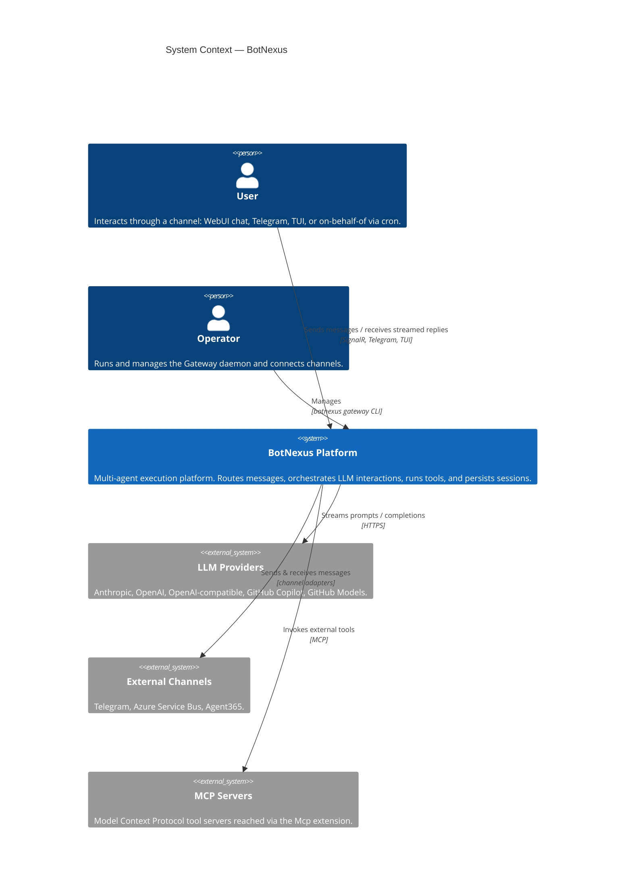
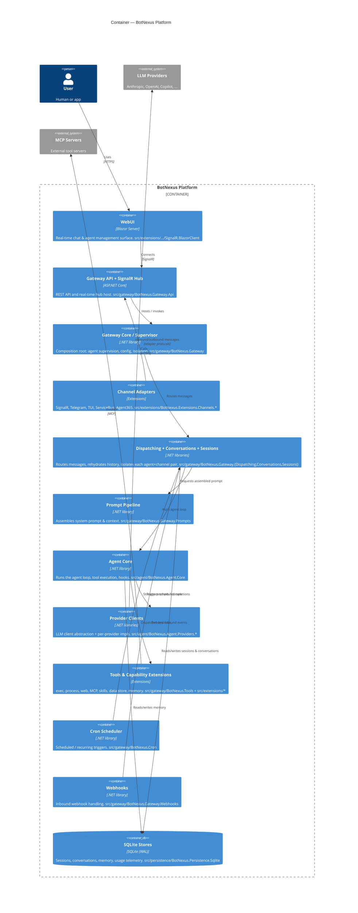

# BotNexus C4 Diagrams

**Status:** Second slice — C4 model diagrams (partially addresses #220)
**Scope:** [C4 model](https://c4model.com/) System Context and Container views for the
BotNexus platform, expressed in [Mermaid](https://mermaid.js.org/) so they render in both
GitHub Markdown preview and the published MkDocs site. Every element below is grounded in
the real `src/` layout — no components are invented.

This complements the [arc42-lite overview](README.md) (§3 Context and §5 Building Blocks)
by providing the visual System Context (Level 1) and Container (Level 2) views the
overview refers to.

---

## Level 1 — System Context

Who and what interacts with BotNexus, and why.

**Notes**

- The **User** reaches the platform only through a **channel** — routing is
  channel-centric, never a direct agent call.
- **LLM Providers** are pluggable; each provider is a separate
  `BotNexus.Agent.Providers.*` library depending only on `Providers.Core`.
- **MCP Servers** are external tool servers reached through the
  `BotNexus.Extensions.Mcp` / `.McpInvoke` extensions.

---

## Level 2 — Container

The runtime containers inside the BotNexus platform boundary and how they collaborate.
Each container maps to real projects under `src/`.

**Container-to-project mapping (verified against `src/`)**

| Container | Real project(s) |
|-----------|-----------------|
| WebUI | `src/extensions/BotNexus.Extensions.Channels.SignalR.BlazorClient(.Core/.Mobile)` |
| Gateway API + SignalR Hub | `src/gateway/BotNexus.Gateway.Api` |
| Gateway Core / Supervisor | `src/gateway/BotNexus.Gateway` |
| Channel Adapters | `src/extensions/BotNexus.Extensions.Channels.{SignalR,Telegram,Tui,ServiceBus,Agent365}` |
| Dispatching / Conversations / Sessions | `src/gateway/BotNexus.Gateway.{Dispatching,Conversations,Sessions}` |
| Prompt Pipeline | `src/gateway/BotNexus.Gateway.Prompts` |
| Agent Core | `src/agent/BotNexus.Agent.Core` |
| Provider Clients | `src/agent/BotNexus.Agent.Providers.{Core,Anthropic,OpenAI,OpenAICompat,Copilot,GitHubModels,IntegrationMock}` |
| Tools & Capabilities | `src/gateway/BotNexus.Tools`, `src/extensions/BotNexus.Extensions.{ExecTool,ProcessTool,WebTools,Mcp,McpInvoke,Skills,Qmd,DataStore,DebugTool,AudioTranscription}`, `src/gateway/BotNexus.Memory` |
| Cron Scheduler | `src/gateway/BotNexus.Cron` |
| Webhooks | `src/gateway/BotNexus.Gateway.Webhooks` |
| SQLite Stores | `src/persistence/BotNexus.Persistence.Sqlite` |

---

## Level 3 — Component (deferred)

Per-container component decompositions (e.g. the internals of the Dispatching or
Agent Core containers) are a follow-up slice. See the
[runtime view](runtime-view.md) for sequence-level detail in the meantime.

---

## Related

- [arc42-lite overview](README.md)
- [Runtime view — sequence diagrams](runtime-view.md)
- [ADR index](adr/README.md)
