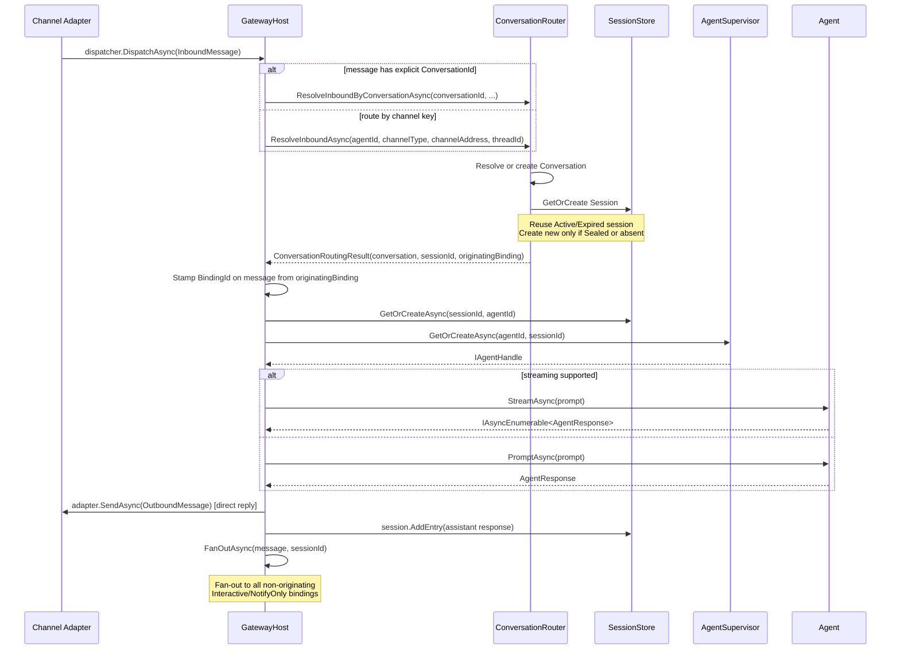
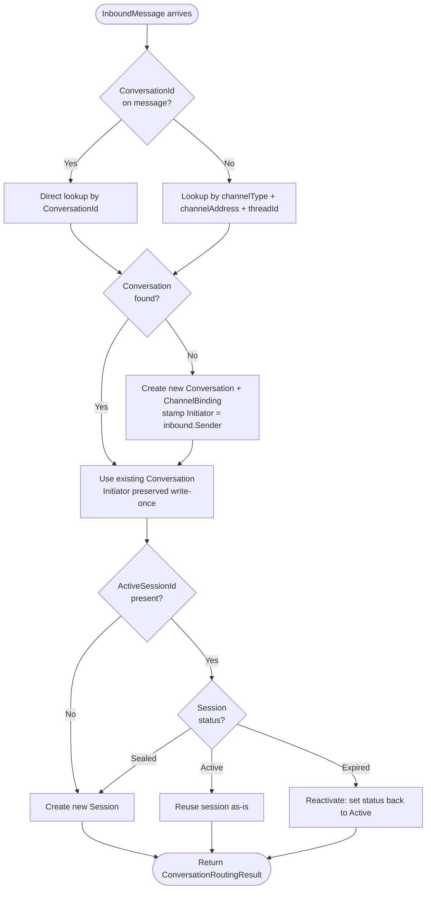
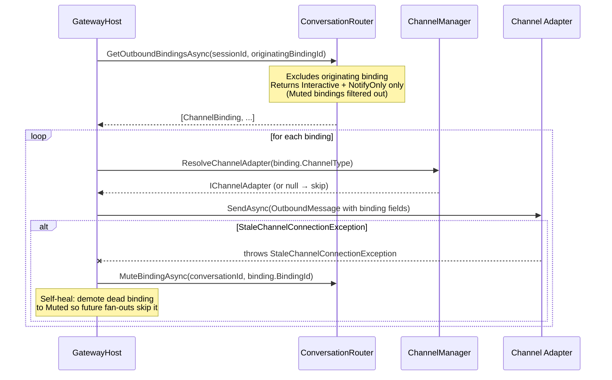
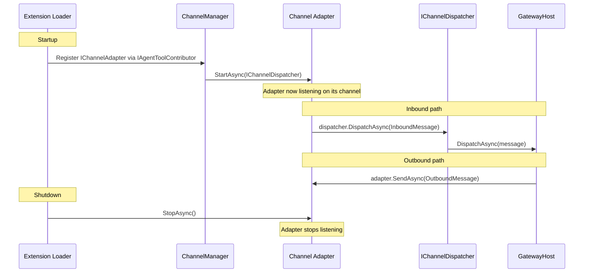

# Gateway Flow Diagrams

Architectural diagrams for the BotNexus gateway message processing pipeline.
Focus: gateway core. Channel-specific details (Telegram, SignalR) are deliberately omitted.

---

## Diagram 1 — Inbound Message Flow

---

## Diagram 2 — Conversation & Session Resolution

---

## Diagram 3 — Outbound Fan-out

---

## Diagram 4 — Channel Extension Lifecycle

---

## Strong Types — Status

All channel-addressing fields have been migrated to strong types (completed in PR #171/#172/#173).

| Field / Parameter | Type | Notes |
|---|---|---|
| `ChannelBinding.ChannelAddress` | `ChannelAddress` | Value type; `ChannelAddress.Empty` for addressless channels (e.g. portal SignalR) |
| `ChannelBinding.ThreadId` | `ThreadId?` | Nullable; `ThreadId.FromNullable()` for optional thread context |
| `InboundMessage.ChannelAddress` | `ChannelAddress` | Required on all inbound messages |
| `InboundMessage.ThreadId` | `ThreadId?` | Nullable thread context |
| `OutboundMessage.ChannelAddress` | `ChannelAddress` | Required on all outbound messages |
| `OutboundMessage.ThreadId` | `ThreadId?` | Nullable thread context |
| `StaleChannelConnectionException.ConversationId` | `ConversationId` | Was `string` — now strong type |

### Remaining string boundaries

| Field | Location | Note |
|---|---|---|
| `InboundMessage.SenderId` | `InboundMessage` | Wire-level audit/allow-list token (channel-native, e.g. SignalR connection id). Phase 2c (#526) added the companion `InboundMessage.Sender` of typed `CitizenId`; the legacy hand-rolled `SenderId` value-object struct was deleted in the same change since the typed identity now lives on `Sender`. |
| `CrossWorldRelayRequest.ChannelAddress` | DTO | Intentionally string for HTTP wire format |
| Streaming `conversationId` | `IStreamEventChannelAdapter` | Channel-specific encoding; strong type would need format changes |

---

## Conversation.Initiator (provenance)

Phase 2b (#529) added `Conversation.Initiator` of type `CitizenId?` to record **who first
caused the conversation to be created**. Distinct from `Conversation.AgentId` (current
agent owner): `Initiator` is **write-once at creation time** and never overwritten — even
when an archived conversation is re-opened or the agent assignment changes.

**Stamping path:**

| Producer | Initiator value | Source |
|---|---|---|
| Channel-driven inbound (SignalR, Telegram, ServiceBus, TUI, ...) | `inbound.Sender` (always a `CitizenId`) | `DefaultConversationRouter` via `GatewayHost` / `DefaultConversationDispatcher` |
| `ConversationTool.NewAsync` (agent-initiated) | `CitizenId.Of(agentId)` | `ConversationTool` |
| `HeartbeatTrigger` / `CronTrigger` (system-initiated for an agent) | `CitizenId.Of(agentId)` | trigger code |
| `ConversationsController.Create` (REST admin path) | `null` (no trustworthy citizen until #527 lands) | controller; left explicit with `// pending SignalR claims-based auth (#527)` |

**Write-once discipline:** the router only stamps `Initiator` on the create-new-conversation
branch (Diagram 2 box F). Existing conversations — including the archived-reopen and
`explicit-ConversationId` fast-path branches — preserve the original `Initiator` even if
the current inbound message carries a different `Sender`.

**Query path:** `IConversationStore.ListForCitizenAsync(CitizenId)` returns the **union**
of `Initiator == citizen` and (when the citizen is an agent) `AgentId == citizen.AsAgent`.
For user citizens the predicate degenerates to the initiator leg only — users do not own
conversations. SQLite implements this with a single `WHERE` clause so duplicates are
naturally deduplicated by the row identity.
