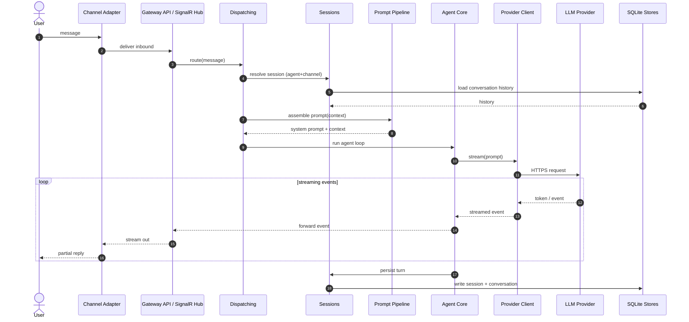
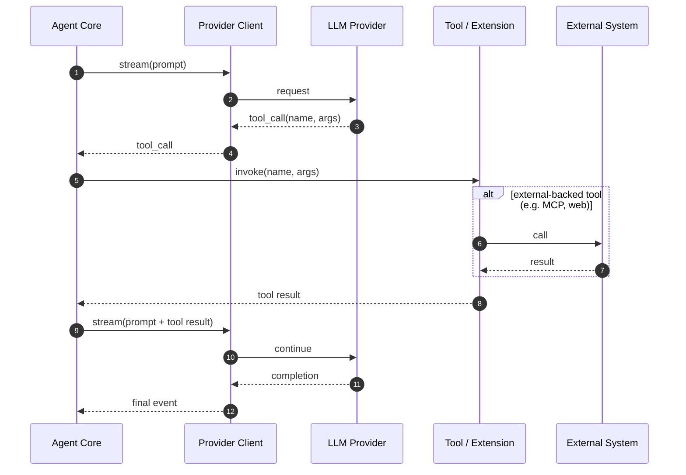

# BotNexus Runtime View

**Status:** Second slice — runtime view (partially addresses #220)
**Scope:** Key runtime scenarios expressed as [Mermaid](https://mermaid.js.org/)
sequence diagrams. These expand arc42 §6 (Runtime View) from the
[overview](README.md) and stay grounded in the real container set from the
[C4 diagrams](c4-diagrams.md).

The diagrams below describe collaboration between the **containers**, not internal
class detail. For a prose walkthrough see the existing
[message flow](../development/message-flow.md) and
[LLM request lifecycle](../development/llm-request-lifecycle.md) development docs.

---

## Scenario 1 — Inbound message → streamed reply

The core streaming path: a user message arrives on a channel and a streamed reply flows
back out.



---

## Scenario 2 — Tool call within the agent loop

When the model requests a tool, Agent Core dispatches to an extension and feeds the
result back into the loop before continuing.



**Notes**

- Tools include the built-in file tools (`BotNexus.Tools`) and capability extensions
  (`ExecTool`, `ProcessTool`, `WebTools`, `Mcp`/`McpInvoke`, `Skills`, `Qmd`,
  `DataStore`, `DebugTool`, `AudioTranscription`).
- Only externally-backed tools reach an **External System**; local tools (file, exec)
  return directly.

---

## Scenario 3 — Scheduled (cron) trigger

A recurring or run-later job wakes an agent with no live human on the channel. It reuses
the same dispatch/session path as an interactive message.

```mermaid
sequenceDiagram
    autonumber
    participant Cron as Cron Scheduler
    participant Disp as Dispatching
    participant Sess as Sessions
    participant AC as Agent Core
    participant Prov as Provider Client
    participant DB as SQLite Stores

    Cron->>Cron: schedule fires
    Cron->>Disp: trigger run(agent, payload)
    Disp->>Sess: resolve/create session
    Sess->>DB: load history
    Disp->>AC: run agent loop
    AC->>Prov: stream(prompt)
    Prov-->>AC: completion
    AC->>Sess: persist turn
    Sess->>DB: write
    Note over AC,DB: Completion is push-based;<br/>result surfaces on the bound channel when done.
```

---

## Related

- [arc42-lite overview](README.md) — §6 Runtime View
- [C4 diagrams](c4-diagrams.md)
- [ADR index](adr/README.md)
