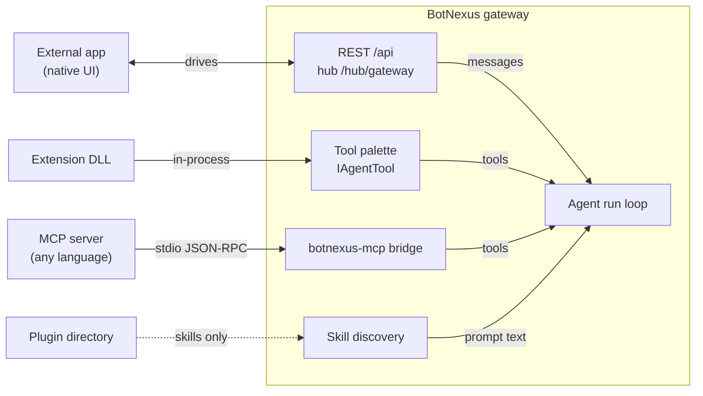

# App integration surfaces

How an existing application attaches to BotNexus, and which of the four surfaces each of its parts
belongs on. Written from the case that prompted it — a SwiftUI app someone wanted to "turn into a
plugin" — but the routing applies to any external application.

This page records what is **wired**, verified against `src/` and a running gateway rather than
against the surrounding documentation, which is ahead of the code in two places noted below.

## A plugin is not a container for an application

A **plugin** is a distribution bundle: skills, agents, commands, hooks and MCP server declarations
packaged so they install as one unit. Its manifest schema sets `additionalProperties: false` and has
no field for an assembly, no field for a UI and no field for a binary. Nothing that runs ships inside
one. See [Plugin architecture](../architecture/plugins.md) for the on-disk contract.

An **extension** is the surface that runs code. That distinction is the first thing to get right,
because "plugin" is the word most people arrive with and it points at the wrong contract.

## The four surfaces

| Surface | What it is | Runs your code | Can serve a UI |
|---|---|---|---|
| Plugin bundle | Directory with `.botnexus-plugin/plugin.json` | No | No |
| Extension | .NET library with `botnexus-extension.json`, loaded into its own `AssemblyLoadContext` | Yes, in-process | Yes, via `endpoint-contributor` |
| MCP server | Any binary over stdio, or an HTTPS/SSE endpoint, configured under `botnexus-mcp` | Yes, out-of-process | No |
| Client | An external app calling `/api` and the SignalR hub | Not on the gateway | It *is* the UI |



The two arrow kinds are different in a way the decision turns on. A client **drives** the agent — it
sends messages and renders events. An extension or MCP server **becomes part of** the agent — it adds
capability the model can reach. An app usually needs both, and that means two artefacts, not a
compromise between them.

## What plugin support actually wires

The plugin epic is built in slices and most of the lifecycle exists as tested library code. What is
missing is a caller.

| Capability | State | Evidence |
|---|---|---|
| Manifest parse and schema validation | Wired | `PluginManifestParser` loads the checked-in JSON Schema |
| Skills from `plugins/*/skills/` | Wired | `SkillsToolContributor`, `SkillPromptHookHandler` → `PluginSkillRootResolver` |
| Read API and portal page | Wired | `botnexus-plugins-api` deploys and loads; `GET /api/plugins`, portal `/plugins` |
| Install / update / remove | **No caller** | `PluginLifecycleManager` is referenced only by its own tests; no `plugin` verb in the CLI, no `POST /api/plugins` |
| Plugin-declared MCP servers | **No caller** | `PluginMcpServerRegistrar` is referenced only by its own tests |
| Plugin agents / commands / hooks | **Not built** | Nothing in `src/` discovers those directories |

So a correctly authored plugin has no supported route onto a gateway today, and a hand-placed one
would contribute only its `skills/` — and only if `installed-plugins.json` recorded it, which nothing
writes. `PluginSkillRootResolver` derives roots from that record rather than by enumerating
directories, deliberately: an unrecorded directory has no provenance and no removal manifest.

**Consequence for planning.** Do not make the plugin format the delivery mechanism for new
capability. Build it as an extension or an MCP server, both of which work today, and wrap it in a
plugin once install lands.

## Choosing a surface

Sort the application by what it mostly *is*.

| If the app is mostly… | Surface | What you build |
|---|---|---|
| Screens over data the agent should also reach | Client + extension | Keep the native client; add an extension exposing the same data as tools |
| Logic and integrations behind a thin UI | Extension | Reimplement the logic as `IAgentTool`s; drop or rebuild the UI |
| Logic you would rather not rewrite | MCP server | Wrap it in a server built for Linux `x86_64`, spawned over stdio |
| Bound to platform-specific frameworks | Client + MCP server | The host machine keeps the platform-only work and exposes it as an HTTPS/SSE MCP server |
| A front end for an existing agent | Client | A native alternative to the `/mobile` portal; no server-side work |

For the SwiftUI case specifically: the gateway runs on Linux, and while Swift runs there, **SwiftUI
does not exist on Linux**. No surface can host the existing view layer. The views either stay native
and become a client, or are rebuilt as web UI served by an extension.

## Client

The portal is itself only a client of these two surfaces, so anything it does an external app can do.
See [api-reference.md](../api-reference.md) and
[signalr-hub-contract.md](../signalr-hub-contract.md) for the full surface.

- REST base `/api`, authenticated with an `X-Api-Key` header or `?apiKey=`. `/health` and `/swagger`
  are exempt. Default rate limit is 60 requests per 60s per caller, answering `429` with
  `Retry-After`. Every `GET` accepts `?fields=` for sparse responses.
- The hub is **SignalR** at `/hub/gateway`, not a raw WebSocket: there is a `negotiate` handshake and
  a framed hub protocol above the socket. A client needs a SignalR implementation for its language,
  not a socket pointed at the URL.
- Identify the surface on the connection URL — `?client=mobile&clientVersion=…`. The gateway stamps
  the resolved value onto every inbound message as `clientKind`.
- Call `SubscribeAll` **and** `SubscribeAgents` after connecting and on every reconnect. They are
  separate verbs on purpose: `SubscribeAll`'s groups derive from existing sessions, so they cannot
  cover a conversation that does not exist yet.
- `RunStarted` / `RunEnded` bracket the whole loop and are the authoritative busy signal; `TurnEnd`
  is not. Handle `UserInputRequired` and answer with `RespondToAskUser`; those prompts are durable
  with no default timeout, so a freshly launched client should hydrate any outstanding one from
  `GET /api/agents/{agentId}/conversations/{conversationId}/pending-ask-user`.

Note that the top-level `apiKey` in `config.json` is the *gateway's* auth key, not a provider
credential. Setting it also locks the web portal, so enable it only once every client can send the
header.

## Extension

The full contract is [extension-development.md](../extension-development.md). Three things that page
does not make obvious, or gets wrong:

**The tool chapter is stale.** It teaches `ITool`, `ToolDefinition` and `BotNexus.Core.Abstractions`.
The current contract is `IAgentTool` in `BotNexus.Agent.Core.Tools` — which the same page's own
manifest table states correctly, and which every shipped extension uses. Follow the table, not the
chapter. `ProcessTool`, `DebugTool` and `ExecTool` are accurate references.

**`CopyLocalLockFileAssemblies` is not optional.** Extensions load into an isolated
`AssemblyLoadContext` that cannot resolve a managed dependency the host has not already loaded, and
library projects do not copy their transitive closure by default. Omitting it yields a
`FileNotFoundException` at load or dispose time that can take the host down.

**Registrations are pruned in silence.** The loader registers every discovered type as a singleton
activated through the host container. If one constructor parameter cannot be supplied, the whole
registration is dropped and the message is logged at **Information**, not Warning:

```
[INF] Pruned extension service registration
'IAgentToolContributor->BotNexus.Extensions.DebugTool.DebugToolContributor'
because it cannot be activated by the host container (no public constructor whose
parameters are all resolvable from the host container). The gateway will start without it.
```

Five services were pruned on one recent boot, including two tool contributors that consequently
contribute nothing. Either give the type a fully DI-resolvable constructor or ship an
`IExtensionRegistrar` that builds it yourself — and grep the boot log for `Pruned` after every
deploy. A tool that never registered is indistinguishable from a tool the model chose not to call.

Deploy the **whole** output directory (`rsync -a --delete`, excluding `botnexus-extension.json`,
which is authored rather than built). Extension DLLs under `~/.botnexus/extensions/` are a separate
copy from the build tree, and a running gateway holds them memory-mapped — a redeploy over a live
gateway fails on a locked `.pdb`.

### Serving a UI from an extension

An extension declaring `endpoint-contributor` can serve a complete SPA; that is how the portal
arrives. `SignalREndpointContributor` maps the hub and then serves a Blazor app from a `blazor/`
folder inside its own extension directory, with a second copy mounted under `/mobile`.

Two constraints. `endpoint-contributor` and `api-contributor` force a **non-collectible** load
context, because ASP.NET emits types at runtime for typed hub proxies — such an extension cannot be
unloaded. And there is **no seam for contributing a portal nav entry**: the navigation is compiled
into the Blazor client, so extension UI lives at its own path rather than as a portal tab.

Use `api-contributor` when only JSON endpoints are needed; it supplies a `RouteGroupBuilder` already
namespaced under `/api/extensions/{id}/`, which makes route collisions impossible.

## MCP server

The only surface that runs non-.NET code server-side. See [extensions/mcp.md](../extensions/mcp.md)
for the full configuration.

Stdio spawns the binary as a subprocess, so it must be built for the gateway's platform. HTTP/SSE
connects outward to a server hosted elsewhere, which is the escape hatch for anything that genuinely
needs a specific OS: run the MCP server on that machine and give the gateway its URL.

Four rules the transport enforces, none of which surface as a startup error:

- A server carrying credentials (`auth`, or an `Authorization` header) **must** use `https`.
  Plaintext non-loopback is refused: the server is skipped and contributes no tools. Loopback `http`
  is the deliberate exception.
- HTTP redirects are not followed, so a bearer token cannot be replayed to another host.
- `inheritEnv` defaults to `true`, handing the subprocess every environment variable the gateway
  has. Set it `false`.
- `botnexus-mcp` ships `configSchema: []`, so none of its keys are manifest-validated. A typo in a
  server key produces no warning at all; failures surface per server at connect time.

## Plugin bundle

Worth authoring for the future, not for delivery today. Layout is discovered by convention; the
manifest's path fields exist only to override an unconventional one.

```text
your-plugin/
  .botnexus-plugin/
    plugin.json        # the only required file
  skills/              # the only part wired today
  agents/
  commands/
  hooks/
  .mcp.json
```

Only `name` is required, and it must be lowercase kebab-case. The manifest adopts the Claude Code
field set so plugins authored for that ecosystem port without translation. Rejection is strict: a
misspelled field such as `"skilz"` is an error rather than a silently ignored key.

Plugin skills join the merge at the global tier, with precedence `Plugin < Global < Agent <
Workspace` — a plugin may add capability but never displaces a skill the operator wrote.

This is where a converted application's *domain knowledge* belongs: the rules its UI flow encoded
implicitly, written out so the agent applies them. A tool tells the agent how to call something; a
skill tells it when and why. See [skills.md](../skills.md) for the `SKILL.md` format.

## The shared failure mode

A missing manifest, an unresolvable constructor, an unvalidated config key, a credentialed MCP server
on a plaintext URL and an unrecorded plugin all produce a gateway that starts cleanly and does less
than the author believes. This is the same class as the eight embedder defects catalogued elsewhere
in this tree: **silence is a valid answer, and it looks exactly like success.**

Verify from the running system — the boot log, the API, the portal — never from the source just
written.

## Related

- [Plugin architecture](../architecture/plugins.md) — on-disk contract and lifecycle
- [Extension development](../extension-development.md) — full manifest and authoring contract
- [MCP extension](../extensions/mcp.md) — server configuration and transports
- [SignalR hub contract](../signalr-hub-contract.md) — hub methods and server events
- [API reference](../api-reference.md) — REST surface and authentication
- [Skills guide](../skills.md) — `SKILL.md` format and discovery
