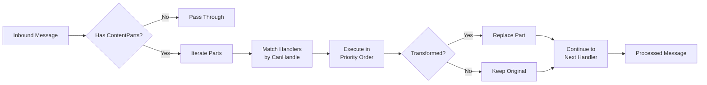

# Creating Media Handlers

Media handlers process non-text content — audio, images, video, and other binary formats — in the BotNexus media pipeline. This guide walks through the pipeline architecture and shows how to build a custom handler extension.

---

## How the Pipeline Works

When a message arrives with `ContentParts`, the `MediaPipeline` processes each part through registered handlers:



For each content part, the pipeline:

1. Iterates through registered `IMediaHandler` instances in **priority order** (lowest value first)
2. Calls `CanHandle()` on each handler — if `true`, calls `ProcessAsync()`
3. If the handler returns `WasTransformed = true`, the transformed part replaces the original and continues through remaining handlers
4. If a handler **throws**, the pipeline logs a warning and passes the part through unchanged — one failing handler never breaks the message flow

!!! info "Pipeline composition"
    Multiple handlers can process the same part sequentially. For example, a validation handler (priority 10) could check file size, then a transcription handler (priority 50) converts audio to text, and a metadata handler (priority 150) enriches the result.

---

## Content Model

The `MessageContentPart` hierarchy represents multi-modal message content:

| Type | Description | Key Properties |
|------|-------------|---------------|
| `TextContentPart` | Plain text content | `MimeType`, `Text` |
| `BinaryContentPart` | Inline binary data (≤1 MB) | `MimeType`, `Data` (byte[]), `FileName?` |
| `ReferenceContentPart` | Large/external media (>1 MB or pre-stored) | `MimeType`, `Uri`, `SizeBytes?`, `FileName?` |

All types inherit from `MessageContentPart` and require a `MimeType` property.

```csharp
// Base type
public abstract record MessageContentPart
{
    public required string MimeType { get; init; }
}

// Text
public sealed record TextContentPart : MessageContentPart
{
    public required string Text { get; init; }
}

// Binary (inline data)
public sealed record BinaryContentPart : MessageContentPart
{
    public required byte[] Data { get; init; }
    public string? FileName { get; init; }
}

// Reference (URI-based)
public sealed record ReferenceContentPart : MessageContentPart
{
    public required string Uri { get; init; }
    public long? SizeBytes { get; init; }
    public string? FileName { get; init; }
}
```

---

## Creating a Handler

### 1. Create an Extension Project

```bash
dotnet new classlib -n BotNexus.Extensions.MyHandler
dotnet sln BotNexus.slnx add extensions/BotNexus.Extensions.MyHandler/BotNexus.Extensions.MyHandler.csproj
```

Add a reference to the contracts project:

```xml
<ProjectReference Include="..\..\src\gateway\BotNexus.Gateway.Contracts\BotNexus.Gateway.Contracts.csproj" />
```

### 2. Implement `IMediaHandler`

The handler interface lives in `BotNexus.Gateway.Abstractions.Media`:

```csharp
public interface IMediaHandler
{
    /// <summary>Display name for logging/diagnostics.</summary>
    string Name { get; }

    /// <summary>Priority for handler ordering. Lower values execute first.</summary>
    int Priority => 100;

    /// <summary>Determines whether this handler can process the given content part.</summary>
    bool CanHandle(MessageContentPart contentPart);

    /// <summary>Processes a content part, potentially transforming it.</summary>
    Task<MediaProcessingResult> ProcessAsync(
        MessageContentPart contentPart,
        MediaProcessingContext context);
}
```

Here's a complete example — an image description handler:

```csharp
using BotNexus.Gateway.Abstractions.Media;
using BotNexus.Gateway.Abstractions.Models;
using Microsoft.Extensions.Logging;

namespace BotNexus.Extensions.ImageDescription;

public sealed class ImageDescriptionHandler : IMediaHandler
{
    private readonly ILogger<ImageDescriptionHandler> _logger;

    public ImageDescriptionHandler(ILogger<ImageDescriptionHandler> logger)
    {
        _logger = logger;
    }

    public string Name => "image-description";
    public int Priority => 100;

    public bool CanHandle(MessageContentPart contentPart)
        => contentPart is BinaryContentPart b
           && b.MimeType.StartsWith("image/", StringComparison.OrdinalIgnoreCase);

    public async Task<MediaProcessingResult> ProcessAsync(
        MessageContentPart contentPart,
        MediaProcessingContext context)
    {
        var binary = (BinaryContentPart)contentPart;

        _logger.LogInformation(
            "Describing {MimeType} image ({Size} bytes) for session {SessionId}",
            binary.MimeType, binary.Data.Length, context.SessionId);

        var description = await DescribeImageAsync(binary.Data, context.CancellationToken);

        return new MediaProcessingResult
        {
            ProcessedPart = new TextContentPart
            {
                MimeType = "text/plain",
                Text = $"[Image description: {description}]"
            },
            WasTransformed = true,
            Metadata = new Dictionary<string, object?>
            {
                ["handler"] = Name,
                ["original_mime"] = binary.MimeType,
                ["original_size"] = binary.Data.Length
            }
        };
    }

    private static async Task<string> DescribeImageAsync(
        byte[] imageData, CancellationToken ct)
    {
        // Your image analysis logic here
        await Task.Delay(100, ct); // placeholder
        return "A sample image description";
    }
}
```

### 3. Understanding the Context and Result Types

**`MediaProcessingContext`** provides session information to your handler:

```csharp
public sealed record MediaProcessingContext
{
    /// <summary>Session ID the message belongs to.</summary>
    public required string SessionId { get; init; }

    /// <summary>Channel the message arrived from (e.g., "signalr").</summary>
    public required string ChannelType { get; init; }

    /// <summary>Cancellation token.</summary>
    public CancellationToken CancellationToken { get; init; }
}
```

**`MediaProcessingResult`** tells the pipeline what happened:

```csharp
public sealed record MediaProcessingResult
{
    /// <summary>The processed content part (may be same as input).</summary>
    public required MessageContentPart ProcessedPart { get; init; }

    /// <summary>Whether this handler transformed the content.</summary>
    public bool WasTransformed { get; init; }

    /// <summary>Optional metadata (duration, model used, etc.).</summary>
    public IReadOnlyDictionary<string, object?>? Metadata { get; init; }
}
```

!!! tip "When to set `WasTransformed`"
    Only set `WasTransformed = true` when your handler meaningfully changed the content. If you only read or validated the part without changing it, return the original part with `WasTransformed = false`. The pipeline uses this flag to decide whether to log transformation events and update telemetry counters.

### 4. Create an Extension Manifest

Create a `botnexus-extension.json` in your project root:

```json
{
    "id": "my-image-handler",
    "name": "Image Description Handler",
    "version": "1.0.0",
    "entryAssembly": "BotNexus.Extensions.ImageDescription.dll",
    "extensionTypes": ["media-handler"]
}
```

| Field | Description |
|-------|-------------|
| `id` | Unique identifier for the extension |
| `name` | Human-readable display name |
| `version` | SemVer version string |
| `entryAssembly` | DLL filename (not path) |
| `extensionTypes` | Array of capabilities — use `"media-handler"` for media handlers |

### 5. Deploy the Extension

Build and copy the output to the BotNexus extensions folder:

```bash
dotnet publish -c Release
```

Copy the published output to your extensions directory. BotNexus discovers extensions via the manifest file at startup.

---

## Error Handling

The pipeline wraps each handler call in a try/catch:

- If `ProcessAsync()` throws, the exception is logged as a warning and the **original content part passes through unchanged**
- The pipeline **stops calling further handlers** for that part after a failure (breaks the handler chain)
- Other content parts in the same message continue processing normally

This means your handler doesn't need defensive try/catch around its entire body — but you should still handle expected failure modes gracefully and return meaningful results when possible.

---

## Priority Guidelines

Handler priority determines execution order. Lower values run first.

| Range | Use Case | Examples |
|-------|----------|----------|
| **1–49** | Pre-processing | Validation, size checks, format detection |
| **50–99** | Primary transforms | Audio transcription, OCR, image-to-text |
| **100–149** | Secondary transforms | Summarization, translation, description |
| **150+** | Post-processing | Metadata enrichment, logging, analytics |

!!! example "Built-in handler priorities"
    The `WhisperTranscriptionHandler` uses priority **50** — placing it in the primary transform range so it runs early enough for downstream handlers to process the transcribed text.

---

## Real-World Example: Whisper Audio Transcription

The built-in `WhisperTranscriptionHandler` is a good reference for production-quality handlers. Key patterns it demonstrates:

- **MIME type filtering** via a configurable `SupportedMimeTypes` list
- **Lazy initialization** of the Whisper model (loaded on first use)
- **Concurrency control** with `SemaphoreSlim` to limit parallel transcriptions
- **Rich metadata** including duration, segment count, and model path
- **`IAsyncDisposable`** for proper cleanup of native resources

```csharp
// Simplified from WhisperTranscriptionHandler
public bool CanHandle(MessageContentPart contentPart)
    => contentPart is BinaryContentPart binary
       && _options.SupportedMimeTypes.Contains(
           binary.MimeType, StringComparer.OrdinalIgnoreCase);

public async Task<MediaProcessingResult> ProcessAsync(
    MessageContentPart contentPart, MediaProcessingContext context)
{
    var binary = (BinaryContentPart)contentPart;

    await _concurrencyGate.WaitAsync(context.CancellationToken);
    try
    {
        using var processor = _factory.CreateBuilder()
            .WithLanguage(_options.Language)
            .Build();

        using var stream = new MemoryStream(binary.Data);
        var segments = new List<string>();

        await foreach (var segment in processor.ProcessAsync(
            stream, context.CancellationToken))
        {
            segments.Add(segment.Text);
        }

        return new MediaProcessingResult
        {
            ProcessedPart = new TextContentPart
            {
                MimeType = "text/plain",
                Text = string.Join(" ", segments).Trim()
            },
            WasTransformed = true,
            Metadata = new Dictionary<string, object?>
            {
                ["transcription.segments"] = segments.Count,
                ["transcription.original_mime"] = binary.MimeType,
                ["transcription.original_size"] = binary.Data.Length
            }
        };
    }
    finally
    {
        _concurrencyGate.Release();
    }
}
```

See the full implementation in `extensions/BotNexus.Extensions.AudioTranscription/`.

---

## Observability

The `MediaPipeline` emits telemetry counters automatically:

| Counter | Description |
|---------|-------------|
| `MediaPartsProcessed` | Total content parts entering the pipeline |
| `MediaPartsTransformed` | Parts successfully transformed by a handler |
| `MediaHandlerErrors` | Handler failures (exceptions caught) |

All counters include `botnexus.channel.type` and `botnexus.session.id` tags. Transformed parts also include `botnexus.media.handler.name`.

Use standard .NET logging and the [observability](../observability.md) infrastructure to monitor your handlers in production.

---

## Transport: SignalR Integration

Media content reaches the pipeline through the `SendMessageWithMedia` SignalR hub method. The WebUI sends `MediaContentPartDto` objects with base64-encoded binary data:

```csharp
public sealed record MediaContentPartDto
{
    public required string MimeType { get; init; }
    public string? Base64Data { get; init; }  // Binary content
    public string? Text { get; init; }        // Text content
    public string? FileName { get; init; }
}
```

The hub converts DTOs to domain `MessageContentPart` instances before dispatching. Your handler only needs to work with the domain types — transport encoding is handled automatically.

---

## Summary

To create a media handler:

1. **Create a class library** referencing `BotNexus.Gateway.Contracts`
2. **Implement `IMediaHandler`** with `Name`, `Priority`, `CanHandle()`, and `ProcessAsync()`
3. **Add a `botnexus-extension.json`** manifest with `"extensionTypes": ["media-handler"]`
4. **Deploy** to the extensions directory

The pipeline handles discovery, ordering, error isolation, and telemetry — you just write the processing logic.
