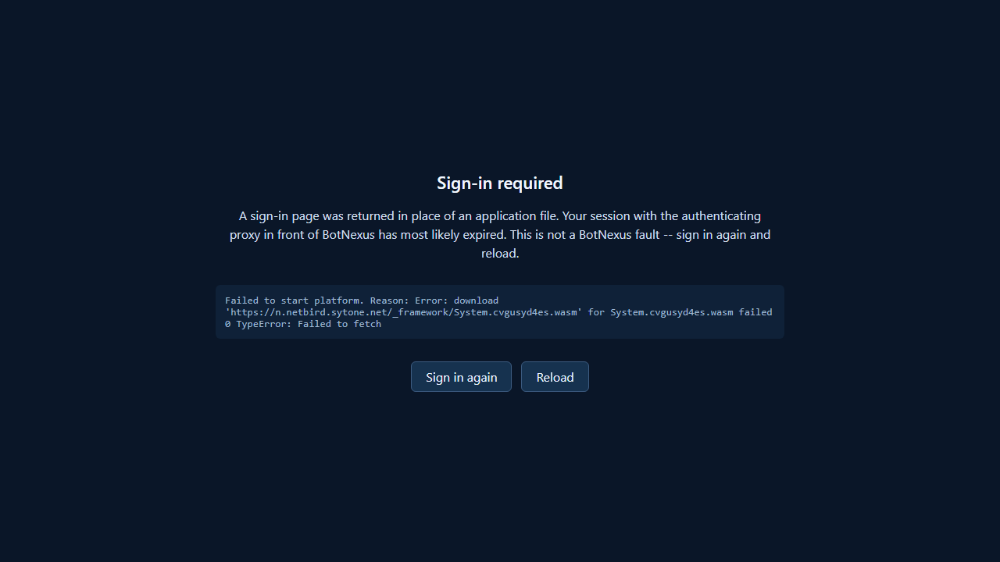
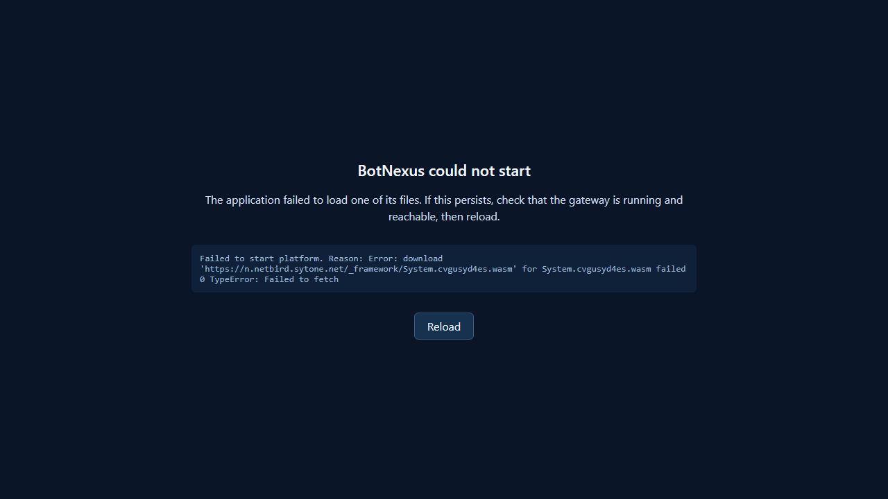

# Portal Boot-Failure Diagnostics

When the Blazor WebAssembly portal fails to start, it renders an actionable on-screen panel
instead of leaving the "Loading BotNexus..." spinner up indefinitely.

## Why this exists

The portal's host page ships a static `.loading-screen` div that Blazor replaces once the app has
booted. With Blazor's default autostart, a failed boot rejects the start promise with nothing
attached to it: the loading screen is never torn down, no error is rendered, and the only diagnosis
available is the browser devtools console. `#blazor-error-ui` does not cover this case — it is
Blazor's *runtime* error bar and is not shown for a pre-start platform failure.

## The auth-interstitial problem

The harder half of this is telling two very different failures apart.

When an authenticating reverse proxy (for example an OAuth2 proxy in front of the gateway) receives
an unauthenticated request for a sub-resource, it may answer `200 OK` with an **HTML login page**
instead of `401` or `302`. Blazor hashes that HTML, the digest does not match `blazor.boot.json`,
and the browser blocks the resource under Subresource Integrity (SRI).

SRI failures reach the fetch API as an opaque `TypeError: Failed to fetch`. **The real cause — an
expired sign-in session — is erased before any application code can observe it**, and the resulting
error text is byte-for-byte identical to a genuine platform fault. The console output points the
reader at Blazor, SRI and the .NET runtime, all three of which are working correctly.

The only way to distinguish them is to re-probe a `_framework/` path after the failure and inspect
the response content type. A `text/html` body on that path means an interstitial, not a fault in
BotNexus.

## Behaviour

`wwwroot/js/bootDiagnostics.js` exposes `window.BotNexusBoot.startBlazor()`. Both host pages load
the Blazor script with `autostart="false"` and start through it, so a boot failure can never become
an unhandled rejection.

On rejection it:

1. Re-probes `/_framework/blazor.boot.json` at the **origin** (not the app's `<base href>`, which
   differs between the desktop and mobile clients).
2. Classifies the failure:

   | Probe result | Classification | Panel |
   |---|---|---|
   | Response content type contains `html` | `auth-interstitial` | "Sign-in required" — states the proxy session likely expired, explicitly says this is **not** a BotNexus fault, and offers a "Sign in again" link to the origin root |
   | Any other content type | `platform` | "BotNexus could not start" — suggests checking that the gateway is running |
   | Probe itself fails | `platform` | as above |

3. Replaces the entire contents of `#app`, which is what removes the spinner. Leaving the spinner
   beside an error panel would be worse than either alone.
4. Renders the underlying error text verbatim (HTML-escaped) plus a reload control.
5. Reports the **classified** cause through the `errorReporting.js` seam, so the gateway's
   `Channel error reported` entry carries the actual cause rather than the erased `TypeError`.

Classification only reaches `auth-interstitial` on positive evidence of an HTML body. A probe that
fails stays `platform` rather than guessing — a fabricated auth diagnosis would be worse than a
generic one.

The panel's styling is inlined rather than taken from `app.css`, because the stylesheet may itself
be an asset the proxy intercepted.

## Surfaces

Both clients ship the handler; the mobile client is not exempt, since it has the same static loading
div and is reached through the same proxy.

- `src/extensions/BotNexus.Extensions.Channels.SignalR.BlazorClient/wwwroot/js/bootDiagnostics.js`
- `src/extensions/BotNexus.Extensions.Channels.SignalR.BlazorClient.Mobile/wwwroot/js/bootDiagnostics.js`

They are separate WebAssembly projects with separate `wwwroot` trees, so the script is physically
duplicated. `MobileBootFailureDiagnosticsTests` pins byte equality between the two copies so a fix
cannot land on one surface and silently miss the other.

## Screenshots

Auth interstitial (expired proxy session):

Genuine platform fault:

