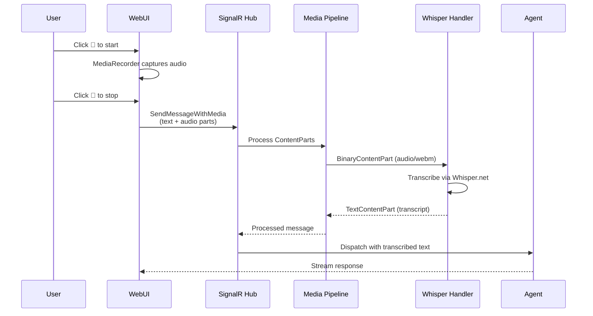

# Audio Recording

BotNexus supports voice messages through browser-based audio recording. Record audio directly in the WebUI, and it will be automatically transcribed and sent to your agent.

---

## Quick Start

1. Click the :material-microphone: **microphone button** in the chat input area
2. Allow microphone access when your browser prompts
3. Speak your message — the button shows :red_circle: while recording
4. Click the button again to stop recording
5. Optionally type additional text alongside the audio
6. Press **Send** — your audio is transcribed and sent to the agent

!!! tip "First time?"
    Your browser will ask for microphone permission on the first recording. Grant it once, and you're set for all future sessions.

---

## Setup

### Enable Audio Transcription

Audio transcription requires the **Whisper extension** and a GGML model file.

#### 1. Download a Whisper Model

Download a GGML-format Whisper model. Recommended options:

| Model | Size | Best For |
|-------|------|----------|
| `ggml-base.en.bin` | ~142 MB | English-only, fast, good accuracy |
| `ggml-small.en.bin` | ~466 MB | English-only, better accuracy |
| `ggml-base.bin` | ~142 MB | Multilingual |
| `ggml-small.bin` | ~466 MB | Multilingual, better accuracy |

Models are available from the [Whisper.net model repository](https://huggingface.co/sandrohanea/whisper.net/tree/main/classic).

#### 2. Place the Model File

Copy the `.bin` file to a location accessible by your BotNexus instance — for example, your BotNexus data directory.

#### 3. Configure the Extension

The Whisper extension supports the following configuration options:

| Option | Default | Description |
|--------|---------|-------------|
| `ModelPath` | *(required)* | Full path to the GGML model file |
| `Language` | `en` | Language code for transcription |
| `MaxConcurrency` | `1` | Maximum parallel transcription operations |
| `SupportedMimeTypes` | see below | Audio formats the handler accepts |

**Default supported formats:** `audio/wav`, `audio/mpeg`, `audio/mp3`, `audio/ogg`, `audio/webm`, `audio/flac`

!!! note
    The WebUI records audio as **WebM/Opus** (`audio/webm`), which is included in the defaults. No format configuration is needed for standard browser recording.

### Browser Requirements

- **Modern browser** with MediaRecorder API support — Chrome, Firefox, or Edge
- **Microphone permission** must be granted when prompted
- **HTTPS** is required (or `localhost` for local development)

!!! warning "Safari support"
    Safari has limited MediaRecorder support. For the best experience, use Chrome, Firefox, or Edge.

---

## How It Works

### Step by Step

1. **Recording** — The browser's MediaRecorder API captures audio from your microphone as WebM/Opus format
2. **Upload** — When you press Send, the audio is base64-encoded and sent alongside any typed text via the `SendMessageWithMedia` SignalR method
3. **Processing** — The media pipeline routes the audio `BinaryContentPart` to the Whisper transcription handler, which converts speech to text
4. **Response** — The transcribed text replaces the audio content part in the message and is processed by the agent like any other text input

---

## Tips

- **Combine voice and text** — Type context in the text box, then record a voice question. Both are sent together.
- **Quiet environment** — Background noise reduces transcription accuracy. Try to record in a quiet space.
- **Speak clearly** — Natural pace and clear enunciation give the best results.
- **Check the model** — Larger Whisper models (`small`, `medium`) are slower but more accurate. Start with `base.en` for English and upgrade if needed.
- **Monitor the indicator** — The recording indicator (:red_circle:) confirms the microphone is active. If it doesn't appear, check your browser's microphone permission.

---

## Troubleshooting

| Issue | Solution |
|-------|----------|
| Microphone button doesn't appear | Check that your browser supports MediaRecorder (Chrome, Firefox, Edge) |
| "Permission denied" error | Allow microphone access in your browser settings |
| Recording starts but no audio is captured | Verify your microphone is selected as the input device in your OS settings |
| Transcription returns empty or garbled text | Try a larger Whisper model, or check that the model file isn't corrupted |
| "Whisper model not found" error | Verify the `ModelPath` in your extension configuration points to the correct `.bin` file |
| Audio not processed (passes through as binary) | Ensure the Whisper extension is installed and loaded — check the startup logs |
| HTTPS error | Audio recording requires HTTPS. Use `localhost` for development or configure TLS |

For general troubleshooting, see the [Troubleshooting Guide](../user-guide/troubleshooting.md).
