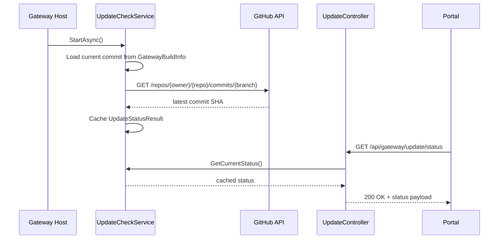
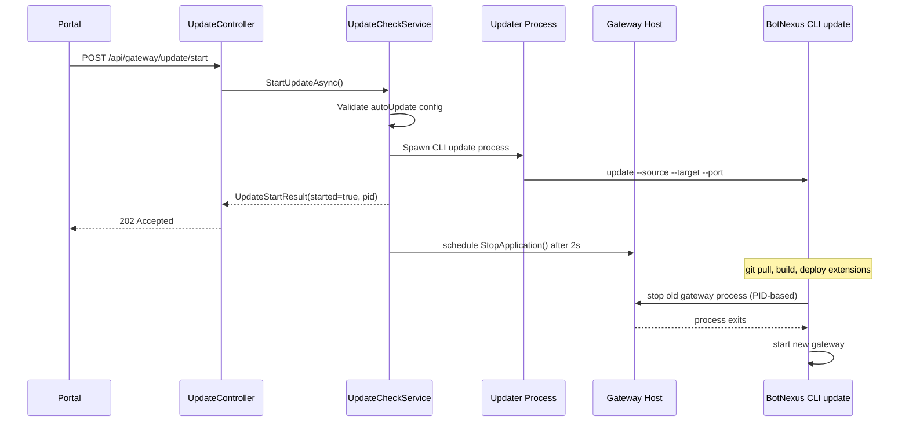
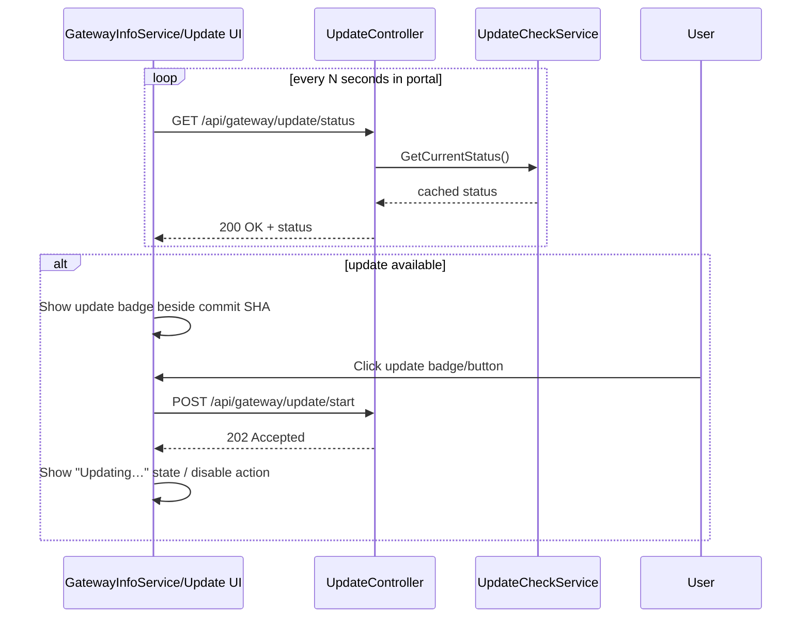

# Auto-update design review

## Key decisions

### 1. `UpdateCheckService` belongs in `BotNexus.Gateway`

Put the background polling service in `BotNexus.Gateway` and register it from `GatewayServiceCollectionExtensions` as a hosted service.

Why:
- Polling for upstream state is gateway runtime behavior, not API surface behavior.
- `BotNexus.Gateway.Api` should stay thin: controllers, DTOs, composition root.
- The service needs to be available to both controllers and any future non-HTTP consumers.
- Existing architecture already registers core hosted services from `BotNexus.Gateway` (`GatewayHost`, `SessionCleanupService`, `MemoryIndexer`, `AgentConfigurationHostedService`). This fits that pattern.

Recommendation:
- `UpdateCheckService` implements both a query contract and `IHostedService`.
- Register the concrete service once, then expose it as the interface and hosted service from DI.

### 2. GitHub polling contract

Use `HttpClient` with:
- `User-Agent: BotNexus/1.0`
- `Accept: application/vnd.github+json`

Endpoint:
- `GET https://api.github.com/repos/{owner}/{repo}/commits/{branch}`

Defaults:
- owner: `sytone`
- repo: `botnexus`
- branch: `main`
- interval: 60 minutes

These should be configurable because forks and release branches are valid deployment shapes.

### 3. Self-update invocation contract

Use explicit config for the two values the gateway cannot reliably infer at runtime:
- `gateway.autoUpdate.cliPath`
- `gateway.autoUpdate.sourcePath`

Do **not** depend on relative probing of `AppContext.BaseDirectory` as the primary contract. That is too fragile across:
- `dotnet <dll>` launches
- single-file/self-contained publish
- dev worktrees
- service manager launchers
- future packaging changes

Runtime resolution rules:
1. `cliPath` from config is authoritative.
2. `sourcePath` from config is authoritative.
3. `target` should come from `BotNexusHome` / `BOTNEXUS_HOME` runtime resolution already used by the gateway.
4. The port passed to CLI update should be derived from the configured listen URL at startup and cached as an integer.

Process launch shape:
- If `cliPath` ends with `.dll`, launch `dotnet "<cliPath>" update --source "<sourcePath>" --target "<targetPath>" --port <port>`
- Otherwise launch `"<cliPath>" update --source ...`

### 4. Shutdown timing and current CLI behavior

The API should:
1. validate prerequisites
2. spawn the update process
3. return `202 Accepted`
4. schedule `StopApplication()` after ~2 seconds

That delay is sufficient.

Important finding from current `UpdateCommand` implementation:
- It does **not** poll the gateway health endpoint waiting for shutdown before proceeding.
- It performs `git pull`, build, deploy, then calls `_processManager.StopAsync(home)`.
- `GatewayProcessManager.StopAsync` is PID-based and forceful, not an HTTP graceful shutdown.

That means the current child updater does **not** rely on the gateway to stop itself first. This is acceptable for v1 of the feature because:
- the spawned updater spends time on pull/build/deploy before attempting stop
- by the time it reaches stop, the API-triggered delayed shutdown will usually already be in progress or complete
- if the gateway is already down, `StopAsync` treats that as success

So no CLI change is strictly required for wave 1. A later hardening pass could add an explicit `--expect-external-shutdown` mode, but that is not necessary to ship the badge + self-update flow.

### 5. Portal badge should use a separate endpoint

Recommendation: add `GET /api/gateway/update/status` rather than extending `/api/gateway/info`.

Why:
- `GatewayInfoService` currently loads build/runtime info once after portal readiness; it is not a periodic poller.
- Update availability is dynamic and should be refreshed on a timer.
- `gateway/info` is stable build/runtime metadata; update state is operational state with fetch timestamps, errors, and in-progress flags.
- Keeping them separate avoids changing every existing `GatewayInfo` consumer when only the sidebar badge needs this state.

Portal behavior:
- Keep the existing one-time `gateway/info` load.
- Add a lightweight periodic poll for `update/status` in the same service or a new update-status service.
- Show the badge next to the footer SHA/restart metadata.

### 6. Config schema

Add a nested `AutoUpdateConfig` under `GatewaySettingsConfig`.

This is the minimum useful shape:
- `enabled`
- `checkIntervalMinutes`
- `repositoryOwner`
- `repositoryName`
- `branch`
- `cliPath`
- `sourcePath`
- `shutdownDelaySeconds`

No `targetPath` property is needed for wave 1 because the gateway already has a canonical runtime home path.

---

## Interface contracts

### `IUpdateCheckService`

```csharp
namespace BotNexus.Gateway.Updates;

public interface IUpdateCheckService
{
    UpdateStatusResult GetCurrentStatus();
    Task<UpdateStatusResult> CheckNowAsync(CancellationToken cancellationToken = default);
    Task<UpdateStartResult> StartUpdateAsync(CancellationToken cancellationToken = default);
}
```

Rationale:
- `GetCurrentStatus()` is synchronous because the service should expose cached state.
- `CheckNowAsync()` gives the controller and future admin tooling a way to force refresh.
- `StartUpdateAsync()` keeps process-spawn and concurrency logic in one place instead of in the controller.

### `UpdateStatusResult`

```csharp
namespace BotNexus.Gateway.Updates;

public sealed record UpdateStatusResult(
    bool Enabled,
    bool IsChecking,
    bool IsUpdateAvailable,
    bool IsUpdateInProgress,
    string CurrentCommitSha,
    string CurrentCommitShort,
    string? LatestCommitSha,
    string? LatestCommitShort,
    DateTimeOffset? LastCheckedAt,
    DateTimeOffset? NextCheckAt,
    string? RepositoryOwner,
    string? RepositoryName,
    string? Branch,
    string? CompareUrl,
    string? Error);
```

Notes:
- Include current and latest commit values so the portal does not have to join two payloads.
- Include `IsUpdateInProgress` so the UI can disable the button.
- Keep `Error` as a string for operator visibility without leaking exception details structurally.

### `UpdateStartResult`

```csharp
namespace BotNexus.Gateway.Updates;

public sealed record UpdateStartResult(
    bool Started,
    int? ProcessId,
    string Message);
```

### `GatewaySettingsConfig`

```csharp
public sealed class GatewaySettingsConfig
{
    public string? ListenUrl { get; set; }
    public string? DefaultAgentId { get; set; }
    public string? AgentsDirectory { get; set; }
    public string? SessionsDirectory { get; set; }
    public SessionStoreConfig? SessionStore { get; set; }
    public CompactionOptions? Compaction { get; set; }
    public CorsConfig? Cors { get; set; }
    public RateLimitConfig? RateLimit { get; set; }
    public string? LogLevel { get; set; }
    public Dictionary<string, ApiKeyConfig>? ApiKeys { get; set; }
    public ExtensionsConfig? Extensions { get; set; }
    public WorldIdentity? World { get; set; }
    public Dictionary<string, LocationConfig>? Locations { get; set; }
    public List<CrossWorldPermissionConfig>? CrossWorldPermissions { get; set; }
    public CrossWorldFederationConfig? CrossWorld { get; set; }
    public FileAccessPolicyConfig? FileAccess { get; set; }
    public string? ShellPreference { get; set; }
    public AutoUpdateConfig? AutoUpdate { get; set; }
}

public sealed class AutoUpdateConfig
{
    public bool Enabled { get; set; } = false;
    public int CheckIntervalMinutes { get; set; } = 60;
    public string RepositoryOwner { get; set; } = "sytone";
    public string RepositoryName { get; set; } = "botnexus";
    public string Branch { get; set; } = "main";
    public string? CliPath { get; set; }
    public string? SourcePath { get; set; }
    public int ShutdownDelaySeconds { get; set; } = 2;
}
```

Validation rules:
- if `Enabled == true`, `CliPath` is required
- if `Enabled == true`, `SourcePath` is required
- `CheckIntervalMinutes >= 5`
- `ShutdownDelaySeconds >= 1`

### `UpdateController`

```csharp
using BotNexus.Gateway.Updates;
using Microsoft.AspNetCore.Mvc;

namespace BotNexus.Gateway.Api.Controllers;

[ApiController]
[Route("api/gateway/update")]
public sealed class UpdateController(IUpdateCheckService updateCheckService) : ControllerBase
{
    [HttpGet("status")]
    [ProducesResponseType<UpdateStatusResult>(StatusCodes.Status200OK)]
    public ActionResult<UpdateStatusResult> GetStatus();

    [HttpPost("check")]
    [ProducesResponseType<UpdateStatusResult>(StatusCodes.Status200OK)]
    public async Task<ActionResult<UpdateStatusResult>> CheckNow(CancellationToken cancellationToken);

    [HttpPost("start")]
    [ProducesResponseType<UpdateStartResult>(StatusCodes.Status202Accepted)]
    [ProducesResponseType<UpdateStartResult>(StatusCodes.Status409Conflict)]
    [ProducesResponseType<UpdateStartResult>(StatusCodes.Status412PreconditionFailed)]
    public async Task<ActionResult<UpdateStartResult>> Start(CancellationToken cancellationToken);
}
```

HTTP behavior:
- `GET status` returns cached state.
- `POST check` forces an immediate GitHub refresh.
- `POST start` returns:
  - `202 Accepted` when updater process spawned successfully
  - `409 Conflict` when an update is already in progress
  - `412 PreconditionFailed` when config/prerequisites are missing (`cliPath`, `sourcePath`, target home, invalid port)

---

## Sequence diagrams

### 1. Startup → first check → status available



### 2. User triggers update → gateway self-update flow



### 3. Portal polling → badge appears → user clicks



---

## Wave breakdown

### Wave 1 — Farnsworth (gateway)

Owns all server-side work:
- add `AutoUpdateConfig` to `GatewaySettingsConfig`
- add config validation / normalization
- implement `IUpdateCheckService` + `UpdateCheckService`
- register service in `GatewayServiceCollectionExtensions`
- create GitHub polling client logic with required headers
- create `UpdateController`
- implement process spawn logic for CLI update
- wire delayed `StopApplication()` after `202 Accepted`
- add update state to tests where appropriate
- add docs/example config if needed

Deliverable boundary:
- a running gateway can expose update status and trigger self-update via HTTP without portal changes

### Wave 2 — Fry (portal)

Owns all client-side work:
- add update-status polling to sidebar data flow
- add UI badge/button near footer commit SHA + restart time
- show latest commit short SHA / available state
- disable button and show progress when `IsUpdateInProgress`
- gracefully handle polling errors or disabled auto-update

Deliverable boundary:
- portal surfaces availability and can invoke the new endpoint cleanly

Why this split is clean:
- Farnsworth owns runtime/process/config concerns.
- Fry owns the Blazor sidebar and polling UX.
- Shared contract is only the `UpdateStatusResult` JSON shape and controller endpoints.

---

## Risks and mitigations

### 1. CLI path missing or wrong

Risk:
- gateway cannot start update process

Mitigation:
- treat `cliPath` as explicit required config when auto-update is enabled
- `POST /start` returns `412 Precondition Failed` with a clear operator message
- do not call `StopApplication()` unless process spawn succeeds

### 2. Source path missing or not a git repo

Risk:
- updater starts but fails during `git pull` / build

Mitigation:
- pre-validate `sourcePath` exists before spawn
- child updater remains responsible for repo/build validation
- keep the failure message in gateway logs and child process output

### 3. Gateway shuts down before HTTP response is flushed

Risk:
- portal sees network failure instead of accepted state

Mitigation:
- always return `202 Accepted` first
- schedule shutdown on a delayed background task after response path completes
- keep default delay at 2 seconds

### 4. Double-start / repeated clicks

Risk:
- multiple updater processes race

Mitigation:
- `UpdateCheckService` owns a single in-progress flag/lock
- `POST /start` returns `409 Conflict` when update already started
- portal disables the button while `IsUpdateInProgress`

### 5. Current CLI stop behavior is forceful, not graceful

Risk:
- abrupt process termination during shutdown window

Mitigation:
- acceptable for wave 1 because the current CLI already uses PID-based stop semantics
- the API-triggered graceful stop is additive, not relied upon for correctness
- later enhancement: teach CLI update to prefer `/api/gateway/shutdown` when self-updating local gateway

### 6. GitHub API failures or rate limiting

Risk:
- badge becomes stale or noisy

Mitigation:
- cache last known status
- surface transient error in `Error`
- do not clear a previously known `LatestCommitSha` just because one poll failed
- default hourly polling is safely under unauthenticated rate limits

### 7. Listen URL cannot be converted cleanly to a localhost port

Risk:
- gateway cannot construct `--port` value for CLI update

Mitigation:
- derive port once from configured `ListenUrl`
- if parsing fails, reject `POST /start` with `412 Precondition Failed`
- keep the contract explicit instead of guessing across multiple URLs or protocols

---

## Recommended implementation notes

- Keep `GatewayController.Info()` unchanged for wave 1 except possibly adding a link field later; do not overload it with update state.
- Store status in-memory only; no persistence is required.
- Make the first GitHub check run immediately on startup, then wait `CheckIntervalMinutes` between polls.
- Log at info level when an update first becomes available, debug level for normal polls, warning level for failures.
- Use `GatewayBuildInfo.CommitSha` as the local comparison value. If it is `unknown`, report status but never claim update availability.

## Proposed JSON example

```json
{
  "gateway": {
    "listenUrl": "http://localhost:5005",
    "autoUpdate": {
      "enabled": true,
      "checkIntervalMinutes": 60,
      "repositoryOwner": "sytone",
      "repositoryName": "botnexus",
      "branch": "main",
      "cliPath": "/home/jon/botnexus/src/gateway/BotNexus.Cli/bin/Debug/net10.0/BotNexus.Cli.dll",
      "sourcePath": "/home/jon/botnexus",
      "shutdownDelaySeconds": 2
    }
  }
}
```
