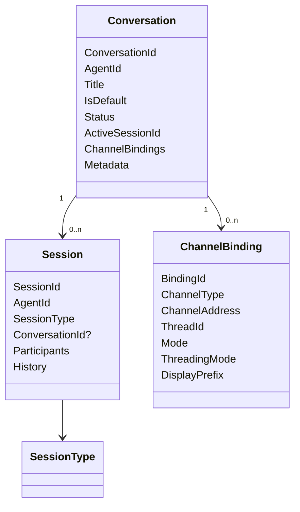
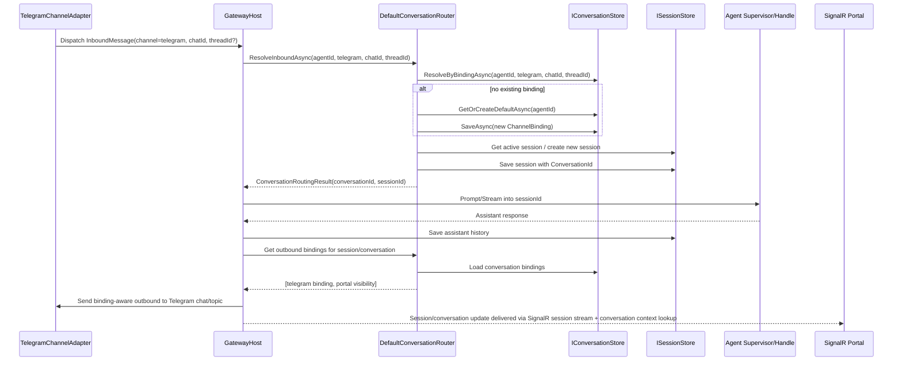

# Telegram Channel Readiness Audit

**Date:** 2026-05-02  
**Author:** Leela (architecture audit)  
**Scope:** conversation model correctness, channel abstraction readiness, and multi-channel conversation gaps before Telegram participates alongside SignalR.

---

## Executive summary

The codebase is **partially conversation-first**, but **not yet ready** for correct Telegram + SignalR shared conversations.

### What is already in place

- `Conversation`, `ChannelBinding`, `ConversationStatus`, `BindingMode`, and `ThreadingMode` exist.
- `IConversationStore`, `IConversationRouter`, and `DefaultConversationRouter` exist.
- `GatewayHost.ProcessInboundMessageAsync` **does call** `IConversationRouter.ResolveInboundAsync`.
- `GatewayHost.FanOutResponseAsync` is **implemented**, not stubbed.
- `SqliteConversationStore` persists conversations and bindings, including `thread_id` and `threading_mode`.
- `GatewayHub` has been partially moved to conversation-first routing via `ResolveOrCreateSessionAsync()` and `ResolveOrCreateSessionByConversationAsync()`.
- The Telegram adapter exists and can send/receive Telegram messages.

### The critical blockers

1. **`Session.ConversationId` is not persisted in `SqliteSessionStore`.**
   - The `Session` domain model has `ConversationId`.
   - `DefaultConversationRouter` stamps it.
   - But `SqliteSessionStore` neither creates a `conversation_id` column nor saves/loads it.
   - This breaks durable conversation/session linkage and makes conversation history/fan-out unreliable after reload.

2. **SignalR portal traffic is still keyed to transient connection/session ids instead of stable conversation identity.**
   - `GatewayHub.ResolveOrCreateSessionAsync()` uses `Context.ConnectionId` as the binding address.
   - `DispatchMessageAsync()` sends `ChannelAddress = session.SessionId.Value`.
   - `GatewayHost.ProcessInboundMessageAsync()` re-runs conversation routing on that session id/address combination.
   - That means SignalR is not cleanly acting as a conversation-first client surface yet.

3. **Telegram threading/binding policy is too generic for real Telegram semantics.**
   - Telegram inbound messages arrive with only `ChannelAddress = chatId`.
   - No Telegram topic/thread id is extracted or propagated.
   - No DM vs group/topic differentiation is made.
   - `DefaultConversationRouter` creates bindings with default `ThreadingMode` and no Telegram-specific policy.

4. **The conversation model does not explicitly model conversation type.**
   - The spec calls out user/agent, agent/agent, and agent/subagent conversations.
   - The code models those distinctions in `SessionType`, not in `Conversation`.
   - `ConversationStatus`, `ChannelBinding`, and `ThreadingMode` do not express those conversation classes.

5. **Multi-channel fan-out works only at a basic address level.**
   - `FanOutResponseAsync()` iterates bindings and sends to each adapter.
   - But `OutboundMessage` only carries `ChannelAddress`, not `ThreadId`, `ThreadingMode`, `DisplayPrefix`, or binding identity.
   - Adapters cannot reliably render thread-aware or prefix-aware outbound behavior from the current contract.

### Readiness assessment

**Telegram as a standalone channel:** close, but incomplete.  
**Telegram participating in the same conversation as SignalR:** **not ready yet**.

The most important missing work is:
- persist `Session.ConversationId`,
- make SignalR truly conversation-first,
- enrich outbound delivery contracts with binding/thread context,
- add Telegram-specific binding/threading rules.

---

## 1. Current state by concern

### 1.1 Conversation model correctness

#### What exists

`Conversation` currently contains:
- `ConversationId`
- `AgentId`
- `Title`
- `IsDefault`
- `Status`
- `CreatedAt`
- `UpdatedAt`
- `ActiveSessionId`
- `ChannelBindings`
- `Metadata`

`ChannelBinding` currently contains:
- `BindingId`
- `ChannelType`
- `ChannelAddress`
- `ThreadId`
- `Mode`
- `ThreadingMode`
- `DisplayPrefix`
- timestamps

#### What is correct

- The model correctly places omnichannel continuity on `Conversation`, not directly on `Session`.
- The model correctly makes bindings conversation-scoped.
- The model correctly separates channel routing concerns from runtime session concerns.

#### What is missing/wrong

- `Conversation` has **no explicit conversation kind/type**.
- The distinction between:
  - user ↔ agent
  - agent ↔ agent
  - agent ↔ subagent
  is only represented in `SessionType`, not in `Conversation`.
- `ConversationStatus` only models `Active` and `Archived`; it does not help distinguish conversation classes.
- `ChannelBinding` and `ThreadingMode` describe transport behavior, not conversation semantics.
- Result: the domain can persist a conversation, but cannot explicitly state what kind of conversation it is.

#### Conclusion

The model is **conversation-first in structure**, but **not complete in semantics**.

---

### 1.2 Conversation types: user/agent, agent/agent, agent/subagent

#### Findings

`SessionType` defines:
- `UserAgent`
- `AgentSelf`
- `AgentSubAgent`
- `AgentAgent`
- `Soul`
- `Cron`

`AgentExchangeService` creates agent-to-agent sessions with:
- `session.SessionType = SessionType.AgentAgent`
- agent participants populated in `Participants`
- no `Conversation` object created
- no `Session.ConversationId` assignment visible

`DefaultSubAgentManager` creates sub-agent child session ids using `SessionId.ForSubAgent(...)`, but does not create or persist a `Conversation` around parent/child interactions.

#### Assessment

- **User/agent**: partially modeled through `Conversation` plus `SessionType.UserAgent`.
- **Agent/agent**: modeled as a session type, **not** as a conversation type.
- **Agent/subagent**: modeled as a session type / child-session pattern, **not** as a conversation type.

#### Conclusion

All three conversation types are **not actually modeled in `Conversation`** today.

---

### 1.3 `Session.ConversationId` persistence

#### Findings

`Session` includes:
```csharp
public ConversationId? ConversationId { get; set; }
```

`DefaultConversationRouter` sets `session.Session.ConversationId = conversation.ConversationId`.

But `SqliteSessionStore`:
- creates `sessions` table with columns:
  - `id`, `agent_id`, `channel_type`, `caller_id`, `session_type`, `participants_json`, `status`, `metadata`, `created_at`, `updated_at`
- does **not** create a `conversation_id` column
- `LoadSessionAsync()` does **not** select/read `conversation_id`
- `UpsertSessionAsync()` does **not** insert/update `conversation_id`
- migrations do **not** add `conversation_id`

#### Conclusion

**This bug is not fixed in SQLite persistence.**  
`Session.ConversationId` exists in memory but is not durably stored or reloaded.

This is a release blocker for conversation correctness.

---

### 1.4 Inbound routing in `GatewayHost`

#### Findings

`GatewayHost.ProcessInboundMessageAsync()` contains:
```csharp
if (_conversationRouter is not null)
{
    var routingResult = await _conversationRouter.ResolveInboundAsync(
        AgentId.From(agentId),
        message.ChannelType,
        message.ChannelAddress ?? string.Empty,
        threadId: null,
        cancellationToken);
    sessionId = routingResult.SessionId.Value;
    resolvedConversationId = routingResult.Conversation.ConversationId;
}
```

#### Assessment

- Yes, `ProcessInboundMessageAsync()` **does** call `IConversationRouter.ResolveInboundAsync`.
- That verifies the PR #85-style routing seam exists.
- However, it currently hardcodes `threadId: null`, which means thread-aware channels are not fully supported at host level.

#### Conclusion

**Verified present.**  
But only partially complete because thread identity is dropped.

---

### 1.5 Fan-out in `GatewayHost`

#### Findings

`GatewayHost.FanOutResponseAsync()`:
- calls `_conversationRouter.GetOutboundBindingsAsync(sessionId, message.ChannelAddress, ...)`
- loads the session
- takes the last assistant entry from session history
- loops all returned bindings
- resolves adapter by `binding.ChannelType`
- sends `OutboundMessage` with:
  - `ChannelType = binding.ChannelType`
  - `ChannelAddress = binding.ChannelAddress`
  - `Content = lastAssistantEntry.Content`
  - `SessionId = sessionId`

#### Assessment

- Fan-out is **implemented**, not stubbed.
- It delivers to all non-muted bindings except the originating address.
- It is best-effort and logs/skips failed bindings.

#### Gaps

- It does not pass `ThreadId`, `ThreadingMode`, or `DisplayPrefix` to the adapter.
- The originating-binding exclusion is address-only, not binding-id-aware.
- Two bindings on the same address with different threads cannot be cleanly distinguished.
- Streaming fan-out is not binding-aware; it relies on the primary response path plus session history.

#### Conclusion

**Implemented, but contractually incomplete for real multi-channel/thread-aware delivery.**

---

### 1.6 Telegram adapter

#### What it does now

`TelegramChannelAdapter`:
- polls Telegram or configures webhook mode
- converts inbound Telegram text messages into `InboundMessage`
- sets:
  - `ChannelType = "telegram"`
  - `SenderId = telegram user id or chat id`
  - `ChannelAddress = chatId`
  - `Content = message.Text`
  - Telegram metadata values
- sends outbound messages by parsing `OutboundMessage.ChannelAddress` as a Telegram chat id
- supports streaming by buffering and editing the last Telegram message

#### What it does **not** do

- It does **not** use `IConversationRouter` directly.
- It does **not** attach Telegram topic/thread ids to inbound messages.
- It does **not** distinguish DM chat vs group chat vs forum-topic chat in routing metadata.
- It does **not** inspect or apply `ThreadingMode`.
- It does **not** inspect or apply `DisplayPrefix`.
- It does **not** consume a binding-aware outbound contract.

#### Important nuance

That is not inherently wrong: adapters should not own conversation routing. But the rest of the system must provide them enough binding context to send correctly. Today it does not.

#### Conclusion

The existing Telegram adapter is **transport-capable**, but **not yet conversation-capable** for shared multi-channel conversations.

---

### 1.7 Channel binding behavior for Telegram

#### Current behavior

When a Telegram message arrives:
- the adapter emits `ChannelType = telegram`
- `ChannelAddress = chatId`
- no thread/topic id is supplied
- `GatewayHost` calls `ResolveInboundAsync(..., threadId: null, ...)`
- `DefaultConversationRouter` falls back to the agent default conversation if no binding exists
- it creates a `ChannelBinding` with:
  - `ChannelType = telegram`
  - `ChannelAddress = chatId`
  - `ThreadId = null`
  - `Mode = Interactive`
  - `ThreadingMode = Single` (default enum value)

#### Assessment

For Telegram **DMs**, that is reasonable.

For Telegram **groups with topics**, it is incomplete:
- the binding cannot differentiate one topic/thread from another,
- `ThreadingMode` is not selected from Telegram chat capabilities,
- `ThreadId` is never populated even if Telegram provides topic context.

#### Conclusion

**Today the router will create `telegram/chatId/null` bindings with `ThreadingMode.Single`.**  
That is acceptable for DMs, but wrong/incomplete for Telegram groups/topics.

---

### 1.8 `OutboundMessage.ChannelAddress` correctness during fan-out

#### Findings

During fan-out, `GatewayHost` sets:
```csharp
ChannelAddress = binding.ChannelAddress
```

For Telegram, that maps cleanly to `chatId`, which the adapter expects.

For SignalR, the situation is weaker:
- the hub uses connection/session-oriented routing,
- portal delivery is primarily session-group-based, not adapter fan-out,
- the portal is supposed to be an implicit conversation observer, not just another address-bound channel.

#### Assessment

- For Telegram outbound to a simple chat id: **yes**, the address is correct.
- For thread-aware channels: **not sufficient** by itself.
- For the SignalR portal model: the abstraction is mismatched; SignalR is not really just another `ChannelAddress` target.

#### Conclusion

`OutboundMessage.ChannelAddress` is only sufficient for the simplest case.  
It is **not a complete contract** for per-binding outbound routing.

---

### 1.9 Channel abstraction readiness

#### What is good

- `IChannelAdapter` is a clean transport abstraction.
- `InboundMessage` / `OutboundMessage` give the host a common channel-neutral envelope.
- `IConversationRouter` centralizes routing/fan-out policy.

#### What is not ready

The abstraction is still too thin for omnichannel conversation fan-out because outbound delivery lacks:
- binding id
- thread id
- threading mode
- display prefix
- originating binding id
- conversation id on outbound

#### Conclusion

The channel layer is **good enough for single-address delivery**, but **not yet good enough for robust multi-channel conversation fan-out**.

---

## 2. Conversation type model

## Current modeled state

| Conversation class | Explicitly modeled in `Conversation` | Implicitly modeled elsewhere | Status |
|---|---:|---:|---|
| User ↔ Agent | Partial | `SessionType.UserAgent`, SignalR/Telegram routing | Partially modeled |
| Agent ↔ Agent | No | `SessionType.AgentAgent`, `AgentExchangeService` | Not modeled at conversation level |
| Agent ↔ Subagent | No | `SessionType.AgentSubAgent`, `DefaultSubAgentManager` | Not modeled at conversation level |
| Agent ↔ Self | No | `SessionType.AgentSelf` | Not modeled at conversation level |
| Cron/system | No | `SessionType.Cron`, `SessionType.Soul` | Not modeled at conversation level |

## Interpretation

`Conversation` currently acts as a **user-facing omnichannel container** for channel-bound traffic.  
It does **not** yet act as the universal envelope for every session type in the system.

## Suggested target model

| Field / concept | Needed? | Why |
|---|---:|---|
| `ConversationKind` enum | Yes | Distinguishes user-agent vs agent-agent vs agent-subagent |
| `Owner/initiator` metadata | Likely | Needed for agent-originated conversations |
| Participant model at conversation level | Likely | Avoids relying on session-only participants |
| Explicit external-channel applicability | Optional | Clarifies that not all conversation kinds support bindings |

## Suggested enum

```csharp
ConversationKind
- UserAgent
- AgentAgent
- AgentSubAgent
- AgentSelf
- System
```

## Diagram



### Key observation

The code currently uses:
- `Conversation` for omnichannel user continuity,
- `SessionType` for runtime semantics.

That split is workable, but only if the product explicitly limits `Conversation` to user-agent conversations. The spec does not do that; it names broader conversation classes.

---

## 3. Channel abstraction gaps to fill before Telegram

## Gap 1 — Persist `Session.ConversationId`

### Current problem
`SqliteSessionStore` drops conversation linkage.

### Exact fix area
- `src/gateway/BotNexus.Gateway.Sessions/SqliteSessionStore.cs`

### Needed changes
- add `conversation_id TEXT NULL` to `sessions`
- add migration for existing DBs
- load/save `ConversationId`
- optionally index `conversation_id` for history lookup

---

## Gap 2 — Outbound contract is too weak

### Current problem
`OutboundMessage` only contains `ChannelAddress` and cannot express binding-specific routing behavior.

### Exact fix area
- `src/domain/BotNexus.Domain/Gateway/Models/Messages.cs`
- `src/gateway/BotNexus.Gateway.Contracts/Channels/IChannelAdapter.cs`
- `src/gateway/BotNexus.Gateway/GatewayHost.cs`

### Needed contract additions
At minimum outbound delivery needs one of:

#### Option A: extend `OutboundMessage`
- `ConversationId`
- `BindingId`
- `ThreadId`
- `ThreadingMode`
- `DisplayPrefix`
- `OriginatingBindingId` or equivalent

#### Option B: introduce binding-aware outbound DTO
Example shape:
```csharp
OutboundBindingMessage
- ConversationId
- SessionId
- ChannelType
- ChannelAddress
- ThreadId
- ThreadingMode
- DisplayPrefix
- Content
- Metadata
```

### Recommendation
Use a **binding-aware outbound DTO** instead of overloading `OutboundMessage`.

---

## Gap 3 — SignalR is not yet a clean conversation surface

### Current problem
SignalR hub routing mixes:
- connection id,
- session id,
- conversation id,
- and channel address semantics.

### Examples
- `ResolveOrCreateSessionAsync()` uses `Context.ConnectionId` as the binding address.
- `DispatchMessageAsync()` sets `ChannelAddress = session.SessionId.Value`.
- Portal is supposed to be an implicit conversation observer, not a persisted address-bound binding.

### Exact fix area
- `src/extensions/BotNexus.Extensions.Channels.SignalR/GatewayHub.cs`
- `src/gateway/BotNexus.Gateway/GatewayHost.cs`

### Needed changes
- use explicit `ConversationId` for portal messaging wherever possible
- stop treating SignalR connection id as stable conversation address
- stop re-resolving portal sends through ambiguous session-id-as-address inputs
- keep session groups for transport, but make conversation identity authoritative

---

## Gap 4 — Telegram thread/topic support is missing

### Current problem
Telegram inbound ignores topic/thread identifiers.

### Exact fix area
- `src/extensions/BotNexus.Extensions.Channels.Telegram/TelegramModels.cs`
- `src/extensions/BotNexus.Extensions.Channels.Telegram/TelegramChannelAdapter.cs`
- `src/gateway/BotNexus.Gateway/GatewayHost.cs`
- `src/gateway/BotNexus.Gateway/Conversations/DefaultConversationRouter.cs`

### Needed changes
- extract Telegram topic/thread id from inbound updates when present
- propagate it through `InboundMessage`
- pass it to `ResolveInboundAsync`
- create bindings with correct `ThreadId`
- select `ThreadingMode.NativeThread` for Telegram topics, `Single` for DMs, maybe `Prefix` fallback for non-topic groups if multi-conversation-in-one-chat is supported

---

## Gap 5 — `InboundMessage` lacks first-class thread identity

### Current problem
Thread identity is being smuggled nowhere; `GatewayHost` hardcodes `threadId: null`.

### Exact fix area
- `src/domain/BotNexus.Domain/Gateway/Models/Messages.cs`
- `src/gateway/BotNexus.Gateway/GatewayHost.cs`

### Needed changes
Add first-class inbound routing fields, e.g.:
- `ThreadId`
- optionally `ConversationId` for explicit channel-side conversation targeting

Without this, thread-capable channels cannot be routed correctly.

---

## Gap 6 — Fan-out excludes by address only

### Current problem
`GetOutboundBindingsAsync(sessionId, originatingChannelAddress, ...)` cannot distinguish:
- multiple bindings on same address,
- same chat but different topic/thread,
- adapter-specific rendering variants.

### Exact fix area
- `src/gateway/BotNexus.Gateway.Contracts/Conversations/IConversationRouter.cs`
- `src/gateway/BotNexus.Gateway/Conversations/DefaultConversationRouter.cs`

### Needed changes
Use originating binding identity, not just originating address.

---

## Gap 7 — No conversation-level API for explicit Telegram rebind/move flows

### Current problem
There is a REST binding API, but no explicit workflow for:
- move this Telegram chat/topic to another conversation
- bind Telegram chat as notify-only
- bind Telegram topic to existing portal conversation

### Exact fix area
- `src/gateway/BotNexus.Gateway.Api/Controllers/ConversationsController.cs`
- portal client contracts/UI

### Needed changes
Add first-class bind/rebind operations oriented around external channel workflows.

---

## 4. Telegram implementation plan

## Phase 1 — Fix correctness foundations

### 1. Persist session/conversation linkage
**Files:**
- `src/gateway/BotNexus.Gateway.Sessions/SqliteSessionStore.cs`

**Tasks:**
- add `conversation_id` column and migration
- load/save `Session.ConversationId`
- add index on `conversation_id`

**Why first:**
Nothing else is reliable until conversation/session linkage survives persistence.

---

### 2. Make inbound routing thread-aware
**Files:**
- `src/domain/BotNexus.Domain/Gateway/Models/Messages.cs`
- `src/gateway/BotNexus.Gateway/GatewayHost.cs`
- `src/gateway/BotNexus.Gateway.Contracts/Conversations/IConversationRouter.cs`
- `src/gateway/BotNexus.Gateway/Conversations/DefaultConversationRouter.cs`

**Tasks:**
- add `ThreadId` to `InboundMessage`
- propagate inbound thread info to router
- stop hardcoding `threadId: null`

---

## Phase 2 — Make outbound delivery binding-aware

### 3. Introduce binding-aware outbound payload
**Files:**
- `src/domain/BotNexus.Domain/Gateway/Models/Messages.cs`
- `src/gateway/BotNexus.Gateway.Contracts/Channels/IChannelAdapter.cs`
- `src/gateway/BotNexus.Gateway/GatewayHost.cs`

**Tasks:**
- introduce `OutboundBindingMessage` or equivalent
- include `BindingId`, `ThreadId`, `ThreadingMode`, `DisplayPrefix`, `ConversationId`
- update fan-out to send binding-aware messages

---

### 4. Tighten outbound binding resolution
**Files:**
- `src/gateway/BotNexus.Gateway.Contracts/Conversations/IConversationRouter.cs`
- `src/gateway/BotNexus.Gateway/Conversations/DefaultConversationRouter.cs`

**Tasks:**
- exclude originating binding by binding id, not just address
- include thread-sensitive binding matching
- update `LastOutboundAt` on successful sends
- ideally update `LastInboundAt` on inbound routing

---

## Phase 3 — Make Telegram a real conversation participant

### 5. Extend Telegram inbound parsing
**Files:**
- `src/extensions/BotNexus.Extensions.Channels.Telegram/TelegramModels.cs`
- `src/extensions/BotNexus.Extensions.Channels.Telegram/TelegramChannelAdapter.cs`

**Tasks:**
- parse Telegram topic/thread/message-thread identifiers where Telegram exposes them
- distinguish DM, basic group, and forum-topic contexts
- set `InboundMessage.ThreadId` appropriately
- add chat-type metadata if needed

---

### 6. Apply Telegram-specific binding policy
**Files:**
- `src/gateway/BotNexus.Gateway/Conversations/DefaultConversationRouter.cs`

**Tasks:**
- for Telegram DM: create binding with `ThreadingMode.Single`
- for Telegram topic/forum thread: create binding with `ThreadingMode.NativeThread`
- for Telegram group without usable native thread but multi-conversation desired: use `ThreadingMode.Prefix`
- set `DisplayPrefix` when prefix strategy is used

---

### 7. Update Telegram outbound send behavior
**Files:**
- `src/extensions/BotNexus.Extensions.Channels.Telegram/TelegramChannelAdapter.cs`

**Tasks:**
- consume thread-aware/binding-aware outbound payload
- send to correct chat/topic target
- apply prefix rendering when `ThreadingMode.Prefix`
- preserve current streaming behavior, but scoped per binding target

---

## Phase 4 — Make SignalR compatible with shared conversations

### 8. Make portal messaging explicit-conversation-first
**Files:**
- `src/extensions/BotNexus.Extensions.Channels.SignalR/GatewayHub.cs`
- `src/gateway/BotNexus.Gateway/GatewayHost.cs`
- portal client contracts if needed

**Tasks:**
- use `SendMessageToConversation(...)` as the primary path
- stop treating `Context.ConnectionId` as long-lived conversation routing key
- make portal a conversation observer/control surface, not a persisted binding
- retain session groups only for event transport

---

### 9. Add conversation rebind APIs/workflows
**Files:**
- `src/gateway/BotNexus.Gateway.Api/Controllers/ConversationsController.cs`
- SignalR client/portal conversation services

**Tasks:**
- bind Telegram chat/topic to existing conversation
- move Telegram binding between conversations
- support notify-only/muted binding modes in UI/API

---

## Phase 5 — Optional model cleanup

### 10. Add explicit conversation kind if product truly wants all conversation classes modeled
**Files:**
- `src/domain/BotNexus.Domain/Gateway/Models/Conversation.cs`
- `src/domain/BotNexus.Domain/Gateway/Models/ConversationEnums.cs`
- relevant APIs/stores

**Tasks:**
- add `ConversationKind`
- decide whether agent-agent and agent-subagent sessions must become first-class conversations
- otherwise explicitly document that `Conversation` currently means only user-agent conversations

---

## 5. Exact answers to the audit questions

### 1. Are all three conversation types actually modeled in `Conversation`?
**No.**  
Only user-agent conversations are partially represented. Agent-agent and agent-subagent are modeled as `SessionType`, not `Conversation`.

### 2. Does `SqliteSessionStore` persist and load `Session.ConversationId`?
**No.**  
The property exists in `Session`, but SQLite schema/load/save logic does not persist it.

### 3. Does `ProcessInboundMessageAsync` call `IConversationRouter.ResolveInboundAsync`?
**Yes.**  
Verified in `GatewayHost.ProcessInboundMessageAsync()`.

### 4. Does `FanOutResponseAsync` actually deliver to all conversation bindings?
**Partially yes.**  
It is implemented and iterates bindings, but outbound delivery lacks binding/thread/rendering context.

### 5. What does the existing Telegram adapter do?
It polls/webhooks Telegram, emits `InboundMessage` with `ChannelAddress = chatId`, and sends outbound by parsing `OutboundMessage.ChannelAddress` as chat id. It does **not** use `IConversationRouter` directly, does not propagate Telegram topic/thread id, and cannot yet participate correctly in thread-aware shared conversations.

### 6. When a Telegram message arrives, does the router create `ChannelType=telegram`, `ChannelAddress=chatId`, `ThreadId=null`?
**Yes, effectively.**  
That is what happens today because no thread id is supplied. `ThreadingMode` remains the default `Single`, which is only correct for DMs.

### 7. Does fan-out set the right `ChannelAddress` on `OutboundMessage`?
**For simple Telegram chats, yes.**  
**For general multi-channel/thread-aware routing, no.** `ChannelAddress` alone is not sufficient.

### 8. What is specifically missing before Telegram can participate in the same conversation as SignalR?
**Exact gaps:**
1. `Session.ConversationId` persistence in `SqliteSessionStore`
2. first-class inbound `ThreadId`
3. binding-aware outbound contract
4. Telegram topic/thread extraction
5. Telegram-specific `ThreadingMode` policy
6. SignalR conversation-first cleanup
7. originating-binding-aware fan-out filtering
8. explicit rebind/move channel workflows

---

## 6. Sequence diagram — target flow for Telegram + SignalR shared conversation



---

## Final recommendation

Do **not** start Telegram multi-channel work by just extending the adapter.

The correct order is:
1. fix `Session.ConversationId` persistence,
2. make routing thread-aware,
3. make outbound delivery binding-aware,
4. then add Telegram topic/group semantics,
5. then clean up SignalR to be explicitly conversation-first.

Once those are in place, Telegram can participate in the same conversation as the SignalR portal without relying on fragile session/address shortcuts.
