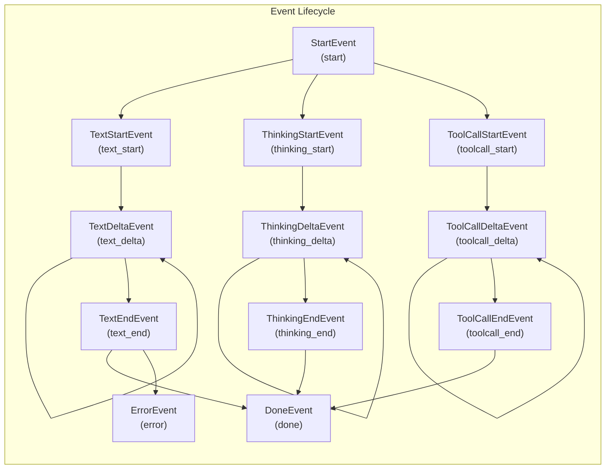
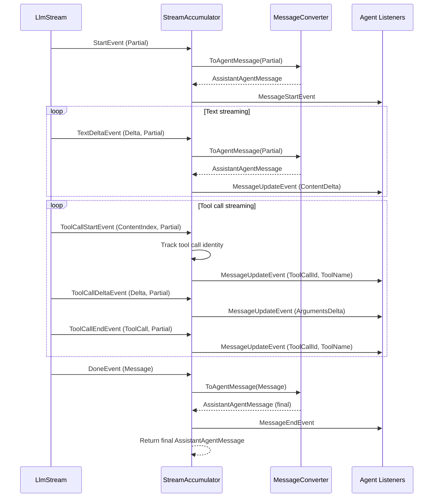

# Streaming

BotNexus uses streaming as its primary communication pattern with LLM APIs. Every provider produces an `LlmStream` of events that are consumed asynchronously and accumulated into a final message. This document explains the streaming pipeline from HTTP response to completed agent message.

## LlmStream — The Core Primitive

`LlmStream` is a channel-backed `IAsyncEnumerable<AssistantMessageEvent>`. Providers push events in; consumers iterate asynchronously.

```csharp
public sealed class LlmStream : IAsyncEnumerable<AssistantMessageEvent>
{
    // Providers call Push() to emit events
    public void Push(AssistantMessageEvent evt);

    // Signal end of stream
    public void End(AssistantMessage? result = null);

    // Consumers iterate via await foreach
    public async IAsyncEnumerator<AssistantMessageEvent> GetAsyncEnumerator(
        CancellationToken cancellationToken = default);

    // Await the final complete message
    public Task<AssistantMessage> GetResultAsync();
}
```

The `Push` → `End` pattern is the provider contract:

1. Provider creates an `LlmStream`
2. Provider starts an HTTP request to the LLM API
3. As SSE events arrive, the provider parses them and calls `Push(event)`
4. When the stream ends, the provider calls `Push(DoneEvent)` then `End()`
5. The consumer (`StreamAccumulator`) iterates events via `await foreach`

Internally, `LlmStream` uses `System.Threading.Channels` with unbounded capacity, single writer, and multiple reader support. The `DoneEvent` or `ErrorEvent` automatically captures the final `AssistantMessage` result.

## AssistantMessageEvent Types

The streaming event protocol is a discriminated union of record types. Each carries a `Type` string and relevant payloads:



### Event Reference

| Event | Type String | Key Fields | Meaning |
|-------|------------|------------|---------|
| `StartEvent` | `"start"` | `Partial` | Stream started, initial assistant message snapshot |
| `TextStartEvent` | `"text_start"` | `ContentIndex`, `Partial` | Text content block started |
| `TextDeltaEvent` | `"text_delta"` | `ContentIndex`, `Delta`, `Partial` | New text chunk received |
| `TextEndEvent` | `"text_end"` | `ContentIndex`, `Content`, `Partial` | Text content block complete |
| `ThinkingStartEvent` | `"thinking_start"` | `ContentIndex`, `Partial` | Reasoning/thinking block started |
| `ThinkingDeltaEvent` | `"thinking_delta"` | `ContentIndex`, `Delta`, `Partial` | New thinking text chunk |
| `ThinkingEndEvent` | `"thinking_end"` | `ContentIndex`, `Content`, `Partial` | Thinking block complete |
| `ToolCallStartEvent` | `"toolcall_start"` | `ContentIndex`, `Partial` | Tool call started streaming |
| `ToolCallDeltaEvent` | `"toolcall_delta"` | `ContentIndex`, `Delta`, `Partial` | Tool arguments JSON chunk |
| `ToolCallEndEvent` | `"toolcall_end"` | `ContentIndex`, `ToolCall`, `Partial` | Tool call complete with parsed args |
| `DoneEvent` | `"done"` | `Reason`, `Message` | Stream ended successfully |
| `ErrorEvent` | `"error"` | `Reason`, `Error` | Stream ended with error |

Every event carries a `Partial` field — a snapshot of the `AssistantMessage` accumulated so far. This gives consumers access to the full state at any point in the stream.

## How SSE Is Parsed

Providers receive Server-Sent Events over HTTP. The `StreamingJsonParser` utility handles the low-level parsing:

1. HTTP response arrives as a chunked stream
2. Parser reads line-by-line, looking for `data:` prefixed lines
3. Each `data:` payload is deserialized to the provider's native event format
4. Provider maps native events to `AssistantMessageEvent` types
5. Events are pushed into the `LlmStream`

The specific mapping depends on the API format:

- **OpenAI Completions**: `choices[0].delta.content` → `TextDeltaEvent`, `choices[0].delta.tool_calls` → `ToolCallDeltaEvent`
- **Anthropic Messages**: `content_block_delta` → `TextDeltaEvent` or `ThinkingDeltaEvent`, `content_block_start` with type `tool_use` → `ToolCallStartEvent`

## StreamAccumulator — From Deltas to Messages

`StreamAccumulator` is the bridge between the provider streaming layer and the agent event system. It sits in `AgentCore.Loop` and consumes `LlmStream` events, emitting `AgentEvent`s for each.

### What It Does



### Key Implementation Details

The accumulator:

1. **Converts provider messages** via `MessageConverter.ToAgentMessage()` to create `AssistantAgentMessage` snapshots
2. **Tracks tool call identity** using a `Dictionary<int, (string? Id, string? Name)>` keyed by `ContentIndex`
3. **Emits `MessageUpdateEvent`** for every delta, carrying either `ContentDelta` (for text/thinking) or `ArgumentsDelta` (for tool calls)
4. **Distinguishes thinking vs text** via the `IsThinking` flag on `MessageUpdateEvent`
5. **Handles errors** by setting `FinishReason = StopReason.Error` on the final message

```csharp
// Core accumulation signature
internal static class StreamAccumulator
{
    public static async Task<AssistantAgentMessage> AccumulateAsync(
        LlmStream stream,
        Func<AgentEvent, Task> emit,
        CancellationToken cancellationToken);
}
```

## Content Blocks

The `AssistantMessage` content is an array of polymorphic `ContentBlock` types:

```csharp
public abstract record ContentBlock;
public sealed record TextContent(string Text, string? TextSignature = null) : ContentBlock;
public sealed record ThinkingContent(string Thinking, string? ThinkingSignature = null) : ContentBlock;
public sealed record ImageContent(string Data, string MimeType) : ContentBlock;
public sealed record ToolCallContent(
    string Id, string Name,
    Dictionary<string, object?> Arguments,
    string? ThoughtSignature = null) : ContentBlock;
```

During streaming, the `Partial` message's content array grows incrementally — new blocks are appended as they start, and existing blocks are updated as deltas arrive.

## StopReason

Every completed message carries a `StopReason`:

```csharp
public enum StopReason
{
    Stop,     // Normal completion
    Length,   // Hit max tokens
    ToolUse,  // Model wants to call tools
    Error,    // Something went wrong
    Aborted   // Cancelled by user/system
}
```

The agent loop uses `StopReason.ToolUse` to decide whether to continue the turn loop.

## Next Steps

- [Agent Loop →](03-agent-loop.md) — how the loop uses StreamAccumulator
- [Provider System](01-provider-system.md) — how providers produce the stream
- [Architecture Overview](00-overview.md) — back to the big picture
