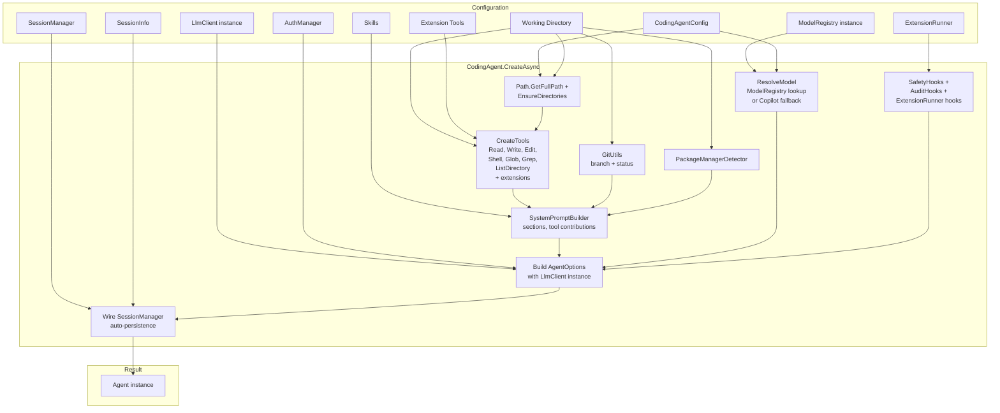

# 03 — Coding Agent

The `CodingAgent` layer wires everything together — tools, extensions, safety, sessions — into a working coding assistant. It builds on [AgentCore](02-agent-core.md) by configuring and creating a fully functional `Agent` with file operations, shell access, safety hooks, and an extension system.

## CodingAgent factory — What CreateAsync does

`CodingAgent` is a static factory class. It doesn't subclass `Agent` — it configures and creates one:

```csharp
public static class CodingAgent
{
    public static async Task<Agent> CreateAsync(
        CodingAgentConfig config,
        string workingDirectory,
        AuthManager authManager,
        LlmClient llmClient,
        ModelRegistry modelRegistry,
        ExtensionRunner? extensionRunner = null,
        IReadOnlyList<IAgentTool>? extensionTools = null,
        IReadOnlyList<string>? skills = null,
        SessionManager? sessionManager = null,
        SessionInfo? session = null);
}
```

Here's what `CreateAsync` does, step by step:

1. **Validate config, resolve working directory** — calls `Path.GetFullPath` on the working directory
2. **EnsureDirectories** — creates `.botnexus-agent/`, `.botnexus-agent/sessions/`, etc.
3. **CreateTools(root, config, extensionTools)** — instantiates the seven built-in tools plus any extension tools (see [Built-in tools](#built-in-tools))
4. **Git metadata** — calls `GitUtils.GetBranchAsync` and `GitUtils.GetStatusAsync` for the system prompt
5. **Package manager detection** — runs `PackageManagerDetector.Detect` to identify npm, pip, dotnet, etc.
6. **Context file discovery** — calls `ContextFileDiscovery.DiscoverAsync` to auto-detect README and documentation files
7. **System prompt construction** — `SystemPromptBuilder.Build` with a `SystemPromptContext` record (see [System prompt construction](#system-prompt-construction))
8. **ResolveModel** — resolves the model from config + `ModelRegistry` (see [Model resolution](#model-resolution))
9. **Create AuditHooks and SafetyHooks** — wires up safety validation and audit logging
10. **Build AgentOptions** — assembles all delegates: `LlmClient` (instance-based), `GetApiKey`, `BeforeToolCall`, `AfterToolCall`, `ConvertToLlm`, `TransformContext`
11. **Wire SessionManager** — if provided, configures auto-persistence of agent state to sessions
12. **Return `new Agent(options)`** — the configured agent, ready to run



> **Key takeaway:** `CreateAsync` is a pure factory. It constructs everything, wires the delegates, and returns an `Agent`. The `Agent` itself has no knowledge of coding-specific concerns — all coding-agent behavior is injected through hooks, tools, and delegates.

## Built-in tools

The CodingAgent ships with seven tools. Six of them are scoped to the working directory; `ShellTool` is the exception — its constructor takes **no parameters**.

| Tool name | Class | Registered as | Purpose |
|-----------|-------|---------------|---------|
| read | `ReadTool` | `"read"` | Read files and directories with line numbers |
| ls | `ListDirectoryTool` | `"ls"` | List directory entries up to 2 levels deep |
| write | `WriteTool` | `"write"` | Write complete files (full replacement) |
| edit | `EditTool` | `"edit"` | Surgical find-and-replace edits with fuzzy matching |
| bash | `ShellTool` | `"bash"` | Shell command execution (Windows: PowerShell, Unix: bash) |
| grep | `GrepTool` | `"grep"` | Regex search with context lines |
| find | `GlobTool` | `"find"` | File pattern matching |

The `CreateTools` method shows how they're instantiated:

```csharp
private static IReadOnlyList<IAgentTool> CreateTools(
    string workingDirectory, 
    CodingAgentConfig config, 
    IReadOnlyList<IAgentTool>? extensionTools)
{
    var tools = new List<IAgentTool>
    {
        new ReadTool(workingDirectory),
        new ListDirectoryTool(workingDirectory),
        new WriteTool(workingDirectory),
        new EditTool(workingDirectory),
        new ShellTool(config.DefaultShellTimeoutSeconds),
        new GlobTool(workingDirectory),
        new GrepTool(workingDirectory)
    };

    if (extensionTools is { Count: > 0 })
        tools.AddRange(extensionTools);

    return tools;
}
```

> Note: `ShellTool` receives `config.DefaultShellTimeoutSeconds` from the `CodingAgentConfig`. All other tools receive `workingDirectory` for path containment.

### `read` — Read files and directories

**Parameters:** `path` (required), `offset` (optional, 1-based line number), `limit` (optional, max lines to return)

**Behavior:**
- **Files:** Returns content with line numbers (`1 | first line`, `2 | second line`)
- **Directories:** Recursive listing up to depth 2
- **Images:** Base64-encoded with MIME type (for multimodal models)
- **Limits:** Max 2,000 lines or 50 KB per read; truncated content includes continuation instructions

### `write` — Write complete files

**Parameters:** `path` (required), `content` (required)

**Behavior:** Full-file replacement. Auto-creates parent directories. Returns byte count written.

### `edit` — Surgical edits

**Parameters:** `path` (required), `edits` (array of `{oldText, newText}`)

**Behavior (Phase 4):**
1. **BOM stripping** — removes UTF-8 BOM (`\uFEFF`) before processing
2. **Exact match** — tries literal string match first
3. **Context-based unified diff** — uses DiffPlex to compute optimal diff hunks (new in Phase 4)
4. **Fuzzy fallback** — normalizes whitespace, Unicode quotes/dashes, and line endings
5. **Validation** — rejects overlapping edits and ambiguous matches
6. **Preservation** — detects and maintains original line endings (CRLF/LF)

```json
{
  "path": "src/main.cs",
  "edits": [
    { "oldText": "var x = 1;", "newText": "var x = 42;" },
    { "oldText": "// TODO", "newText": "// DONE" }
  ]
}
```

> **Phase 4 change:** `EditTool` now uses DiffPlex for proper context-based unified diffs. This improves diff quality when fuzzy matching is needed, providing better visual context for debugging edit operations.

### `bash` — Shell command execution

**Parameters (Phase 5):** `command` (required), `timeout` (optional, overrides default)

**Platform behavior (Phase 4):**
- **Windows:** Prefers Git Bash if available; falls back to PowerShell only if Git Bash is not found (`FindBashExecutable` detects `bash.exe` in PATH)
- **Unix:** Executes via `/bin/bash -lc`

**Output format (Phase 5):**
```
[output truncated — showing last 100 lines of 5000]
... (last 100 lines of output) ...
```

**Output behavior — Phase 5 changes:**
- **TAIL truncation:** Output is truncated at the **tail** (keeps last lines instead of first). This preserves errors and results which are typically at the end.
- **Truncation notice:** Appears at the top of output as `[output truncated — showing last N lines of TOTAL]`
- **Limits:** Capped at 50 * 1024 bytes (51,200 bytes, aligned with TypeScript implementation) or 2,000 lines, whichever hits first.

**Timeout configuration — Phase 5:**

Default timeout is configured via `CodingAgentConfig.DefaultShellTimeoutSeconds` (defaults to 600 seconds):

```csharp
// In config.json or via CodingAgentConfig
{
  "defaultShellTimeoutSeconds": 600
}

// Per-call override via tool argument
{
  "command": "npm run build",
  "timeout": 1800  // 30 minutes for this command
}
```

**Cancellation handling:** `ShellTool` distinguishes explicit cancellation from timeout. When the caller's `CancellationToken` fires (e.g., user presses Ctrl+C), the running process is killed and the result returns `"Command cancelled."` with any partial output collected so far. Timeout expiry is reported separately as `"Command timed out after N seconds."` — both paths capture partial output (last lines) and set `IsError: true`.

### `grep` — Regex search

**Parameters:** `pattern` (regex, required), `path`, `glob` (file pattern, e.g. `*.cs`), `ignore_case`, `context` (lines), `limit`

**Features:** Regex validation, `.gitignore` filtering, binary file detection, context lines, match count limiting.

### `find` — File pattern matching

**Parameters:** `pattern` (glob, required), `path` (base directory), `limit` (max results, default 1000)

**Features:** Uses `Microsoft.Extensions.FileSystemGlobbing`. Filters through `.gitignore` rules. Returns sorted relative paths.

## ListDirectory — 2 levels deep (Phase 5)

**Parameters:** `path` (optional, default `.`), `limit` (optional, default 500)

**Output format (Phase 5):**
```
directory/
├── file1.txt
├── file2.txt
├── subdir/
│   ├── nested1.txt
│   └── nested2.txt
│── another/
│   ├── file3.txt
│   └── deeper/
│       └── (not shown — max 2 levels)
```

**Depth:** Shows children (level 1) and grandchildren (level 2). Stops at level 2 to avoid overwhelming output. Directories at level 2 are marked but their contents are not shown.

**Byte limit (Phase 5):** Output is capped at 50 * 1024 bytes (51,200 bytes). If the limit is reached, a truncation notice is appended.

**Why Phase 5:** One level of nesting is insufficient for understanding directory structure (you see files but not substructure). Two levels provides enough context without becoming unwieldy.

> **Key takeaway:** `ListDirectoryTool` now shows better structure at a glance. Use it to explore project layout before diving into specific files.

## Context file discovery — ancestor walk (Phase 5)

`ContextFileDiscovery` walks from the current working directory up to the git root (or filesystem root) looking for agent context files.

**Discovery order:**
1. Check `{directory}/.github/copilot-instructions.md`
2. Check `{directory}/AGENTS.md`
3. Move to parent directory
4. Repeat until git root or filesystem root

**Files discovered:**
- `.github/copilot-instructions.md` — Copilot-specific instructions (takes precedence)
- `AGENTS.md` — Project-level agent instructions

**Example — monorepo structure:**

```
project/                                    (git root)
├── .git/
├── .github/
│   └── copilot-instructions.md             (org-level)
├── AGENTS.md                               (org-level)
└── services/
    └── api/
        ├── .github/
        │   └── copilot-instructions.md     (project-level ← found first)
        ├── AGENTS.md                       (project-level ← found first)
        └── src/
```

When running from `services/api/src/`:
1. Check `services/api/src/.github/copilot-instructions.md` — not found
2. Check `services/api/src/AGENTS.md` — not found
3. Move to `services/api/`
4. Check `services/api/.github/copilot-instructions.md` — **found!** ← returned
5. Check `services/api/AGENTS.md` — **found!** ← returned
6. Stop (both kinds found)

**Budget:** Discovery is limited to 16 KB total content (across all found files). If budget is exhausted, remaining files are skipped. Truncated content appends `[truncated]` marker.

**Why Phase 5:** Monorepos have project-level and org-level context. Walking the hierarchy ensures agents get the most relevant and specific context first.

> **Key takeaway:** Place `AGENTS.md` and `.github/copilot-instructions.md` at your project level (or org root) for automatic discovery. Hierarchy is respected — closest to cwd wins.

> **Key takeaway:** Tools implement `IAgentTool` and contribute to the system prompt via `GetPromptSnippet()` and `GetPromptGuidelines()`. The `ShellTool` is intentionally directory-agnostic — shell commands control their own working directory.

## System prompt construction

`SystemPromptBuilder` uses a **section-based** architecture. Tools contribute their own prompt snippets and guidelines.

### SystemPromptContext

```csharp
public sealed record SystemPromptContext(
    string WorkingDirectory,
    string? GitBranch,
    string? GitStatus,
    string PackageManager,
    IReadOnlyList<string> ToolNames,
    IReadOnlyList<string> Skills,
    string? CustomInstructions,
    IReadOnlyList<ToolPromptContribution>? ToolContributions = null,
    IReadOnlyList<PromptContextFile>? ContextFiles = null);
```

### Prompt sections (in order)

| # | Section | Content |
|---|---------|---------|
| 1 | **Role definition** | "You are a coding assistant with access to tools..." |
| 2 | **Environment** | OS, working directory, git branch/status, package manager |
| 3 | **Available Tools** | Tool names with optional snippets from `GetPromptSnippet()` |
| 4 | **Tool Guidelines** | Merged set: built-in defaults + custom guidelines from `GetPromptGuidelines()` |
| 5 | **Project Context** | Content from `PromptContextFile` entries (e.g., README, CONTRIBUTING) |
| 6 | **Skills** | Parsed skill files with YAML frontmatter |
| 7 | **Custom Instructions** | User-configured final instructions |

### Tool contributions

Each tool can optionally provide prompt content:

```csharp
public sealed record ToolPromptContribution(
    string Name,
    string? Snippet = null,
    IReadOnlyList<string>? Guidelines = null);
```

- **`GetPromptSnippet()`** — short description appended to the tool listing
- **`GetPromptGuidelines()`** — usage guidelines merged into the Tool Guidelines section

### Skills loading

Skills are markdown files with optional YAML frontmatter, loaded from three locations:

1. `./AGENTS.md` (project root)
2. `./.botnexus-agent/AGENTS.md` (local config)
3. `./.botnexus-agent/skills/*.md` (alphabetically sorted)

```markdown
---
name: MySkill
description: Specialized knowledge for database queries
---

When the user asks about database queries, follow these rules:
1. Always use parameterized queries
2. Check for SQL injection patterns
```

> **Key takeaway:** The system prompt is assembled dynamically from context, tools, skills, and user configuration. Tools influence their own prompt representation through `GetPromptSnippet()` and `GetPromptGuidelines()`.

## Model resolution

The model is resolved from config using the injected `ModelRegistry` with intelligent fallbacks:

```csharp
private static LlmModel ResolveModel(CodingAgentConfig config, ModelRegistry modelRegistry)
{
    var provider = config.Provider ?? "github-copilot";
    var modelId = config.Model ?? "gpt-4.1";

    // Normalize "copilot" → "github-copilot"
    if (provider.Equals("copilot", StringComparison.OrdinalIgnoreCase))
        provider = "github-copilot";

    // Try registry first
    var existing = modelRegistry.GetModel(provider, modelId);
    if (existing is not null)
        return existing;

    // Fallback: construct a model definition with Copilot headers
    return new LlmModel(
        Id: modelId,
        Name: modelId,
        Api: "openai-completions",
        Provider: provider,
        BaseUrl: "https://api.individual.githubcopilot.com",
        // ... defaults with Copilot-specific headers
    );
}
```

**Resolution rules:**
- **Default provider:** `"github-copilot"`
- **Default model:** `"gpt-4.1"`
- **Provider normalization:** `"copilot"` → `"github-copilot"`
- **Registry lookup first:** checks `ModelRegistry` for a registered model
- **Fallback construction:** creates an `LlmModel` with Copilot-specific headers (`User-Agent`, `Editor-Version`, `Editor-Plugin-Version`, `Copilot-Integration-Id`)
- **BaseUrl fallback:** `https://api.individual.githubcopilot.com`

> **Key takeaway:** Model resolution tries the registry first, then falls back to constructing a Copilot-compatible model definition. The `"copilot"` → `"github-copilot"` normalization prevents common misconfiguration.

## Configuration hierarchy

Configuration merges in four layers — later layers override earlier ones:

```
1. Defaults (hardcoded)
   ├─ MaxToolIterations: 40
   ├─ MaxContextTokens: 100000
   └─ Model: "gpt-4.1", Provider: "github-copilot"

2. Global config (~/.botnexus/coding-agent.json)
   └─ User-wide preferences

3. Local config (.botnexus-agent/config.json)
   └─ Project-specific overrides

4. CLI arguments (--model, --provider, etc.)
   └─ Session-level overrides
```

### CodingAgentConfig fields

```csharp
public sealed class CodingAgentConfig
{
    public string? Model { get; set; }            // e.g., "gpt-4.1"
    public string? Provider { get; set; }         // e.g., "github-copilot"
    public string? ApiKey { get; set; }           // Direct API key
    public int MaxToolIterations { get; set; }    // Default: 40
    public int MaxContextTokens { get; set; }     // Default: 100000
    public List<string> AllowedCommands { get; set; }  // Shell command whitelist
    public List<string> BlockedPaths { get; set; }     // File paths to deny
    public Dictionary<string, object?> Custom { get; set; }  // Extension config
}
```

**Config file format:**
```json
{
  "model": "claude-sonnet-4",
  "provider": "anthropic",
  "maxToolIterations": 80,
  "maxContextTokens": 200000,
  "allowedCommands": ["dotnet", "git"],
  "blockedPaths": [".env"],
  "custom": {
    "verbose": true,
    "instructions": "Always write tests before implementation."
  }
}
```

The `Load(workingDirectory)` method handles the merge chain. `EnsureDirectories` creates the local config folder and writes a default `config.json` if missing.

> **Key takeaway:** Four-layer config merging means you can set global defaults, override per-project, and further override per-session via CLI args — without editing any config files for one-off runs.

## Safety hooks

`SafetyHooks` runs as a `BeforeToolCallDelegate` and enforces three categories of safety:

### Path validation (write/edit tools)

1. Resolve path with `PathUtils.ResolvePath()` — enforces containment within the working directory
2. Check against `config.BlockedPaths` list
3. Warn if payload exceeds 1 MB

### Shell command validation (bash tool)

1. If `config.AllowedCommands` is non-empty, the command must start with an allowed prefix
2. Check against a built-in blocklist: `rm -rf /`, `format`, `del /s /q`
3. Case-insensitive matching

```csharp
// In CodingAgentConfig:
AllowedCommands: ["dotnet", "git", "npm"],   // Only these prefixes allowed
BlockedPaths: [".env", "secrets/"]            // These paths are off-limits
```

### Large write warnings

Payloads over 1 MB trigger a console warning (not a block) so the user is aware of unusually large file writes.

> **Key takeaway:** Safety hooks are a `BeforeToolCall` delegate — they can block tool execution entirely or let it through with warnings. Path containment prevents the agent from escaping the working directory.

## Session management

Sessions persist conversation history so agents can resume where they left off. Data is stored in `.botnexus-agent/sessions/` as `.jsonl` files.

### Auto-persistence

`CodingAgent.CreateAsync` wires automatic session persistence via `WireSessionAutoPersistence`. An event listener watches for `MessageEndEvent` on `AssistantAgentMessage` completions and fires a background `SaveSessionAsync` call (guarded by a `SemaphoreSlim` to serialize concurrent saves). This means every assistant turn is persisted without explicit save calls — if the process crashes mid-conversation, the last completed assistant message is recoverable. Manual `SaveSessionAsync` calls in the interactive loop still supplement this for additional save points.

### JSONL tree model

Sessions use a directed acyclic graph (DAG) structure. Each entry has an `EntryId` and `ParentEntryId`, enabling branching:

| Entry type | Purpose | Key fields |
|------------|---------|------------|
| `session_header` | Session metadata | Version, SessionId, Name, WorkingDirectory, CreatedAt, ParentSessionId |
| `message` | User or assistant message | EntryId, ParentEntryId, Role, Content, ToolCalls, Timestamp |
| `tool_result` | Tool execution result | EntryId, ParentEntryId, ToolCallId, ToolName, Content, IsError |
| `compaction_summary` | Context compaction checkpoint | EntryId, ParentEntryId, Summary |
| `metadata` | Key-value state (e.g., active leaf) | Key, Value, Timestamp |

```jsonl
{"type":"session_header","version":2,"sessionId":"20260404-141523-a3f2","name":"Fix auth bug","workingDirectory":"/home/user/project"}
{"type":"message","entryId":"e1","parentEntryId":null,"timestamp":"2026-04-04T14:15:23Z","message":{"type":"user","payload":{...}}}
{"type":"message","entryId":"e2","parentEntryId":"e1","timestamp":"2026-04-04T14:15:30Z","message":{"type":"assistant","payload":{...}}}
{"type":"tool_result","entryId":"e3","parentEntryId":"e2","timestamp":"2026-04-04T14:15:31Z","toolCallId":"call_1","toolName":"read","content":"..."}
{"type":"metadata","timestamp":"2026-04-04T14:16:00Z","key":"leaf","value":"e3"}
```

### DAG-based branching

```
e1 (user: "Fix the bug")
├─ e2 (assistant: approach A)
│  └─ e3 (tool: read file)
│     └─ e4 (assistant: here's the fix)
│
└─ e5 (assistant: approach B)     ← Branch created by different response
   └─ e6 (tool: run tests)
```

Key concepts:
- **Leaf entries** — entries with no children; each leaf is the tip of a conversation branch
- **Active leaf** — tracked via `metadata` entries with `key: "leaf"`; determines which branch is current
- **Branch path** — the linear path from root to a specific leaf (resolved by walking `ParentEntryId` chains)
- **Branch names** — stored as metadata entries with `key: "branch_name:{leafId}"`

### SessionManager API

```csharp
public sealed class SessionManager
{
    Task<SessionInfo> CreateSessionAsync(
        string workingDirectory, string? name, string? parentSessionId = null);

    Task SaveSessionAsync(
        SessionInfo session, IReadOnlyList<AgentMessage> messages);

    Task<(SessionInfo, IReadOnlyList<AgentMessage>)> ResumeSessionAsync(
        string sessionId, string workingDirectory);

    Task<IReadOnlyList<SessionInfo>> ListSessionsAsync(
        string workingDirectory);

    Task<IReadOnlyList<SessionBranchInfo>> ListBranchesAsync(
        string sessionId, string workingDirectory);

    Task<SessionInfo> SwitchBranchAsync(
        string sessionId, string workingDirectory,
        string leafEntryId, string? branchName = null);

    Task DeleteSessionAsync(string sessionId, string workingDirectory);
}
```

When `SaveSessionAsync` is called with messages that diverge from the current branch:
1. The manager finds the **common prefix length** between existing and new messages
2. New entries are appended with `ParentEntryId` pointing to the last shared entry
3. This creates a fork in the tree without modifying existing entries
4. The active leaf is updated to point to the new branch tip

### Session compaction

When conversation history grows too large, `SessionCompactor` summarizes older messages:

```csharp
var compactor = new SessionCompactor();
var options = new SessionCompactionOptions(
    MaxContextTokens: 100_000,
    ReserveTokens: 16_384,
    KeepRecentTokens: 20_000,
    KeepRecentCount: 10,
    LlmClient: llmClient,     // For LLM-powered summarization
    Model: model,
    ApiKey: apiKey,            // Required for authenticated summarization
    Headers: headers,          // Optional custom headers
    CustomInstructions: null,  // Optional summarization instructions
    OnCompactionAsync: null    // Optional extension callback
);

IReadOnlyList<AgentMessage> compacted = await compactor.CompactAsync(messages, options, ct);
```

**Compaction algorithm:**
1. **Estimate tokens** — actual usage or `chars ÷ 4` heuristic
2. **Check budget** — if within budget, return messages unchanged
3. **Find cut point** — keep recent messages (≥20K tokens, ≥10 messages)
4. **Validate cut point** — ensure cut never falls on a `ToolResultAgentMessage`; prefer `UserMessage` boundaries
5. **Summarize** — LLM-driven summarization of older messages; falls back to heuristic extraction if LLM is unavailable
6. **Return** — `[SystemAgentMessage(summary), ...recentMessages]`

The summary includes file tracking metadata:

```
<read-files>
src/auth.cs
src/models/user.cs
</read-files>

<modified-files>
src/auth.cs
tests/auth_test.cs
</modified-files>
```

> **Key takeaway:** The JSONL tree model with DAG-based branching lets sessions fork without losing history. Compaction keeps context windows manageable by summarizing old messages while preserving file-tracking metadata.

## Extensions and skills

### IExtension interface

Extensions are plugins loaded from DLL assemblies. They hook into the full agent lifecycle:

```csharp
public interface IExtension
{
    string Name { get; }

    // Provide additional tools
    IReadOnlyList<IAgentTool> GetTools();

    // Hook: before tool execution (return Block: true to prevent)
    ValueTask<BeforeToolCallResult?> OnToolCallAsync(
        ToolCallLifecycleContext context, CancellationToken ct);

    // Hook: after tool execution (return to transform result)
    ValueTask<AfterToolCallResult?> OnToolResultAsync(
        ToolResultLifecycleContext context, CancellationToken ct);

    // Session lifecycle
    ValueTask OnSessionStartAsync(SessionLifecycleContext context, CancellationToken ct);
    ValueTask OnSessionEndAsync(SessionLifecycleContext context, CancellationToken ct);

    // Context compaction override
    ValueTask<string?> OnCompactionAsync(
        CompactionLifecycleContext context, CancellationToken ct);

    // Request interception
    ValueTask<object?> OnModelRequestAsync(
        ModelRequestLifecycleContext context, CancellationToken ct);
}
```

All lifecycle methods have default implementations, so extensions only override what they need.

### ExtensionLoader

```csharp
var loader = new ExtensionLoader();
var result = loader.LoadExtensions(".botnexus-agent/extensions/");
// Scans *.dll, discovers IExtension implementations, instantiates them
// Individual failures don't break other extensions
```

### ExtensionRunner — Lifecycle coordination

`ExtensionRunner` coordinates all loaded extensions with these resolution rules:

| Hook | Rule |
|------|------|
| `OnToolCallAsync` | First `Block: true` wins (short-circuits) |
| `OnToolResultAsync` | Last non-null result wins (content/details/isError merge) |
| `OnSessionStartAsync/EndAsync` | All called; errors caught per-extension |
| `OnCompactionAsync` | First non-null summary wins |
| `OnModelRequestAsync` | Payload pipelines through all extensions sequentially |

### Skills (markdown instructions)

Skills are simpler than extensions — they're markdown files injected into the system prompt:

```csharp
var loader = new SkillsLoader();
IReadOnlyList<string> skills = loader.LoadSkills(workingDirectory, config);
// Loaded from: AGENTS.md, .botnexus-agent/AGENTS.md, .botnexus-agent/skills/*.md
```

`SkillsLoader` respects `.gitignore` patterns within each skill directory. A `.gitignore` file placed in a skill directory (e.g., `.botnexus-agent/skills/.gitignore`) filters out matched paths before skill discovery. Directories like `node_modules`, `bin`, `obj`, `.git`, `build`, and `dist` are always excluded regardless of `.gitignore` presence.

**When to use which:**
- **Skills** — for teaching the agent domain-specific knowledge (no code required)
- **Extensions** — for adding tools, intercepting lifecycle events, and modifying behavior (compiled DLLs)

> **Key takeaway:** Extensions provide full lifecycle hooks and custom tools via compiled assemblies. Skills provide prompt-level guidance via markdown files. Both are loaded from `.botnexus-agent/` at agent creation time.

## Code example: Extending the coding agent

Here's how to create an agent with `CodingAgent.CreateAsync` and a custom extension that provides an additional tool:

```csharp
using BotNexus.AgentCore;
using BotNexus.CodingAgent;
using BotNexus.CodingAgent.Auth;
using BotNexus.Providers.Core;
using BotNexus.Providers.Core.Registry;

// 1. Define a custom tool
public sealed class MetricsTool : IAgentTool
{
    public string Name => "metrics";
    public string Label => "Metrics";

    public Tool Definition => new Tool(
        Name: "metrics",
        Description: "Report build and test metrics",
        Parameters: JsonSerializer.Deserialize<JsonElement>("""
        { "type": "object", "properties": {} }
        """));

    public Task<IReadOnlyDictionary<string, object?>> PrepareArgumentsAsync(
        IReadOnlyDictionary<string, object?> arguments,
        CancellationToken cancellationToken = default)
        => Task.FromResult(arguments);

    public Task<AgentToolResult> ExecuteAsync(
        string toolCallId, IReadOnlyDictionary<string, object?> arguments,
        CancellationToken cancellationToken = default,
        AgentToolUpdateCallback? onUpdate = null)
    {
        var report = GatherMetrics(); // your logic
        return Task.FromResult(new AgentToolResult(
            Content: [new AgentToolContent(AgentToolContentType.Text, report)]));
    }

    public string? GetPromptSnippet() => null;
    public IReadOnlyList<string> GetPromptGuidelines() => [];
}

// 2. Define a custom extension
public sealed class MetricsExtension : IExtension
{
    public string Name => "metrics";

    public IReadOnlyList<IAgentTool> GetTools()
        => new IAgentTool[] { new MetricsTool() };

    // All other lifecycle methods use default (no-op) implementations
}

// 3. Load extensions and create the agent
var workingDir = Environment.CurrentDirectory;
var config = CodingAgentConfig.Load(workingDir);

var apiProviderRegistry = new ApiProviderRegistry();
var modelRegistry = new ModelRegistry();
var httpClient = new HttpClient();
apiProviderRegistry.Register(new OpenAICompletionsProvider(httpClient, logger));
var llmClient = new LlmClient(apiProviderRegistry, modelRegistry);
var authManager = new AuthManager();

// Load extensions from disk + add our custom one
var loader = new ExtensionLoader();
var loaded = loader.LoadExtensions(".botnexus-agent/extensions/");
var allExtensions = loaded.Extensions.Append(new MetricsExtension()).ToList();
var extensionRunner = new ExtensionRunner(allExtensions);
var extensionTools = allExtensions.SelectMany(e => e.GetTools()).ToList();

// Create the agent with extension tools wired in
var agent = await CodingAgent.CreateAsync(
    config,
    workingDir,
    authManager,
    llmClient,
    modelRegistry,
    extensionRunner: extensionRunner,
    extensionTools: extensionTools);

// 4. Subscribe to streaming output and run
using var sub = agent.Subscribe(async (evt, ct) =>
{
    if (evt is MessageUpdateEvent update && update.ContentDelta is not null)
        Console.Write(update.ContentDelta);
});

var result = await agent.PromptAsync("Run the test suite and report metrics.");
if (result[^1] is AssistantAgentMessage final)
    Console.WriteLine(final.Content);
```

> **Key takeaway:** Custom tools and extensions plug into the same factory pipeline as built-in tools. The agent treats them identically — no special registration beyond passing them to `CreateAsync`.

## Cross-references

- [Architecture overview](00-overview.md) — high-level layer diagram and project map
- [Provider system](01-providers.md) — LLM communication, streaming, and the provider registry
- [Agent core](02-agent-core.md) — the agent loop, tool execution, events, and message types
- [Building your own](04-building-your-own.md) — hands-on tutorial for custom agents, tools, and extensions
