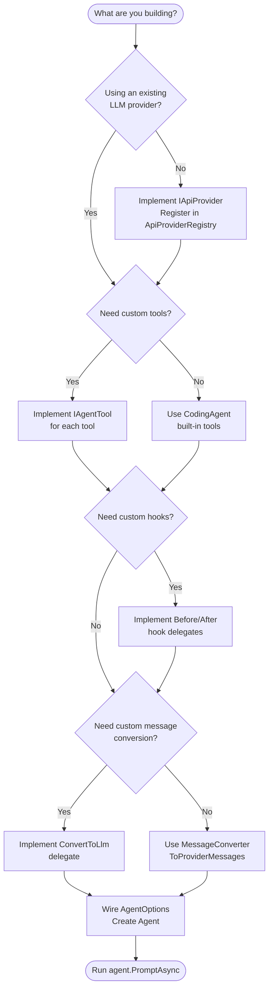

# Building Your Own Agent

This guide walks you through building a custom AI agent on BotNexus — from choosing a provider and defining tools, all the way to session persistence and adding a new LLM provider from scratch.

**Prerequisites:** Familiarity with C#/.NET 10 (records, async/await, `IAsyncEnumerable`), LLM API concepts (chat completions, streaming, tool calling), and the [Architecture overview](../architecture/overview.md).

---

## What do you need to implement?

Use this decision tree to scope your work:



> **Key takeaway:** Most custom agents only need Steps 1–4. You only implement a provider (Step 10) if the built-in ones don't cover your LLM API.

---

## Step 1: Choose your provider and model

BotNexus ships with four provider implementations:

| Provider | Project | API identifier | Auth |
|----------|---------|----------------|------|
| **GitHub Copilot** | `BotNexus.Agent.Providers.Copilot` | Routed via OpenAI/Anthropic | OAuth (default) |
| **OpenAI** | `BotNexus.Agent.Providers.OpenAI` | `openai-completions` | API key |
| **Anthropic** | `BotNexus.Agent.Providers.Anthropic` | `anthropic-messages` | API key |
| **OpenAI-Compatible** | `BotNexus.Agent.Providers.OpenAICompat` | `openai-completions` | API key |

See [Provider system](01-providers.md) for the full streaming protocol reference.

### Option A: Use a built-in provider

All registries are **instance-based** — create them, register providers, and wire into `LlmClient`:

```csharp
using BotNexus.Agent.Providers.Core;
using BotNexus.Agent.Providers.Core.Models;
using BotNexus.Agent.Providers.Core.Registry;

// 1. Create instance-based registries
var apiProviderRegistry = new ApiProviderRegistry();
var modelRegistry = new ModelRegistry();
var httpClient = new HttpClient();

// 2. Register the provider you need
apiProviderRegistry.Register(new AnthropicProvider(httpClient));

// 3. Register or define a model
var model = new LlmModel(
    Id: "claude-sonnet-4",
    Name: "Claude Sonnet 4",
    Api: "anthropic-messages",       // Routes to AnthropicProvider
    Provider: "anthropic",
    BaseUrl: "https://api.anthropic.com",
    Reasoning: true,
    Input: new[] { "text" },
    Cost: new ModelCost(3m, 15m, 0.3m, 3.75m),
    ContextWindow: 200_000,
    MaxTokens: 64_000
);
modelRegistry.Register("anthropic", model);

// 4. Create the LLM client
var llmClient = new LlmClient(apiProviderRegistry, modelRegistry);
```

### Option B: Register a custom provider

If your LLM isn't covered by the built-in providers, implement `IApiProvider`:

```csharp
public class MyProvider : IApiProvider
{
    public string Api => "my-api-format";

    public LlmStream Stream(LlmModel model, Context context, StreamOptions? options = null)
    {
        var stream = new LlmStream();

        // Return the stream immediately — do all work in the background
        _ = Task.Run(async () =>
        {
            try
            {
                stream.Push(new StartEvent(partialMessage));
                stream.Push(new TextDeltaEvent(0, "Hello ", partialMessage));
                stream.Push(new TextDeltaEvent(0, "world!", partialMessage));
                stream.Push(new DoneEvent(StopReason.Stop, finalMessage));
                stream.End();
            }
            catch (Exception ex)
            {
                // CRITICAL: Never throw — encode errors as ErrorEvent
                var error = BuildErrorMessage(ex);
                stream.Push(new ErrorEvent(StopReason.Error, error));
                stream.End();
            }
        });

        return stream;
    }

    public LlmStream StreamSimple(
        LlmModel model, Context context, SimpleStreamOptions? options = null)
    {
        return Stream(model, context, options);
    }
}

// Register on the instance-based registry
apiProviderRegistry.Register(new MyProvider());
```

> **Key takeaway:** Always return the `LlmStream` **immediately**. Push events from a background `Task.Run`. Catch all exceptions and encode them as `ErrorEvent` — never let them escape.

For a full provider tutorial, see [Step 10: Adding a new LLM provider](#step-10-adding-a-new-llm-provider).

---

## Step 2: Define custom tools

Each tool implements `IAgentTool` (defined in `BotNexus.Agent.Core.Tools`). The interface has seven members:

| Member | Purpose |
|--------|---------|
| `Name` | Machine-readable identifier (used in tool calls) |
| `Label` | Human-readable display name |
| `Definition` | `Tool` record with name, description, and JSON Schema parameters |
| `PrepareArgumentsAsync` | Validate and normalize arguments. **Throw to reject.** |
| `ExecuteAsync` | Do the work. Return `AgentToolResult`. |
| `GetPromptSnippet()` | One-line tool summary injected into the system prompt |
| `GetPromptGuidelines()` | Usage guidelines injected into the system prompt |

Here's a complete example — a weather lookup tool:

```csharp
using System.Text.Json;
using BotNexus.Agent.Core.Tools;
using BotNexus.Agent.Core.Types;
using BotNexus.Agent.Providers.Core.Models;
using BotNexus.Agent.Providers.Core.Validation;  // Phase 5: validation

public sealed class WeatherTool : IAgentTool
{
    // ── Identity ──────────────────────────────────────────

    public string Name => "get_weather";
    public string Label => "Get Weather";

    public Tool Definition => new(
        Name: "get_weather",
        Description: "Get the current weather for a city or coordinates.",
        Parameters: JsonSerializer.Deserialize<JsonElement>("""
        {
            "type": "object",
            "properties": {
                "location": {
                    "type": "string",
                    "description": "City name or lat,lon coordinates"
                }
            },
            "required": ["location"]
        }
        """)
    );

    // ── Lifecycle ─────────────────────────────────────────

    public Task<IReadOnlyDictionary<string, object?>> PrepareArgumentsAsync(
        IReadOnlyDictionary<string, object?> arguments,
        CancellationToken cancellationToken = default)
    {
        // Validate — throw to reject the tool call
        if (!arguments.ContainsKey("location"))
            throw new ArgumentException("'location' is required.");

        return Task.FromResult(arguments);
    }

    public async Task<AgentToolResult> ExecuteAsync(
        string toolCallId,
        IReadOnlyDictionary<string, object?> arguments,
        CancellationToken cancellationToken = default,
        AgentToolUpdateCallback? onUpdate = null)
    {
        // Phase 5: Validate arguments before executing
        using (var doc = JsonDocument.Parse(JsonSerializer.Serialize(arguments)))
        {
            var (isValid, errors) = ToolCallValidator.Validate(
                doc.RootElement,
                Definition.ParameterSchema);

            if (!isValid)
            {
                var errorMsg = string.Join("; ", errors);
                return new AgentToolResult([
                    new AgentToolContent(AgentToolContentType.Text, errorMsg)
                ], new { IsError = true });
            }
        }

        var location = arguments["location"]!.ToString()!;
        var weather = await FetchWeatherAsync(location, cancellationToken);

        return new AgentToolResult([
            new AgentToolContent(AgentToolContentType.Text, weather)
        ]);
    }

    // ── Prompt contributions ──────────────────────────────

    public string? GetPromptSnippet() =>
        "get_weather — Look up current weather for any location";

    public IReadOnlyList<string> GetPromptGuidelines() =>
    [
        "Use get_weather when the user asks about weather conditions.",
        "Pass the city name or coordinates as the 'location' argument.",
        "Present the temperature and conditions in a human-friendly format."
    ];

    // ── Private ───────────────────────────────────────────

    private static async Task<string> FetchWeatherAsync(
        string location, CancellationToken ct)
    {
        // Your API call here
        await Task.Delay(100, ct);
        return $"Weather in {location}: 72°F, sunny, humidity 45%";
    }
}
```

> **Key takeaway:** `PrepareArgumentsAsync` is your first validation gate — throw `ArgumentException` to reject a tool call before it executes (Phase 5: prefer `ToolCallValidator` in `ExecuteAsync` for JSON Schema validation). `ExecuteAsync` does the actual work and returns content to the LLM.

---

## Step 3: Wire AgentOptions

`AgentOptions` is the single record that wires everything together. Here's a complete example showing every parameter:

```csharp
using BotNexus.Agent.Core;
using BotNexus.Agent.Core.Configuration;
using BotNexus.Agent.Core.Hooks;
using BotNexus.Agent.Core.Types;
using BotNexus.Agent.Providers.Core;
using BotNexus.Agent.Providers.Core.Models;
using BotNexus.Agent.Providers.Core.Registry;

// ── Tools ────────────────────────────────────────────────
var tools = new List<IAgentTool>
{
    new WeatherTool(),
    // Add more tools here...
};

// ── System prompt ────────────────────────────────────────
var systemPrompt = """
    You are a helpful weather assistant.
    Use the get_weather tool to answer weather questions.
    Always provide temperature and conditions.
    """;

// ── Model ────────────────────────────────────────────────
var model = new LlmModel(
    Id: "claude-sonnet-4",
    Name: "Claude Sonnet 4",
    Api: "anthropic-messages",
    Provider: "anthropic",
    BaseUrl: "https://api.anthropic.com",
    Reasoning: true,
    Input: new[] { "text" },
    Cost: new ModelCost(3m, 15m, 0.3m, 3.75m),
    ContextWindow: 200_000,
    MaxTokens: 64_000
);

// ── Registries + LlmClient ──────────────────────────────
var apiProviderRegistry = new ApiProviderRegistry();
var modelRegistry = new ModelRegistry();
var httpClient = new HttpClient();
apiProviderRegistry.Register(new AnthropicProvider(httpClient));
var llmClient = new LlmClient(apiProviderRegistry, modelRegistry);

// ── ConvertToLlm delegate ───────────────────────────────
// Maps AgentMessage types to provider Message types.
// Use the built-in converter for standard scenarios:
ConvertToLlmDelegate convertToLlm = MessageConverter.ToProviderMessages;

// ── TransformContext delegate ───────────────────────────
// Identity (pass-through) — or implement compaction logic
TransformContextDelegate transformContext =
    (messages, ct) => Task.FromResult(messages);

// ── GetApiKey delegate ──────────────────────────────────
GetApiKeyDelegate getApiKey = (provider, ct) =>
    Task.FromResult(Environment.GetEnvironmentVariable("ANTHROPIC_API_KEY"));

// ── GenerationSettings ──────────────────────────────────
var generationSettings = new SimpleStreamOptions
{
    Reasoning = ThinkingLevel.Low,
    CacheRetention = CacheRetention.Short,
    MaxTokens = model.MaxTokens
};

// ── Before/After tool call hooks (optional) ─────────────
BeforeToolCallDelegate? beforeHook = null;  // See Step 5
AfterToolCallDelegate? afterHook = null;    // See Step 5

// ── Assemble AgentOptions ───────────────────────────────
var options = new AgentOptions(
    InitialState: new AgentInitialState(
        SystemPrompt: systemPrompt,
        Model: model,
        Tools: tools
    ),
    Model: model,
    LlmClient: llmClient,
    ConvertToLlm: convertToLlm,
    TransformContext: transformContext,
    GetApiKey: getApiKey,
    GetSteeringMessages: null,         // Inject messages mid-run
    GetFollowUpMessages: null,         // Auto-follow-up messages
    ToolExecutionMode: ToolExecutionMode.Sequential,  // or Parallel
    BeforeToolCall: beforeHook,
    AfterToolCall: afterHook,
    GenerationSettings: generationSettings,
    SteeringMode: QueueMode.All,       // Consume all queued steering messages
    FollowUpMode: QueueMode.OneAtATime // Process follow-ups one at a time
);
```

### AgentOptions parameter reference

| Parameter | Type | Purpose |
|-----------|------|---------|
| `InitialState` | `AgentInitialState` | System prompt, model, initial tools and messages |
| `Model` | `LlmModel` | Default model for LLM calls |
| `LlmClient` | `LlmClient` | Routes requests to the right provider |
| `ConvertToLlm` | `ConvertToLlmDelegate` | Maps `AgentMessage` → provider `Message` |
| `TransformContext` | `TransformContextDelegate` | Identity or context compaction |
| `GetApiKey` | `GetApiKeyDelegate` | Resolves API key per provider |
| `GetSteeringMessages` | `GetMessagesDelegate?` | Injects messages mid-run |
| `GetFollowUpMessages` | `GetMessagesDelegate?` | Auto-follow-up messages |
| `ToolExecutionMode` | `ToolExecutionMode` | `Sequential` or `Parallel` |
| `BeforeToolCall` | `BeforeToolCallDelegate?` | Pre-execution hook |
| `AfterToolCall` | `AfterToolCallDelegate?` | Post-execution hook |
| `GenerationSettings` | `SimpleStreamOptions` | Temperature, reasoning level, cache |
| `SteeringMode` | `QueueMode` | `All` or `OneAtATime` |
| `FollowUpMode` | `QueueMode` | `All` or `OneAtATime` |

> **Key takeaway:** `AgentOptions` is immutable and provided at construction time. The agent uses it for every turn in the loop.

---

## Step 4: Create and run

```csharp
// Create the agent
var agent = new Agent(options);

// Subscribe to streaming events
using var sub = agent.Subscribe(async (evt, ct) =>
{
    switch (evt)
    {
        case MessageUpdateEvent { ContentDelta: not null } update:
            Console.Write(update.ContentDelta);
            break;
        case ToolExecutionStartEvent toolStart:
            Console.WriteLine($"\n[calling {toolStart.ToolName}...]");
            break;
        case ToolExecutionEndEvent toolEnd:
            Console.WriteLine($"[{toolEnd.ToolName} done]");
            break;
    }
});

// Run a prompt — the agent loops until the LLM is done
var result = await agent.PromptAsync("What's the weather in Seattle?");

// Continue the conversation (context is preserved)
var followUp = await agent.PromptAsync("How about Tokyo?");
```

`PromptAsync` returns an `IReadOnlyList<AgentMessage>` — all messages produced during the run (assistant replies, tool results, etc.). The agent handles the full loop: prompt → LLM → tool execution → repeat until done.

> **Key takeaway:** `Subscribe` gives you real-time streaming events. `PromptAsync` gives you the final message list. Use both together for a responsive UI.

---

## Step 5: Add safety hooks

Hooks let you intercept tool calls before and after execution — for policy enforcement, logging, redaction, or result transformation.

### BeforeToolCallDelegate — block dangerous operations

```csharp
BeforeToolCallDelegate beforeHook = async (context, ct) =>
{
    // Block shell commands that contain "rm" or "del"
    if (context.ToolCallRequest.Name == "run_command")
    {
        var cmd = context.ValidatedArgs["command"]?.ToString() ?? "";
        if (cmd.Contains("rm ", StringComparison.OrdinalIgnoreCase)
            || cmd.Contains("del ", StringComparison.OrdinalIgnoreCase))
        {
            return new BeforeToolCallResult(
                Block: true,
                Reason: "Destructive commands are not allowed."
            );
        }
    }

    // Allow everything else
    return null;
};
```

The `BeforeToolCallContext` record gives you access to:
- `AssistantMessage` — the assistant message requesting the tool call
- `ToolCallRequest` — the `ToolCallContent` (id, name, arguments)
- `ValidatedArgs` — arguments after `PrepareArgumentsAsync`
- `AgentContext` — the full agent context (system prompt, messages, tools)

Return `null` to allow the call, or a `BeforeToolCallResult(Block: true, Reason: "...")` to reject it.

### AfterToolCallDelegate — transform or log results

```csharp
AfterToolCallDelegate afterHook = async (context, ct) =>
{
    // Log every tool call
    Console.WriteLine(
        $"[HOOK] {context.ToolCallRequest.Name} → " +
        $"{(context.IsError ? "ERROR" : "OK")}");

    // Redact secrets from tool output
    var content = context.Result.Content;
    var redacted = content.Select(c =>
        new AgentToolContent(
            c.Type,
            c.Value.Replace("sk-", "sk-***", StringComparison.Ordinal)
        )
    ).ToList();

    return new AfterToolCallResult(Content: redacted);
};
```

The `AfterToolCallContext` record gives you access to:
- `Result` — the `AgentToolResult` (before hook transformation)
- `IsError` — whether execution failed
- Same context as `BeforeToolCallContext`

Return `null` to leave the result unchanged, or an `AfterToolCallResult` with replacement content.

### Wire hooks into AgentOptions

```csharp
var options = new AgentOptions(
    // ... other parameters ...
    BeforeToolCall: beforeHook,
    AfterToolCall: afterHook,
    // ...
);
```

> **Key takeaway:** Hooks are your policy layer. Use `BeforeToolCall` for access control, `AfterToolCall` for redaction and logging. They run synchronously in the tool execution pipeline.

---

## Step 6: Session persistence patterns

BotNexus uses a JSONL-based session format for persisting agent conversations. The `SessionManager` class (in `BotNexus.CodingAgent.Session`) handles the full lifecycle.

### JSONL session format

Each session is a `.jsonl` file in `.botnexus-agent/sessions/`. Every line is a JSON object:

```
{"type":"session_header","version":2,"sessionId":"abc-123","name":"My Session",...}
{"type":"message","entryId":"e1","parentEntryId":null,"message":{...}}
{"type":"message","entryId":"e2","parentEntryId":"e1","message":{...}}
{"type":"metadata","key":"leaf","value":"e2"}
```

Entry types:
- **Header** — session metadata (ID, name, working directory, timestamps)
- **Message** — a conversation turn (user, assistant, or tool result)
- **Metadata** — key-value pairs (active leaf, branch name)

### SessionManager usage

```csharp
using BotNexus.CodingAgent.Session;

var sessionManager = new SessionManager();

// Create a new session
var session = await sessionManager.CreateSessionAsync(
    workingDir: "/projects/myapp",
    name: "Weather Agent Session");

// Run the agent and collect messages
var messages = await agent.PromptAsync("What's the weather?");

// Save the session
await sessionManager.SaveSessionAsync(session, messages);

// Later — resume the session
var (resumedSession, history) = await sessionManager.ResumeSessionAsync(
    sessionId: session.Id,
    workingDir: "/projects/myapp");

// Restore the agent with prior context
var agent = new Agent(new AgentOptions(
    InitialState: new AgentInitialState(
        SystemPrompt: systemPrompt,
        Model: model,
        Tools: tools,
        Messages: history   // Inject prior conversation
    ),
    // ... rest of options
));

// List all sessions
var sessions = await sessionManager.ListSessionsAsync("/projects/myapp");
```

### Compaction for long conversations

As conversations grow, context windows fill up. Use the `TransformContext` delegate to implement compaction — trimming or summarizing older messages:

```csharp
TransformContext: (messages, ct) =>
{
    if (messages.Count <= 50)
        return Task.FromResult(messages);

    // Keep the first message (system context) and the last 40
    var compacted = new List<AgentMessage>();
    compacted.Add(messages[0]);
    compacted.AddRange(messages.Skip(messages.Count - 40));

    return Task.FromResult<IReadOnlyList<AgentMessage>>(compacted);
},
```

> **Key takeaway:** Sessions are stored as append-only JSONL files with parent-child entry relationships. Use `SessionManager` for save/resume, and `TransformContext` for compaction.

---

## Step 7: System prompt engineering for agents

The system prompt is the single most important configuration for agent behavior. BotNexus provides several mechanisms to build effective prompts.

### Direct system prompt

Set the system prompt in `AgentInitialState`:

```csharp
var systemPrompt = """
    You are a documentation assistant.
    You help users understand and navigate codebases.

    ## Rules
    - Always read the file before answering questions about it.
    - Cite line numbers when referencing code.
    - If uncertain, say so rather than guessing.
    """;
```

### Tool contributions (GetPromptSnippet + GetPromptGuidelines)

Tools contribute to the system prompt automatically. The `SystemPromptBuilder` collects these contributions:

```csharp
// In your IAgentTool implementation:
public string? GetPromptSnippet() =>
    "read_file — Read the contents of a source file";

public IReadOnlyList<string> GetPromptGuidelines() =>
[
    "Use read_file to inspect source code before answering questions.",
    "Pass the full relative path as the 'path' argument.",
    "For large files, use the 'line_start' and 'line_end' arguments."
];
```

The builder injects these into the prompt under **Available Tools** and **Tool Guidelines** sections.

### Context files

Context files provide project-specific knowledge. The `SystemPromptBuilder` accepts `PromptContextFile` records:

```csharp
var contextFiles = new List<PromptContextFile>
{
    new("AGENTS.md", File.ReadAllText("AGENTS.md")),
    new(".editorconfig", File.ReadAllText(".editorconfig"))
};
```

### Skills injection

Skills are markdown files (loaded by `SkillsLoader`) that teach the agent specialized capabilities. Place them in `.botnexus-agent/skills/` as `SKILL.md` files with optional YAML frontmatter:

```markdown
---
name: "code-review"
description: "How to review C# code"
---

## Code Review Guidelines

When reviewing C# code:
1. Check for null reference warnings
2. Verify async/await patterns
3. Look for missing CancellationToken propagation
```

> **Key takeaway:** Combine a clear system prompt with tool contributions (`GetPromptSnippet`/`GetPromptGuidelines`), context files, and skills for maximum agent effectiveness.

---

## Step 8: Testing your agent

### Test tool execution directly

```csharp
var weatherTool = new WeatherTool();

// Test argument validation
var validated = await weatherTool.PrepareArgumentsAsync(
    new Dictionary<string, object?> { ["location"] = "Seattle" });

// Test execution
var result = await weatherTool.ExecuteAsync("test-1", validated);
Console.WriteLine(result.Content[0].Value);
// Output: "Weather in Seattle: 72°F, sunny, humidity 45%"
```

### Test the agent loop

```csharp
var events = new List<AgentEvent>();
agent.Subscribe(async (evt, ct) => events.Add(evt));

var messages = await agent.PromptAsync("What's the weather in Seattle?");

// Verify the agent used the tool
Assert.Contains(events, e =>
    e is ToolExecutionStartEvent t && t.ToolName == "get_weather");
Assert.Contains(events, e =>
    e is ToolExecutionEndEvent t && !t.IsError);

// Verify the response
var lastAssistant = messages.OfType<AssistantAgentMessage>().Last();
Assert.Contains("Seattle", lastAssistant.Content, StringComparison.OrdinalIgnoreCase);
```

### Test hooks

```csharp
var blocked = false;
BeforeToolCallDelegate testHook = async (ctx, ct) =>
{
    if (ctx.ToolCallRequest.Name == "get_weather"
        && ctx.ValidatedArgs["location"]?.ToString() == "classified")
    {
        blocked = true;
        return new BeforeToolCallResult(Block: true, Reason: "Classified location");
    }
    return null;
};

// Wire and verify
var agent = new Agent(new AgentOptions(
    BeforeToolCall: testHook,
    // ... rest of options
));
```

---

## Step 9: Extensions

Extensions provide lifecycle hooks that go beyond simple before/after tool call delegates. They implement `IExtension` (in `BotNexus.CodingAgent.Extensions`):

```csharp
public sealed class LoggingExtension : IExtension
{
    public string Name => "logging";

    public IReadOnlyList<IAgentTool> GetTools() => [];

    public async ValueTask<BeforeToolCallResult?> OnToolCallAsync(
        ToolCallLifecycleContext context, CancellationToken ct)
    {
        Console.WriteLine($"[LOG] Calling {context.ToolName}");
        return null;  // Don't block
    }

    public async ValueTask<AfterToolCallResult?> OnToolResultAsync(
        ToolResultLifecycleContext context, CancellationToken ct)
    {
        var status = context.IsError ? "ERROR" : "OK";
        Console.WriteLine($"[LOG] {context.ToolName} → {status}");
        return null;  // Don't transform
    }

    public ValueTask OnSessionStartAsync(
        SessionLifecycleContext context, CancellationToken ct) =>
        ValueTask.CompletedTask;

    public ValueTask OnSessionEndAsync(
        SessionLifecycleContext context, CancellationToken ct) =>
        ValueTask.CompletedTask;

    public ValueTask<string?> OnCompactionAsync(
        CompactionLifecycleContext context, CancellationToken ct) =>
        ValueTask.FromResult<string?>(null);

    public ValueTask<object?> OnModelRequestAsync(
        ModelRequestLifecycleContext context, CancellationToken ct) =>
        ValueTask.FromResult<object?>(null);
}
```

Deploy extensions by building to DLL and placing in the extensions directory, or register manually:

```csharp
var extensions = new IExtension[] { new LoggingExtension() };
var runner = new ExtensionRunner(extensions);
```

> **Key takeaway:** Extensions hook into the full agent lifecycle (sessions, compaction, model requests) — not just tool calls.

---

## Step 10: Adding a new LLM provider

This section is a full tutorial for implementing a provider from scratch. If you're using a built-in provider, you can skip this.

### 10.1: Create the project

```bash
dotnet new classlib -n BotNexus.Providers.MyLLM
cd BotNexus.Providers.MyLLM
dotnet add reference ../BotNexus.Agent.Providers.Core/BotNexus.Agent.Providers.Core.csproj
```

### 10.2: Implement IApiProvider

The `IApiProvider` interface has three members:

```csharp
public interface IApiProvider
{
    string Api { get; }
    LlmStream Stream(LlmModel model, Context context, StreamOptions? options = null);
    LlmStream StreamSimple(LlmModel model, Context context, SimpleStreamOptions? options = null);
}
```

Full implementation skeleton:

```csharp
using System.Net.Http.Headers;
using System.Text;
using System.Text.Json;
using BotNexus.Agent.Providers.Core;
using BotNexus.Agent.Providers.Core.Models;
using BotNexus.Agent.Providers.Core.Registry;
using BotNexus.Agent.Providers.Core.Streaming;

namespace BotNexus.Providers.MyLLM;

public sealed class MyLlmProvider(HttpClient httpClient) : IApiProvider
{
    private static readonly JsonSerializerOptions JsonOptions = new()
    {
        PropertyNamingPolicy = JsonNamingPolicy.SnakeCaseLower,
        DefaultIgnoreCondition =
            System.Text.Json.Serialization.JsonIgnoreCondition.WhenWritingNull
    };

    // Unique identifier — used for routing via LlmModel.Api
    public string Api => "myllm-chat";

    public LlmStream Stream(
        LlmModel model, Context context, StreamOptions? options = null)
    {
        var stream = new LlmStream();
        var contentBlocks = new List<ContentBlock>();
        var usage = Usage.Empty();
        StopReason stopReason = StopReason.Stop;
        string? responseId = null;

        // Fire-and-forget: stream events in background
        _ = Task.Run(async () =>
        {
            try
            {
                await StreamCoreAsync(
                    model, context, options, stream,
                    contentBlocks, ref usage, ref stopReason, ref responseId,
                    options?.CancellationToken ?? CancellationToken.None);

                var finalMessage = BuildFinalMessage(
                    model, contentBlocks, usage, stopReason, responseId);
                stream.Push(new DoneEvent(stopReason, finalMessage));
                stream.End(finalMessage);
            }
            catch (OperationCanceledException)
            {
                var aborted = BuildFinalMessage(
                    model, contentBlocks, usage, StopReason.Aborted, responseId);
                stream.Push(new DoneEvent(StopReason.Aborted, aborted));
                stream.End(aborted);
            }
            catch (Exception ex)
            {
                // CRITICAL: Never throw — encode as ErrorEvent
                var errorMessage = BuildFinalMessage(
                    model, contentBlocks, usage, StopReason.Error,
                    responseId, ex.Message);
                stream.Push(new ErrorEvent(StopReason.Error, errorMessage));
                stream.End(errorMessage);
            }
        });

        return stream;
    }

    public LlmStream StreamSimple(
        LlmModel model, Context context, SimpleStreamOptions? options = null)
    {
        var streamOptions = new StreamOptions
        {
            Temperature = options?.Temperature,
            MaxTokens = options?.MaxTokens,
            CancellationToken = options?.CancellationToken ?? default,
            ApiKey = options?.ApiKey,
            CacheRetention = options?.CacheRetention ?? CacheRetention.Short,
            Headers = options?.Headers
        };
        return Stream(model, context, streamOptions);
    }
}
```

### 10.3: SSE parsing pattern

The core streaming method sends an HTTP request and processes the SSE response line by line:

```csharp
private async Task StreamCoreAsync(
    LlmModel model, Context context, StreamOptions? options,
    LlmStream stream, List<ContentBlock> contentBlocks,
    ref Usage usage, ref StopReason stopReason, ref string? responseId,
    CancellationToken ct)
{
    // 1. Resolve API key
    var apiKey = options?.ApiKey
        ?? Environment.GetEnvironmentVariable("MYLLM_API_KEY")
        ?? throw new InvalidOperationException("MYLLM_API_KEY not set");

    // 2. Build request body
    var body = BuildRequestBody(model, context, options);
    var json = JsonSerializer.Serialize(body, JsonOptions);

    // 3. Create HTTP request
    var url = $"{model.BaseUrl}/v1/chat/completions";
    var request = new HttpRequestMessage(HttpMethod.Post, url)
    {
        Content = new StringContent(json, Encoding.UTF8, "application/json")
    };
    request.Headers.Authorization =
        new AuthenticationHeaderValue("Bearer", apiKey);
    request.Headers.Accept.Add(
        new MediaTypeWithQualityHeaderValue("text/event-stream"));

    // 4. Send with streaming
    var response = await httpClient.SendAsync(
        request, HttpCompletionOption.ResponseHeadersRead, ct);
    response.EnsureSuccessStatusCode();

    // 5. Push StartEvent
    var partial = BuildPartialMessage(model, contentBlocks, usage);
    stream.Push(new StartEvent(partial));

    // 6. Parse SSE response line by line
    using var responseStream = await response.Content.ReadAsStreamAsync(ct);
    using var reader = new StreamReader(responseStream);

    while (!reader.EndOfStream)
    {
        var line = await reader.ReadLineAsync(ct);

        // SSE format: "data: {json}" or "data: [DONE]"
        if (string.IsNullOrEmpty(line) || !line.StartsWith("data: "))
            continue;

        var data = line.AsSpan(6);  // Skip "data: " prefix
        if (data is "[DONE]")
            break;

        using var doc = JsonDocument.Parse(data.ToString());
        var root = doc.RootElement;

        // Extract response ID
        if (root.TryGetProperty("id", out var idProp))
            responseId = idProp.GetString();

        // Extract usage (if present in final chunk)
        if (root.TryGetProperty("usage", out var usageProp))
            usage = ParseUsage(usageProp);

        // Process delta — emit text and tool call events
        // (See message conversion below for full delta processing)
    }
}
```

### 10.4: Event sequence

Every provider must follow this event sequence:

```
StartEvent
├── TextStartEvent(index=0)
│   ├── TextDeltaEvent(index=0, "Hello ")
│   ├── TextDeltaEvent(index=0, "world!")
│   └── TextEndEvent(index=0, fullText)
├── ToolCallStartEvent(index=1)      ← (if tool use)
│   ├── ToolCallDeltaEvent(index=1, argsDelta)
│   └── ToolCallEndEvent(index=1, toolCall)
└── DoneEvent(stopReason, finalMessage)
    └── (or ErrorEvent on failure)
```

The `ContentIndex` increments for each content block (text or tool call).

### 10.5: Message conversion

Convert BotNexus `Context` (system prompt + `Message` list) to your API's request format:

```csharp
private static Dictionary<string, object?> BuildRequestBody(
    LlmModel model, Context context, StreamOptions? options)
{
    var body = new Dictionary<string, object?>
    {
        ["model"] = model.Id,
        ["stream"] = true,
        ["stream_options"] = new Dictionary<string, object?>
            { ["include_usage"] = true },
        ["max_tokens"] = options?.MaxTokens ?? model.MaxTokens / 3,
    };

    var messages = new List<Dictionary<string, object?>>();

    // System prompt
    if (context.SystemPrompt is not null)
    {
        messages.Add(new Dictionary<string, object?>
        {
            ["role"] = "system",
            ["content"] = context.SystemPrompt
        });
    }

    // Convert each message type
    foreach (var msg in context.Messages)
    {
        switch (msg)
        {
            case UserMessage user:
                messages.Add(new Dictionary<string, object?>
                {
                    ["role"] = "user",
                    ["content"] = user.Content.IsText
                        ? user.Content.Text
                        : ConvertContentBlocks(user.Content.Blocks!)
                });
                break;

            case AssistantMessage assistant:
                var assistantMsg = new Dictionary<string, object?>
                    { ["role"] = "assistant" };
                var text = assistant.Content.OfType<TextContent>().ToList();
                var calls = assistant.Content.OfType<ToolCallContent>().ToList();
                if (text.Any())
                    assistantMsg["content"] = string.Join("\n",
                        text.Select(t => t.Text));
                if (calls.Any())
                    assistantMsg["tool_calls"] = calls.Select(tc =>
                        new Dictionary<string, object?>
                        {
                            ["id"] = tc.Id,
                            ["type"] = "function",
                            ["function"] = new Dictionary<string, object?>
                            {
                                ["name"] = tc.Name,
                                ["arguments"] = JsonSerializer.Serialize(
                                    tc.Arguments, JsonOptions)
                            }
                        }).ToList();
                messages.Add(assistantMsg);
                break;

            case ToolResultMessage toolResult:
                messages.Add(new Dictionary<string, object?>
                {
                    ["role"] = "tool",
                    ["tool_call_id"] = toolResult.ToolCallId,
                    ["content"] = string.Join("\n",
                        toolResult.Content.OfType<TextContent>()
                            .Select(t => t.Text))
                });
                break;
        }
    }

    body["messages"] = messages;

    // Convert tool definitions
    if (context.Tools?.Count > 0)
    {
        body["tools"] = context.Tools.Select(t =>
            new Dictionary<string, object?>
            {
                ["type"] = "function",
                ["function"] = new Dictionary<string, object?>
                {
                    ["name"] = t.Name,
                    ["description"] = t.Description,
                    ["parameters"] = JsonSerializer.Deserialize<object>(
                        t.Parameters.GetRawText())
                }
            }).ToList();
    }

    return body;
}
```

### 10.6: Helper methods

```csharp
private static StopReason MapFinishReason(string? reason) => reason switch
{
    "stop" => StopReason.Stop,
    "length" => StopReason.Length,
    "tool_calls" => StopReason.ToolUse,
    "content_filter" => StopReason.Refusal,
    _ => StopReason.Stop
};

private static Usage ParseUsage(JsonElement usage) => new()
{
    Input = usage.TryGetProperty("prompt_tokens", out var pt)
        ? pt.GetInt32() : 0,
    Output = usage.TryGetProperty("completion_tokens", out var ct)
        ? ct.GetInt32() : 0,
    TotalTokens = usage.TryGetProperty("total_tokens", out var tt)
        ? tt.GetInt32() : 0
};

private static AssistantMessage BuildPartialMessage(
    LlmModel model, List<ContentBlock> contentBlocks, Usage usage)
{
    return new AssistantMessage(
        Content: contentBlocks.ToList(),
        Api: "myllm-chat",
        Provider: model.Provider,
        ModelId: model.Id,
        Usage: usage,
        StopReason: StopReason.Stop,
        ErrorMessage: null,
        ResponseId: null,
        Timestamp: DateTimeOffset.UtcNow.ToUnixTimeMilliseconds()
    );
}

private static AssistantMessage BuildFinalMessage(
    LlmModel model, List<ContentBlock> contentBlocks, Usage usage,
    StopReason stopReason, string? responseId,
    string? errorMessage = null)
{
    var cost = ModelRegistry.CalculateCost(model, usage);
    return new AssistantMessage(
        Content: contentBlocks.ToList(),
        Api: "myllm-chat",
        Provider: model.Provider,
        ModelId: model.Id,
        Usage: usage with
        {
            TotalTokens = usage.Input + usage.Output,
            Cost = cost
        },
        StopReason: stopReason,
        ErrorMessage: errorMessage,
        ResponseId: responseId,
        Timestamp: DateTimeOffset.UtcNow.ToUnixTimeMilliseconds()
    );
}
```

### 10.7: Register in ApiProviderRegistry

```csharp
var apiRegistry = new ApiProviderRegistry();
apiRegistry.Register(new MyLlmProvider(new HttpClient()));
```

### 10.8: Add model definitions to ModelRegistry

```csharp
var modelRegistry = new ModelRegistry();

modelRegistry.Register("myllm", new LlmModel(
    Id: "myllm-large",
    Name: "MyLLM Large",
    Api: "myllm-chat",              // Must match MyLlmProvider.Api
    Provider: "myllm",
    BaseUrl: "https://api.myllm.com",
    Reasoning: false,
    Input: new[] { "text", "image" },
    Cost: new ModelCost(
        Input: 2.0m,
        Output: 8.0m,
        CacheRead: 0.2m,
        CacheWrite: 2.5m
    ),
    ContextWindow: 128_000,
    MaxTokens: 32_000
));
```

### 10.9: API key resolution

Add your provider's environment variable to `EnvironmentApiKeys`:

```csharp
// In EnvironmentApiKeys.cs, add to the EnvMap dictionary:
["myllm"] = "MYLLM_API_KEY",
```

Or resolve in your provider:

```csharp
var apiKey = options?.ApiKey
    ?? Environment.GetEnvironmentVariable("MYLLM_API_KEY")
    ?? throw new InvalidOperationException("MYLLM_API_KEY not set");
```

### Provider checklist

Before shipping, verify:

- [ ] `Api` property returns a unique, stable identifier
- [ ] `Stream` returns `LlmStream` immediately (no blocking)
- [ ] Errors are encoded as `ErrorEvent`, never thrown
- [ ] `OperationCanceledException` produces `StopReason.Aborted`
- [ ] Event sequence: `StartEvent` → content events → `DoneEvent`/`ErrorEvent`
- [ ] `ContentIndex` increments correctly across content blocks
- [ ] Tool calls produce `ToolCallStartEvent` → deltas → `ToolCallEndEvent`
- [ ] `ToolCallEndEvent` includes complete, parsed arguments
- [ ] `DoneEvent.Message` includes final usage and cost
- [ ] `StopReason` maps correctly from the provider's finish reason
- [ ] API key resolved from options, environment, or throws clear error
- [ ] `CancellationToken` is respected throughout

> **Key takeaway:** The streaming contract is the hardest part. Follow the event sequence exactly, never throw from the background task, and always push a terminal event (`DoneEvent` or `ErrorEvent`).

---

## Complete working example: a "Documentation Agent"

Let's build a complete agent that reads source files and writes documentation. This ties together every concept from the guide.

### Custom tools

```csharp
// ── ReadCodeTool ─────────────────────────────────────────

public sealed class ReadCodeTool : IAgentTool
{
    private readonly string _rootDir;

    public ReadCodeTool(string rootDir) => _rootDir = rootDir;

    public string Name => "read_code";
    public string Label => "Read Code File";

    public Tool Definition => new(
        Name: "read_code",
        Description: "Read the contents of a source code file.",
        Parameters: JsonSerializer.Deserialize<JsonElement>("""
        {
            "type": "object",
            "properties": {
                "path": {
                    "type": "string",
                    "description": "Relative path to the source file"
                }
            },
            "required": ["path"]
        }
        """)
    );

    public Task<IReadOnlyDictionary<string, object?>> PrepareArgumentsAsync(
        IReadOnlyDictionary<string, object?> arguments,
        CancellationToken cancellationToken = default)
    {
        if (!arguments.TryGetValue("path", out var pathObj)
            || pathObj is not string path
            || string.IsNullOrWhiteSpace(path))
            throw new ArgumentException("'path' is required.");

        // Security: ensure the path doesn't escape the root
        var fullPath = Path.GetFullPath(Path.Combine(_rootDir, path));
        if (!fullPath.StartsWith(_rootDir, StringComparison.OrdinalIgnoreCase))
            throw new ArgumentException("Path must be within the project root.");

        return Task.FromResult<IReadOnlyDictionary<string, object?>>(
            new Dictionary<string, object?> { ["path"] = path });
    }

    public async Task<AgentToolResult> ExecuteAsync(
        string toolCallId,
        IReadOnlyDictionary<string, object?> arguments,
        CancellationToken cancellationToken = default,
        AgentToolUpdateCallback? onUpdate = null)
    {
        var path = (string)arguments["path"]!;
        var fullPath = Path.Combine(_rootDir, path);

        if (!File.Exists(fullPath))
            return new AgentToolResult([
                new AgentToolContent(AgentToolContentType.Text,
                    $"File not found: {path}")
            ]);

        var content = await File.ReadAllTextAsync(fullPath, cancellationToken);
        return new AgentToolResult([
            new AgentToolContent(AgentToolContentType.Text, content)
        ]);
    }

    public string? GetPromptSnippet() =>
        "read_code — Read the contents of a source code file";

    public IReadOnlyList<string> GetPromptGuidelines() =>
    [
        "Always read a file before writing documentation for it.",
        "Use relative paths from the project root."
    ];
}

// ── WriteDocTool ─────────────────────────────────────────

public sealed class WriteDocTool : IAgentTool
{
    private readonly string _rootDir;

    public WriteDocTool(string rootDir) => _rootDir = rootDir;

    public string Name => "write_doc";
    public string Label => "Write Documentation";

    public Tool Definition => new(
        Name: "write_doc",
        Description: "Write a markdown documentation file.",
        Parameters: JsonSerializer.Deserialize<JsonElement>("""
        {
            "type": "object",
            "properties": {
                "path": {
                    "type": "string",
                    "description": "Relative path for the output .md file"
                },
                "content": {
                    "type": "string",
                    "description": "The markdown content to write"
                }
            },
            "required": ["path", "content"]
        }
        """)
    );

    public Task<IReadOnlyDictionary<string, object?>> PrepareArgumentsAsync(
        IReadOnlyDictionary<string, object?> arguments,
        CancellationToken cancellationToken = default)
    {
        if (!arguments.ContainsKey("path"))
            throw new ArgumentException("'path' is required.");
        if (!arguments.ContainsKey("content"))
            throw new ArgumentException("'content' is required.");

        var path = arguments["path"]!.ToString()!;
        if (!path.EndsWith(".md", StringComparison.OrdinalIgnoreCase))
            throw new ArgumentException("Output path must end with .md");

        return Task.FromResult(arguments);
    }

    public async Task<AgentToolResult> ExecuteAsync(
        string toolCallId,
        IReadOnlyDictionary<string, object?> arguments,
        CancellationToken cancellationToken = default,
        AgentToolUpdateCallback? onUpdate = null)
    {
        var path = arguments["path"]!.ToString()!;
        var content = arguments["content"]!.ToString()!;
        var fullPath = Path.Combine(_rootDir, path);

        var dir = Path.GetDirectoryName(fullPath)!;
        Directory.CreateDirectory(dir);

        await File.WriteAllTextAsync(fullPath, content, cancellationToken);

        return new AgentToolResult([
            new AgentToolContent(AgentToolContentType.Text,
                $"Documentation written to {path} ({content.Length} chars)")
        ]);
    }

    public string? GetPromptSnippet() =>
        "write_doc — Write a markdown documentation file";

    public IReadOnlyList<string> GetPromptGuidelines() =>
    [
        "Write clear, concise documentation with code examples.",
        "Use standard markdown formatting with headers and code blocks.",
        "Output path must end in .md."
    ];
}
```

### Safety hooks

```csharp
// Only allow reading .cs files, only allow writing .md files
BeforeToolCallDelegate safetyHook = async (context, ct) =>
{
    var toolName = context.ToolCallRequest.Name;
    var args = context.ValidatedArgs;

    if (toolName == "read_code")
    {
        var path = args["path"]?.ToString() ?? "";
        if (!path.EndsWith(".cs", StringComparison.OrdinalIgnoreCase))
            return new BeforeToolCallResult(
                Block: true,
                Reason: "Only .cs files can be read by the doc agent.");
    }

    if (toolName == "write_doc")
    {
        var path = args["path"]?.ToString() ?? "";
        if (!path.EndsWith(".md", StringComparison.OrdinalIgnoreCase))
            return new BeforeToolCallResult(
                Block: true,
                Reason: "Only .md files can be written.");
    }

    return null;
};
```

### Full wiring

```csharp
using BotNexus.Agent.Core;
using BotNexus.Agent.Core.Configuration;
using BotNexus.Agent.Core.Hooks;
using BotNexus.Agent.Core.Loop;
using BotNexus.Agent.Core.Tools;
using BotNexus.Agent.Core.Types;
using BotNexus.Agent.Providers.Core;
using BotNexus.Agent.Providers.Core.Models;
using BotNexus.Agent.Providers.Core.Registry;

var projectRoot = @"C:\projects\myapp";

// ── Tools ────────────────────────────────────────────────
var tools = new IAgentTool[]
{
    new ReadCodeTool(projectRoot),
    new WriteDocTool(projectRoot)
};

// ── Model ────────────────────────────────────────────────
var model = new LlmModel(
    Id: "claude-sonnet-4",
    Name: "Claude Sonnet 4",
    Api: "anthropic-messages",
    Provider: "anthropic",
    BaseUrl: "https://api.anthropic.com",
    Reasoning: true,
    Input: new[] { "text" },
    Cost: new ModelCost(3m, 15m, 0.3m, 3.75m),
    ContextWindow: 200_000,
    MaxTokens: 64_000
);

// ── Registries ───────────────────────────────────────────
var apiProviderRegistry = new ApiProviderRegistry();
var modelRegistry = new ModelRegistry();
var httpClient = new HttpClient();
apiProviderRegistry.Register(new AnthropicProvider(httpClient));
var llmClient = new LlmClient(apiProviderRegistry, modelRegistry);

// ── System prompt ────────────────────────────────────────
var systemPrompt = """
    You are a documentation engineer. Your job is to read C# source files
    and produce clear, accurate markdown documentation.

    ## Workflow
    1. Use read_code to read the source file.
    2. Analyze the public API, types, and patterns.
    3. Use write_doc to create the documentation file.

    ## Documentation standards
    - Start with a one-line summary of the class/module.
    - Document all public members with description and examples.
    - Include a "Usage" section with code snippets.
    - End with a "See also" section linking related types.
    """;

// ── Agent options ────────────────────────────────────────
var options = new AgentOptions(
    InitialState: new AgentInitialState(
        SystemPrompt: systemPrompt,
        Model: model,
        Tools: tools
    ),
    Model: model,
    LlmClient: llmClient,
    ConvertToLlm: MessageConverter.ToProviderMessages,
    TransformContext: (ctx, ct) => Task.FromResult(ctx),
    GetApiKey: (provider, ct) =>
        Task.FromResult(
            Environment.GetEnvironmentVariable("ANTHROPIC_API_KEY")),
    GetSteeringMessages: null,
    GetFollowUpMessages: null,
    ToolExecutionMode: ToolExecutionMode.Sequential,
    BeforeToolCall: safetyHook,
    AfterToolCall: null,
    GenerationSettings: new SimpleStreamOptions
    {
        Reasoning = ThinkingLevel.Medium,
        CacheRetention = CacheRetention.Short
    },
    SteeringMode: QueueMode.All,
    FollowUpMode: QueueMode.OneAtATime
);

// ── Create and run ───────────────────────────────────────
var agent = new Agent(options);

using var sub = agent.Subscribe(async (evt, ct) =>
{
    switch (evt)
    {
        case MessageUpdateEvent { ContentDelta: not null } u:
            Console.Write(u.ContentDelta);
            break;
        case ToolExecutionStartEvent ts:
            Console.WriteLine($"\n📖 Reading/writing: {ts.ToolName}...");
            break;
        case ToolExecutionEndEvent te:
            Console.WriteLine($"✅ {te.ToolName} complete");
            break;
    }
});

Console.WriteLine("Documentation Agent ready.");
var result = await agent.PromptAsync(
    "Read src/Agent.cs and write documentation to docs/agent-api.md");

Console.WriteLine($"\nDone — {result.Count} messages produced.");
```

> **Key takeaway:** A production agent combines custom tools, safety hooks, a focused system prompt, and the standard `Agent` + `AgentOptions` wiring. The agent loop handles the rest.

---

## Summary checklist

| Step | What you build | Key types |
|------|---------------|-----------|
| 1 | Provider + model selection | `ApiProviderRegistry`, `ModelRegistry`, `LlmClient`, `LlmModel` |
| 2 | Custom tools | `IAgentTool`, `Tool`, `AgentToolResult`, `AgentToolContent` |
| 3 | Agent wiring | `AgentOptions`, `AgentInitialState`, `SimpleStreamOptions` |
| 4 | Create and run | `Agent`, `PromptAsync`, `Subscribe` |
| 5 | Safety hooks | `BeforeToolCallDelegate`, `AfterToolCallDelegate`, `BeforeToolCallResult` |
| 6 | Session persistence | `SessionManager`, JSONL format |
| 7 | System prompt engineering | `SystemPromptBuilder`, `GetPromptSnippet`, `GetPromptGuidelines` |
| 8 | Testing | `AgentEvent`, `ToolExecutionStartEvent`, `ToolExecutionEndEvent` |
| 9 | Extensions | `IExtension`, `ExtensionRunner` |
| 10 | Custom LLM provider | `IApiProvider`, `LlmStream`, `AssistantMessageEvent` |

## See also

- [Architecture overview](../architecture/overview.md) — System-level design and project map
- [Provider system](01-providers.md) — Streaming protocol and registry deep dive
- [Agent core](02-agent-core.md) — Agent loop internals and state management
- [Coding agent](03-coding-agent.md) — Built-in tools, sessions, and the factory
- [Glossary](05-glossary.md) — Term definitions
