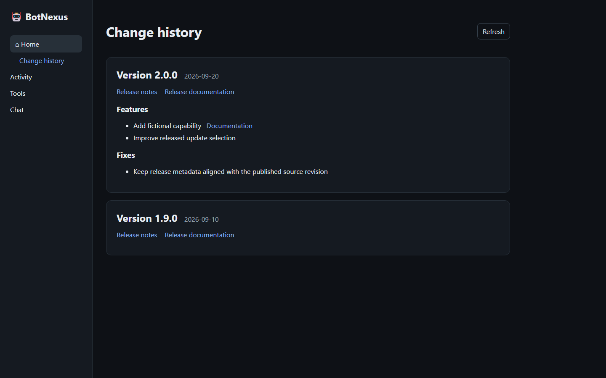

# Review released changes

This page is for BotNexus operators who want to see what changed in published versions without leaving the product.

## View change history

The installed command-line interface (CLI) does not currently display the complete release history. Use the web interface:

1. Open BotNexus in your browser.
2. Under **Home**, select **Change history**.
3. Read versions from newest to oldest. Select **Release notes**, **Release documentation**, or a capability **Documentation** link for public details.

The page uses the release workflow's canonical metadata. It does not list changes from the unreleased development branch.

## If release history is unavailable

The page shows an unavailable state when the published artifact cannot be reached or does not pass validation. Select **Retry** after checking your network connection. BotNexus does not reconstruct missing release history from development commits or rendered web pages.
